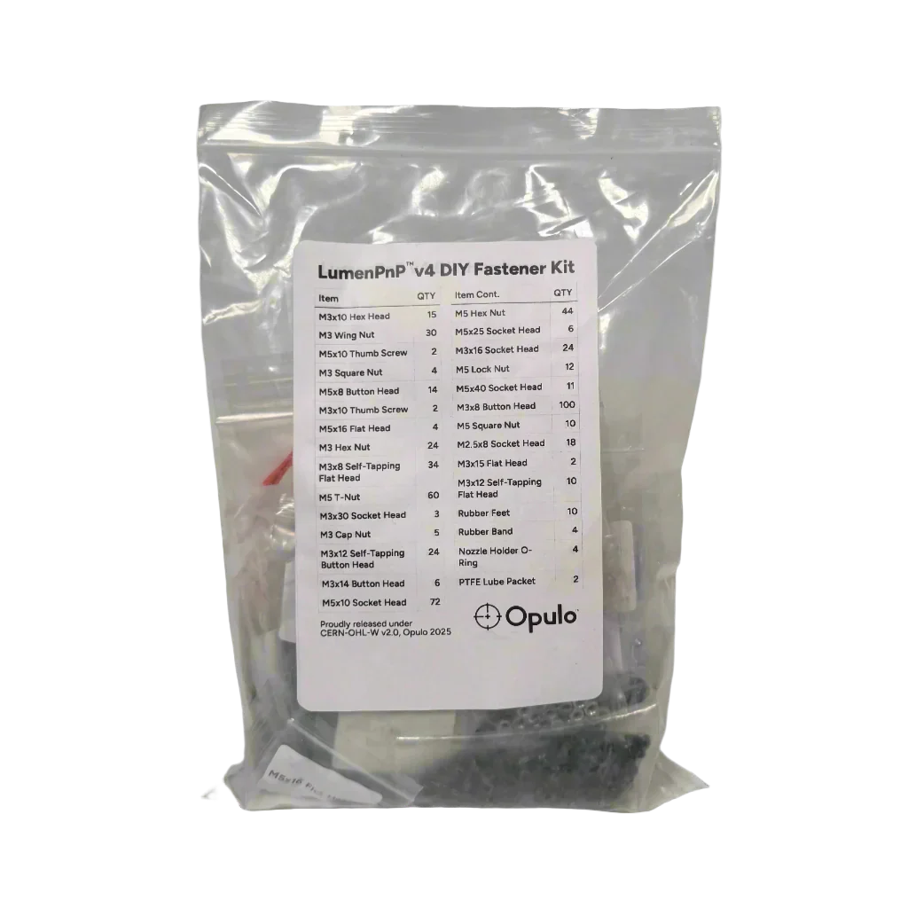

# Fastener Kit

This work instruction is for preparing the Fastener Kit - a bag full of all the hardware needed to assemble a v4 from scratch.

We get a pre-made bag of *most* of the hardware pre-made.

It needs **six** things added, and **one** thing changed.

## Swap

Hunt down the bag of 4x M3 "square nuts".

They're weird, and won't work for a LumenPnP build. Toss them, but keep the bag, and replace with 4x normal M3 square nuts. Add back to the main bag.

## Add

Prepare the following things, added to small bags with labels, as shown below

- 2x M3x10 thumbscrew (for bottom cam mount)
- 10x M3x12 self-tapping flat head
- 10x rubber feed
- 4x rubber bands
- 4x nozzle holder o-rings
- 2x PTFE lube packets
- 3x M5x16mm Socket Head (not pictured)

Add to the main bag.

Add the label to the bag.

