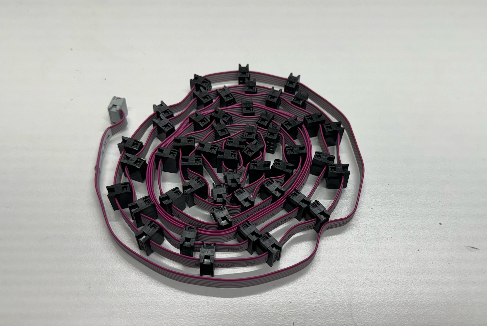
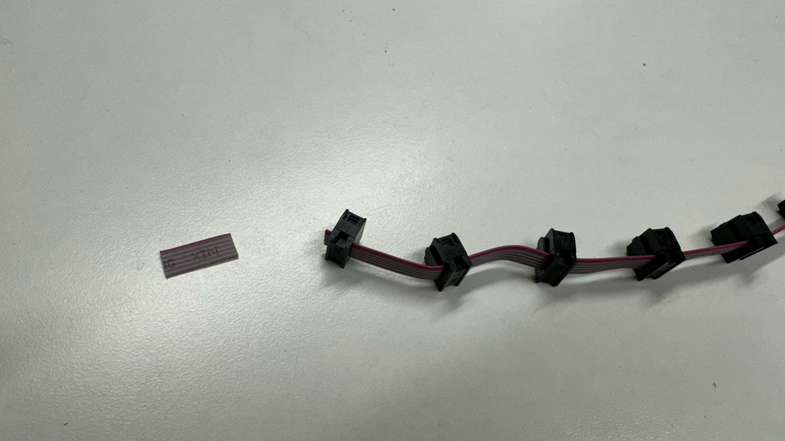

# Feeder Connection Kit

This section will guide the reader on how to properly prepare the accessories that go into a `feeder-connection-kit`.

## bagged-extrusion-cable-clips
* Place 10x `extrusion-cable-clip` pieces into a 3" x 4" plastic bag before sealing it shut

	
	

* Place each `bagged-extrusion-cable-clips` set into a  yellow NEEDS QC bin while it awaits inspection

	

* Weigh each `bagged-extrusion-cable-clips`, confirming it weighs `19.9g`

	 
	
* Place the `bagged-extrusion-cable-clips` pieces that pass weight check into a  green QC-Pass bin

	

## Hex Key for Drive Wheel Adjustment
* Adhere a hex key bag label onto a 2.5" x 3" plastic bag

* Place a hex key into the plastic bag before resealing it

## feeder-blade-cable-harness
###Cutting up feeder-slot-cable-harness
* Begin by unpacking a stock `feeder-slot-cable-harness`
	
* Unroll the harness and cut the cable after Slot #1 connector to create `mobo-to-slot1-cable-harness` before setting it aside for later use
	
* Cut the loose cable leading up to the Slot #2 IDC connector
	
* Cut out the center of the cable between Slot #25 and #26 as shown below to create `slot25-to-slot26-cable-harness` before setting it aside for later use
	
	
	
	
* Segment the remaining `feeder-slot-cable-harness` into 30mm long cables with a connector at each end to create 23x `blade12-to-blade13-cable-harness` before setting them aside for later use
	
	

###Packaging feeder-blade-cable-harness
* Collect the following cables and package them into a `4x6-anti-static-bag` before sealing it shut
	* 1x `mobo-to-slot1-cable-harness`
	* 1x `slot25-to-slot26-cable-harness`
	* 2x `blade12-to-blade13-cable-harness`
	
	
	
	

###Additional notes
* To keep the workstation organized keep everything organized in the bin shown below:
	* Section #1 - unmodified `feeder-slot-cable-harness` pieces
	* Section #2 - spare `blade12-to-blade13-cable-harness` pieces
	* Section #3 - finished and bagged`feeder-blade-cable-harness` units
	

!!!success "These three assemblies can now be set aside for further use in packout"