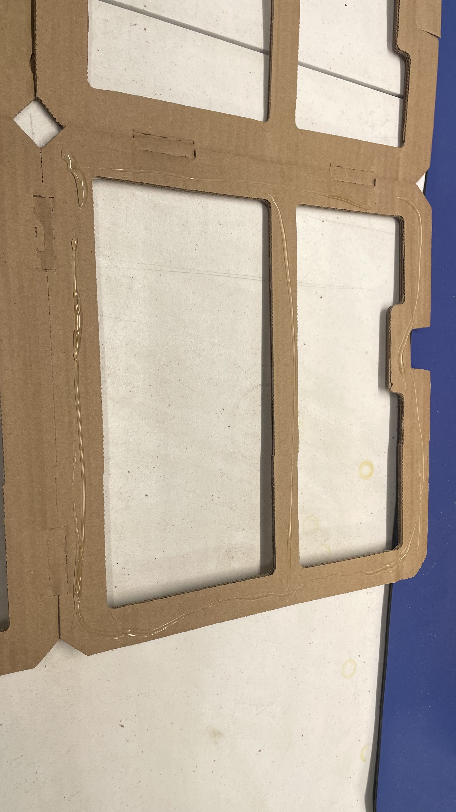

# Packaging the Feeder Connection Kit

This section will guide the reader on how to properly package a `feeder-connection-kit`

## Prep the cardboard tray

* Apply hot melt glue to inside faces of `feeder-accessory-tray`

	

* Immediately after gluing, folding `feeder-accessory-tray`

	

## Package `feeder-blade-set` 

* Move the `feeder-blade-set` into a `feeder-accessory-tray`
	

## Package additional items

* Move to Ghidra to finish this item if you haven't already
	

* Install the other accessories into the `feeder-accessory-tray`:
	* feeder-floor-cable-harness
	* feeder-slot-hardware-set
	* feeder-programmer
	* bagged-extrusion-cable-clips
	* drive-wheel-adj-key
	
	
	
* Add some foam to the `feeder-connection-kit` tray to protect the items in transit
	
