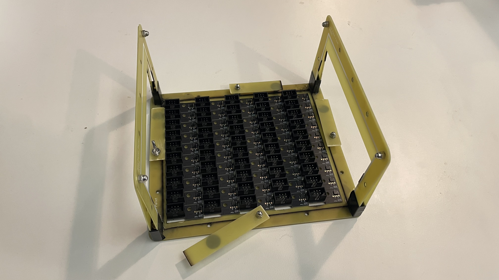
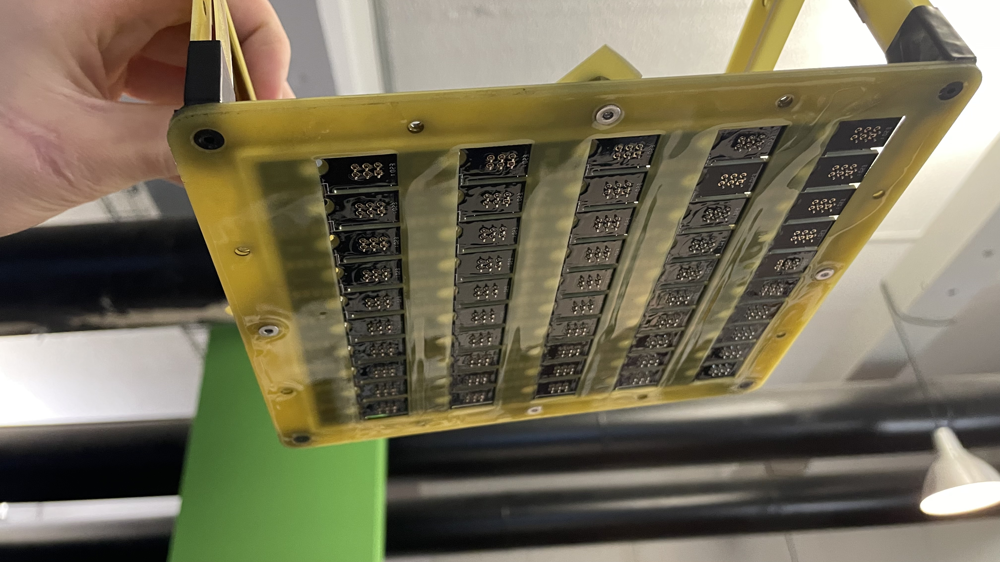
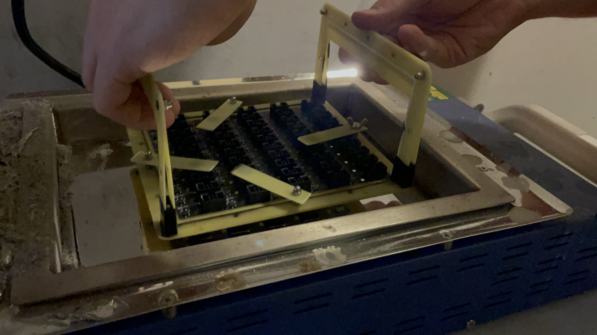
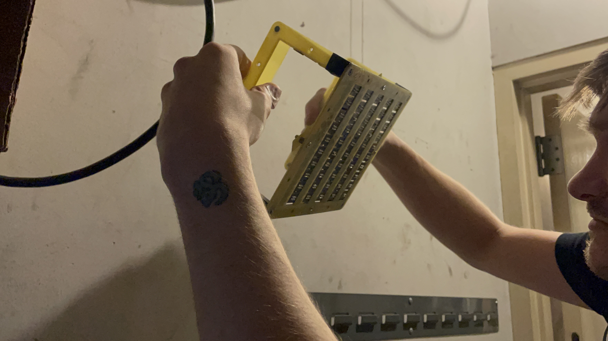
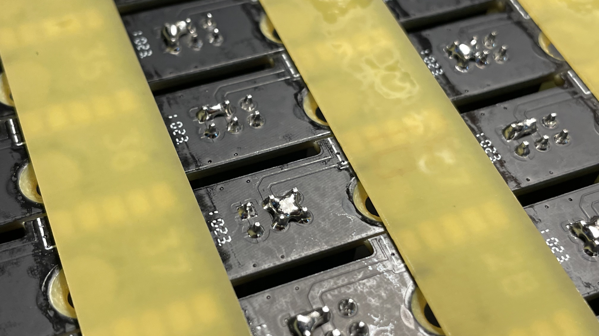
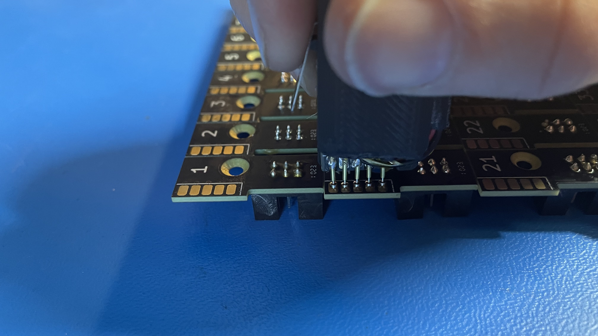
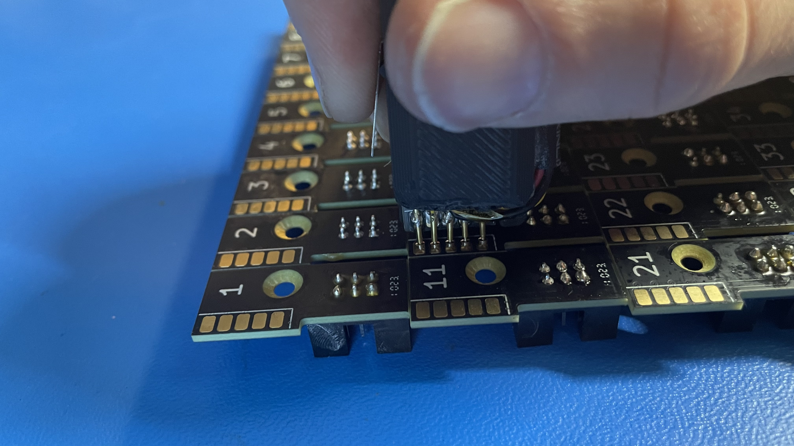
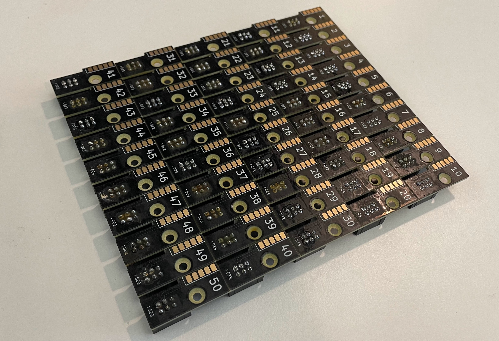
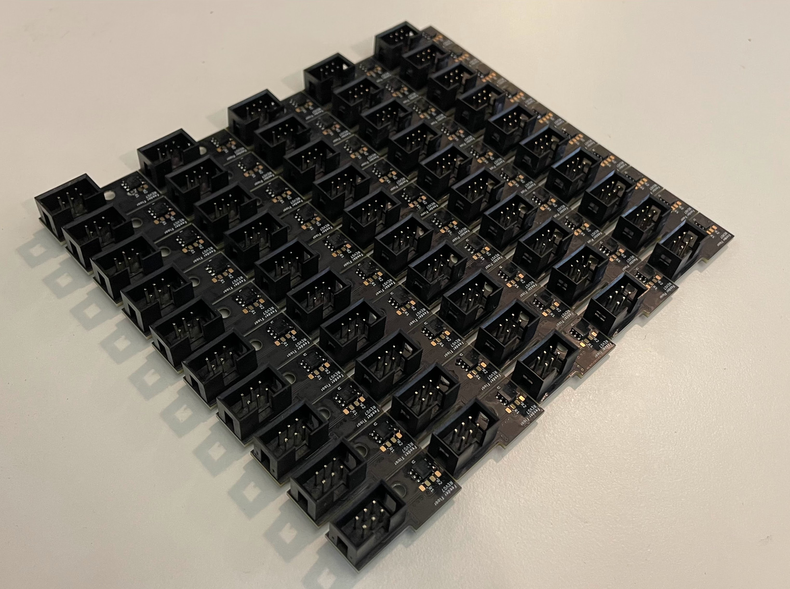

# Panelized Feeder Slot
This section will guide the reader on how to properly create a `panelized-feeder-slot` PCBA

## SMT

* Words go here

## THT
The `panelized-feeder-slot` PCBA requires the installation of 50x `2x3-IDC-connectors. The process for installing these will be covered in the subsections below.

### Component Installation

* Words go gere

### Dip Soldering
* Apply flux to the underside of the PCBA by dunking it it into a flux-filled container 
	
	
	!!!inspection "Inspect that the underside is fully coated in flux before proceeding"
		
* Dip the board into the solder pot with the following technique:
		* Words go here

* Inspect for large regions that require more solder - re-dipping the board if needed 
	

### Cleanup
* Proceed to address any solder bridging that may have resulted from the dip soldering process before proceeding
	
	
	
	
	
	
* Proceed after removing all instances of solder bridging
	

## Programming

* Words go here

## QC
Ensure your completed PCBA matches the image below before passing the completed to assembly along for further use on the assembly line 

