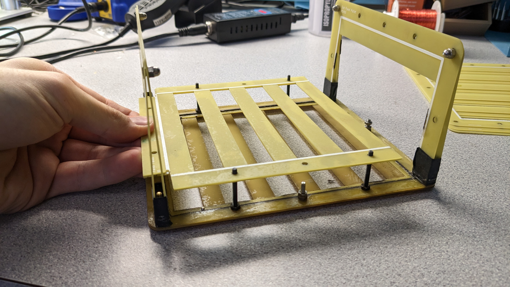
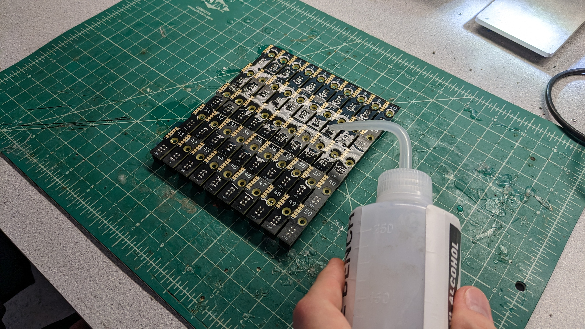
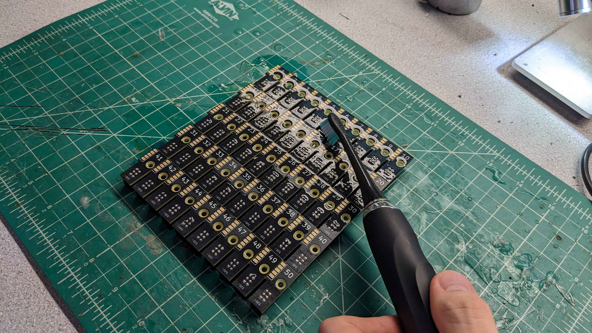
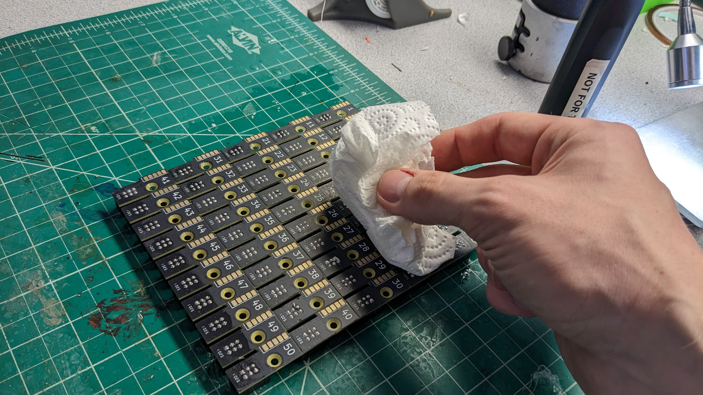

# Panelized Feeder Slot
This section will guide the reader on how to properly create a `panelized-feeder-slot` PCBA

## SMT

* Paste slot panels two at a time.
* Load two pasted slot panels into the Slot Lumen.
* Run the job in OpenPnP
  * Early stencils have a mistake from JLCPCB where the 120R termination resistor cutout is missing. If this is the case for the stencil you're running, disable that part in openpnp and mount after reflow.
* Remove the panels and reflow them in the oven one at a time.
* Inspect for any shorts or shifted components and rework as needed.
* Add the 120R termination resistor to the 50th slot PCB if needed

## THT
The `panelized-feeder-slot` PCBA requires the installation of 50x `2x3-IDC-connectors. The process for installing these will be covered in the subsections below.

### Component Installation

* After trimming the connectors, insert them into a panel that has undergone SMT.
	
	!!!inspection "Check Orientation"
		Be sure that ALL connectors have the keying slot facing ***towards*** the cutout in the PCB. Reference the picture below.

	
	

* Affix the retention bracket on top of the connectors as shown:
  
	

### Dip Soldering
* Don the PPE by the solder pot. None of these items are optional:
  * Safety Glasses
  * Gloves
  * Apron
  * Respirator
  * Close-Toed Shoes

	

* Preheat the board for 45 seconds by holding it over the pot.

* Apply flux to the underside of the PCBA by spritzing it with the spray bottle by the solder pot.
	
	!!!inspection "Inspect that the underside is fully coated in flux before proceeding"
		

* Skim the top layer of dross/oxidation from the top of the pot.

* Dip the board into the solder pot at an angle, push down gently for 2-3 seconds. Then remove at an angle, so one corner is last to leave the pot.

### Solder Cleanup
* Proceed to address any solder bridging that may have resulted from the dip soldering process before proceeding
	
	
	
	
* Proceed after removing all instances of solder bridging
	

### Board Cleanup
* Lay a slot panel connector-side down.
	
* Squirt IPA onto the top side of the board.
	
* Use the toothbrush to clean up any remaining flux or debris on the board.
	
* Wipe down with a paper towel until clean and streak-free.
	
	

## Programming

* Grab the stylus from the slot programmer.
  
* Ensure that the address is set to `1`. You can adjust the address with the buttons to the right of the screen.
* Place the spring pins of the stylus against the pads on the first slot. Make sure the orientation matches as shown below.
  
  
* When all spring pins are their pads, press the switch on the stylus.
* Look at the screen. 
    * If you see the `1 - SUCCESS` then the first slot was programmed correctly.
    * If you see anything other than success, programming failed. The jig is capable of detecting shorts, and will fail programming if one is detected. It will display which pin it has sensed has shorted. Perform any necessary cleanup and try again. The jig will remember your place.
* After successfully programming address `1`, perform the same step for the next 49 addresses.

## QC
Ensure your completed PCBA matches the image below before passing the completed to assembly along for further use on the assembly line 

