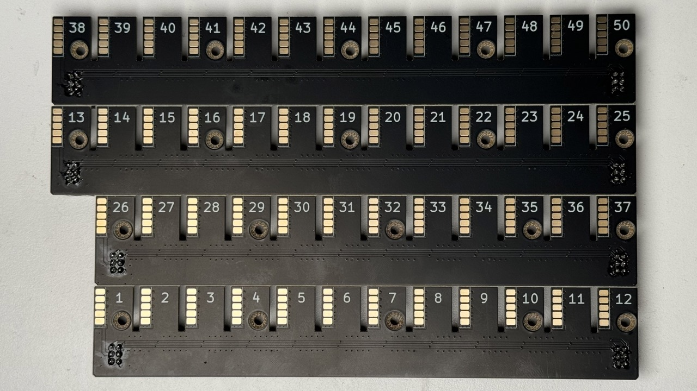
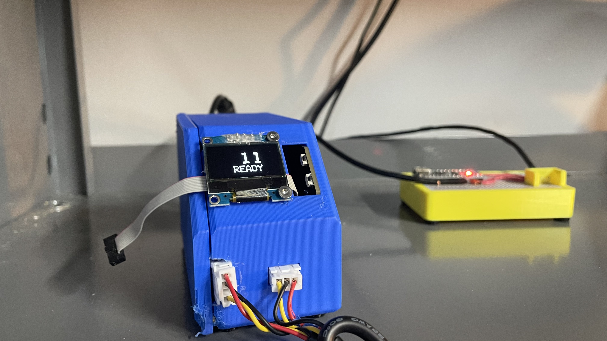
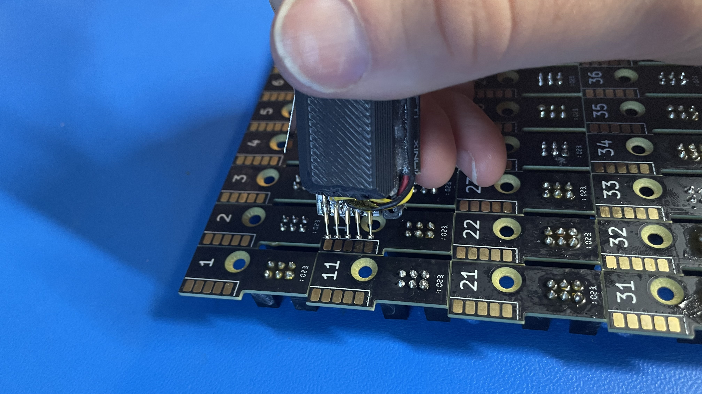
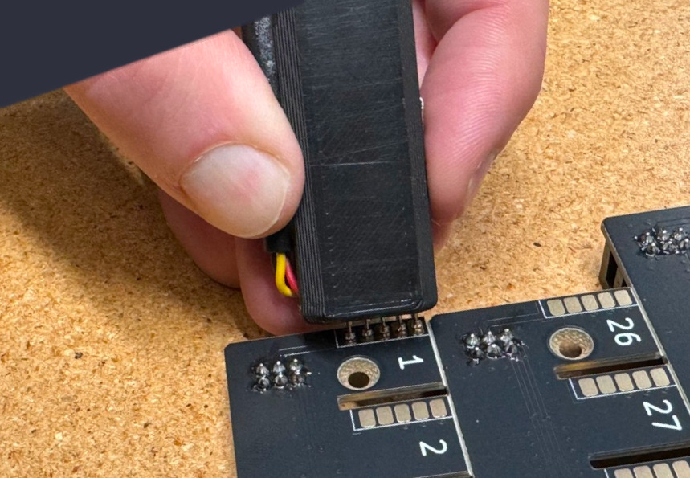
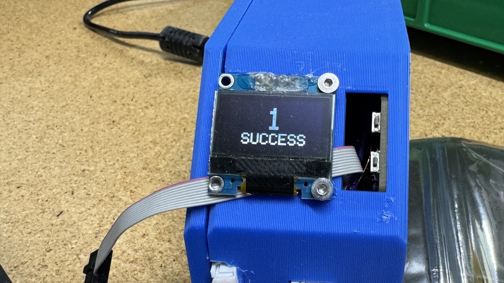
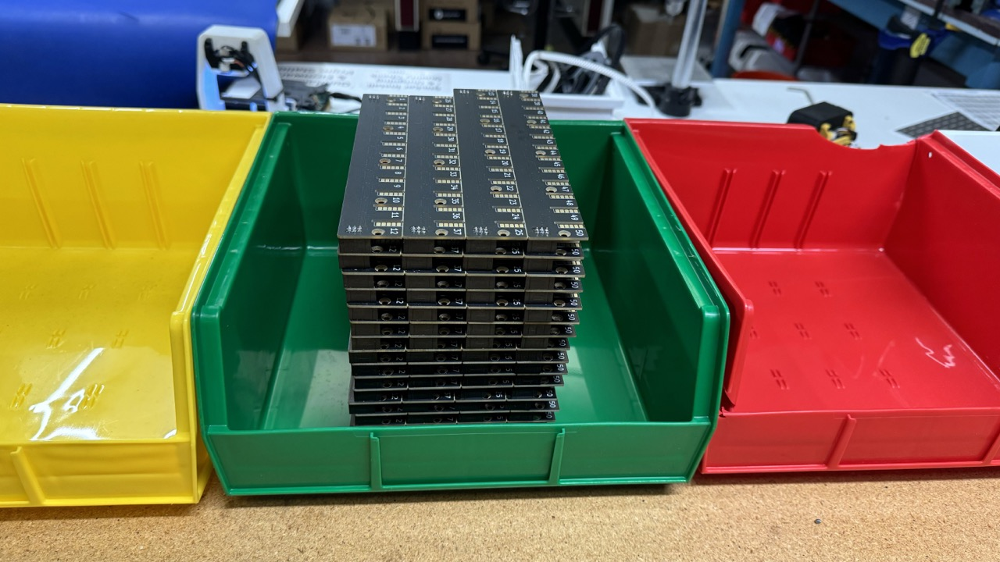

# Panelized Feeder Slot
This section will guide the reader on how to properly create a `feeder-slot-panel` PCBA

## SMT
* Paste slot panels three at a time.
* Load three pasted slot panels into the Slot Lumen
* Run the job in OpenPnP
* Remove the panels and reflow them in the oven *one at a time*
* Inspect for any shorts or shifted components and rework as needed
* Add the 120R termination resistor to the 50th slot PCB if needed

## THT
The `feeder-slot-panel` PCB requires the installation of 8x `2x3-IDC-connector`

* Install 8x `2x3-idc-connnector` into the `feeder-slot-panel` in the orientation shown below
	
	!!!inspection "Check Orientation"
		Be sure that ALL connectors have the keying slot facing ***towards*** the cutout in the PCB. Reference the picture below.
		

* Flip the board over and proceed to solder 8x  `2x3-idc-connnector` to `feeder-slot-panel` with a soldering iron and lead-free solder

	

* Place the completed `feeder-slot-panel` units into the yellow bin found at the slot assembly work station
	

## Programming
* Grab the stylus from the slot programmer.
  
* Ensure that the address is set to `1`
	* You can adjust the address with the buttons to the right of the screen
* Place the spring pins of the stylus against the pads on `Slot #1`
	* Make sure the orientation matches as shown below:
		  
		  

* Press the switch on the stylus when all spring pins are compressed against the pads
	
* Look at the screen:
	!!!failure "The programming step failed if you see *anything other than a `success` message*"
		* The jig is capable of detecting shorts, and will fail programming if one is detected
			* The screen will display which pin it sensed has shorted
		* If a failure is observed perform any necessary cleanup and try again
		* Note that the jig will remember the last place you left off

	!!!success "If the programmer reads `1 - SUCCESS` proceed to the next slot"
		

* After successfully programming address `1`, repeat this step for the next 49 addresses while moving in the following order:   Pink (4th row)  →  Red (2nd row)  →  Green (3rd row)  →  Blue (1st row) 
	

	!!!warning "Pay **extreme attention** to avoid programming any slot with the wrong value"

## QC
Ensure your completed PCBA meets the following requirements:

- 8x `2x3 IDC connector` are present with each connector's slit facing towards the `Feeder Floor REV07` silkscreen text
- Switch the programmer to `QC Mode` and confirm that Slots #1, #13, #26, #38, and #50 each have a programmed value that matches the top-side silkscreen text

	!!!info "For example:"
		Confirm that Slot #26 is *actually* programmed as Slot #26

- Gold spring finger pads are free of damage

Place each quality checked `feeder-slot-panel` into the appropriate QC bin:

!!!success "Place all QC passing `feeder-slot-panel` units into the green QC bin"
	
	
!!!failure "Place all QC failing `feeder-slot-panel` units into the red QC bin"
	Be sure to label each defective unit with any issues it has
	

The next step is to proceed to `Feeder Slot Set Final Assembly`