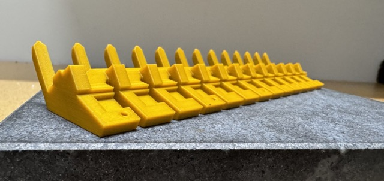
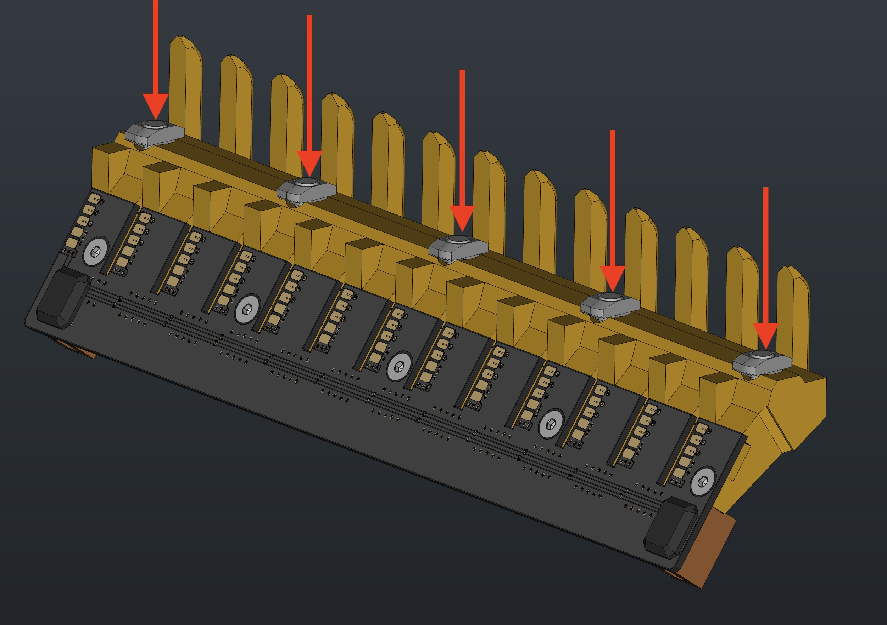

# Feeder Slot Set

This section will guide the reader on how to properly assemble and package a `feeder-blade-set`

## Materials Prep

* Check 2x `blade-12` and 2x `blade-13` using the granite block to ensure the print printed without warping
	

## Assembly Process
* Begin by separating a `feeder-blade-panel` into four separate rows
	
	
	

* Install each `blade13-pcb` into a `blade13` 3D print to create `feeder-blade13-asm`
	
	

* Set `feeder-blade13-asm` into the `feeder-blade-cradle-jig`
	

* Proceed to install 5x `M3x8-self-threading-screw` into the WIP `feeder-blade13-asm`
	* Use an automatic torque driver set to `6`

	

* Remove the blades from the `feeder-blade-cradle-jig`
* Loosely install 5x `M5-t-slot-nut` and 5x `M5x10-bolt` into each feeder blade for subsequent use in mounting onto a feeder rail
	
	

* Repeat these above steps until you have created 2x `feeder-blade13-asm` and 2x `feeder-blade12-asm`
	* The steps to make the `feeder-blade12-asm` are the same as the 13-gang version, the only differences are that the 3D print and PCB are a 12-slot variant.

!!!success "Once all 4 assemblies have been prepared, you have finished building a `feeder-blade-set`"
	

# Next Steps
The next step is to proceed to either:

* [`Feeder Accessory Preparation`](../accessories/) - provided you are making a Feeder Connection Kit
* [`Front-feeder-rail / Rear-feeder-rail`](https://ohai.opulo.io/lumen/feeder-rail/) - provided you are making a LumenPnP

