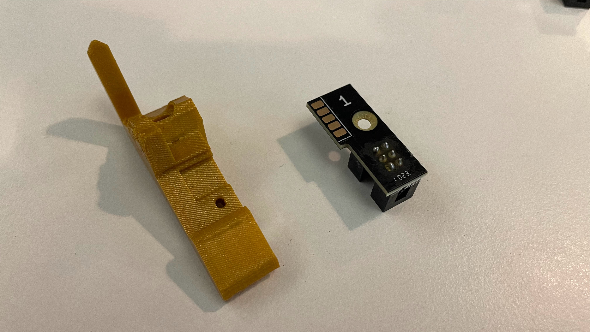

# Feeder Slot Set

This section will guide the reader on how to properly assemble and package a `feeder-slot-set`

## Assembly Process
* Begin by separating a `panelized-feeder-slot` PCBA into 50x separate `feeder-slot-pca` pieces

* Perform the following steps 49x times 
	* Install `feeder-slot-pca` into `feeder-slot-bracket` to create 49pcs `feeder-slot-asm`
	
		

		

	* Set each `feeder-slot-asm` into the `feeder-slot-cradle-jig`, being sure to place them in numerically sequential order
	
	`TO DO - Replace image with ones that show using the 50-up-feeder-slot-cradle-jig` 

		
		
	
	`TO DO - Replace image with ones that show using the 50-up-feeder-slot-cradle-jig` 

* Repeat the previous step an additional time for the 50th `feeder-slot-asm` but instead use the *yellow* `feeder-slot-bracket-last` 
	
	
* There should now be 50x `feeder-slot-asm` pieces in the `feeder-slot-cradle-jig` 
	* `TO DO - Show photo of what this looks like`

* Proceed to install 50x `M3x8-self-threading-screw` into the WIP `feeder-slot-asm` pieces

	
	`TO DO - Replace image with ones that show using the 50-up-feeder-slot-cradle-jig` 

	
	`TO DO - Replace image with ones that show using the 50-up-feeder-slot-cradle-jig` 

!!!success "You have finished building a `feeder-slot-set`"
	* This part name represents a #1 through #50 set of `feeder-slot-asm`  

## Packout

* Move the 50x `feeder-slot-asm` from the `feeder-slot-cradle-jig` into a `feeder-accessory-tray`
	* Be sure to keep the 50x `feeder-slot-asm` in numerically sequential order
	
	

	

