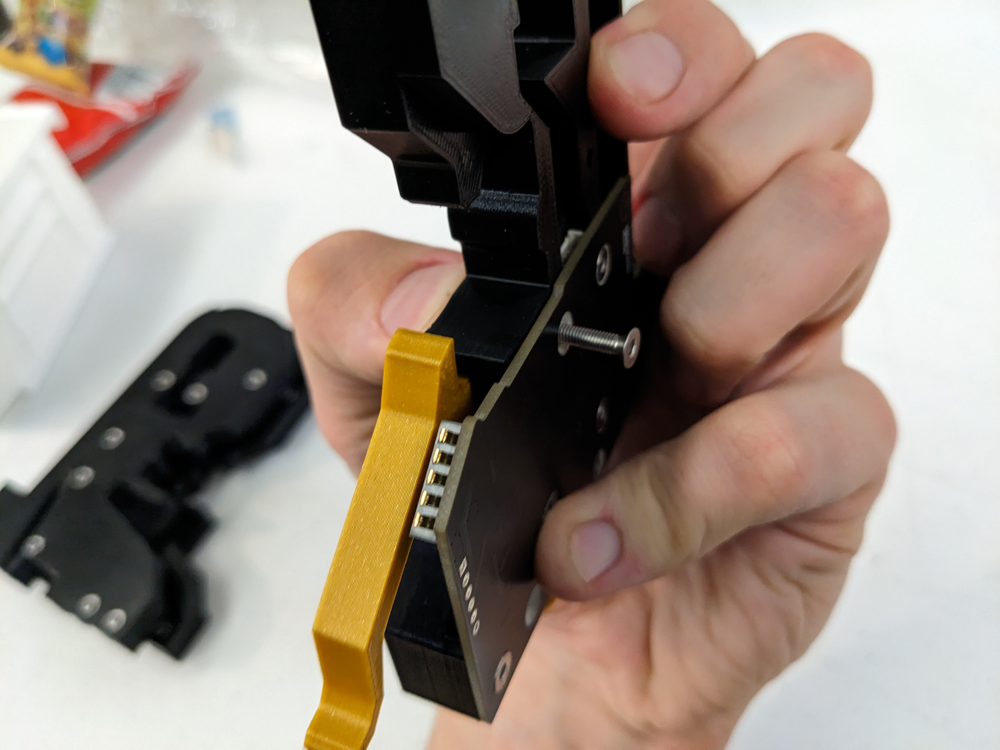
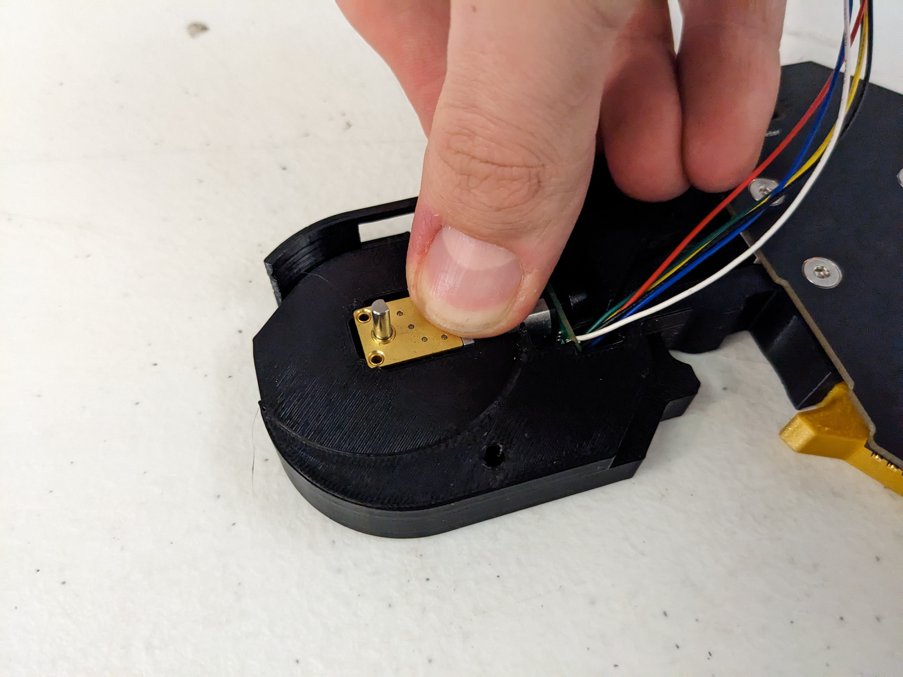
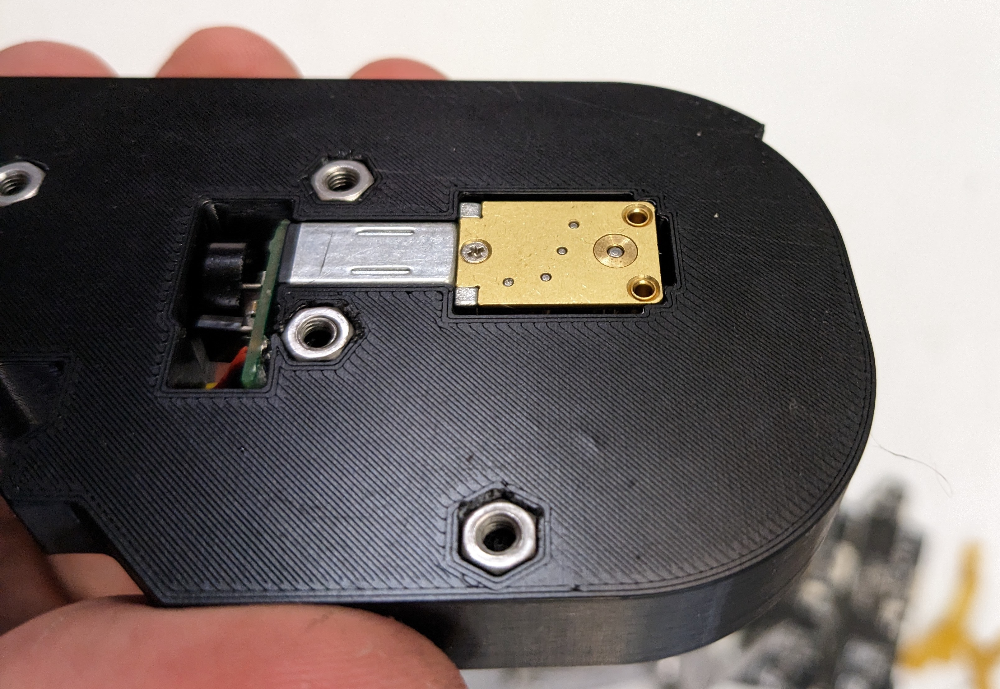
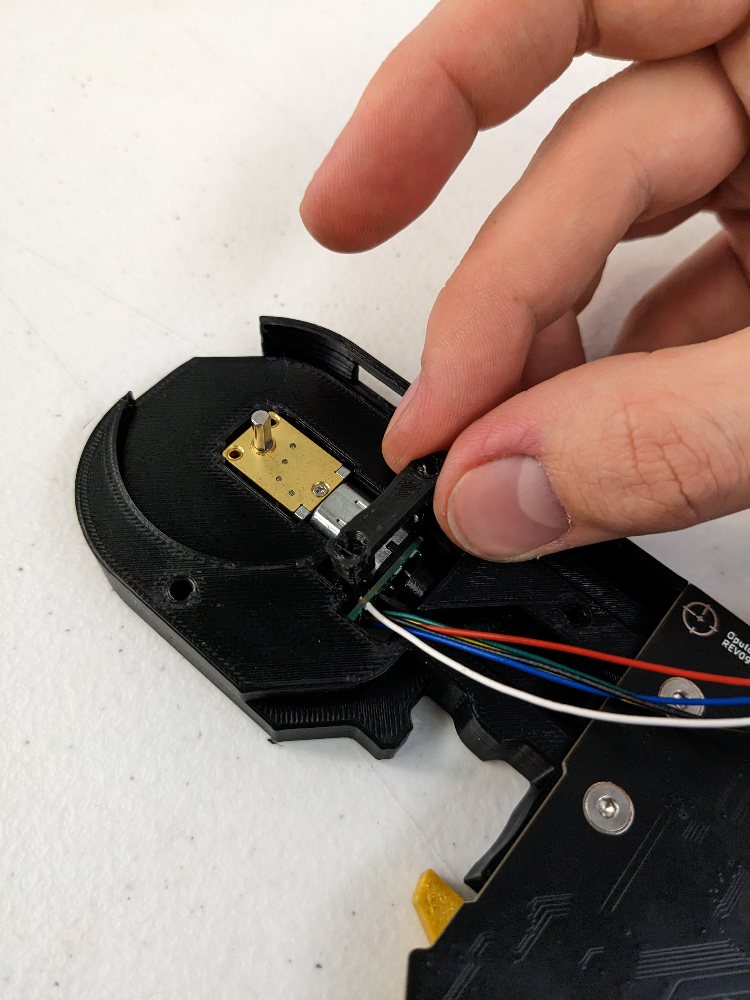
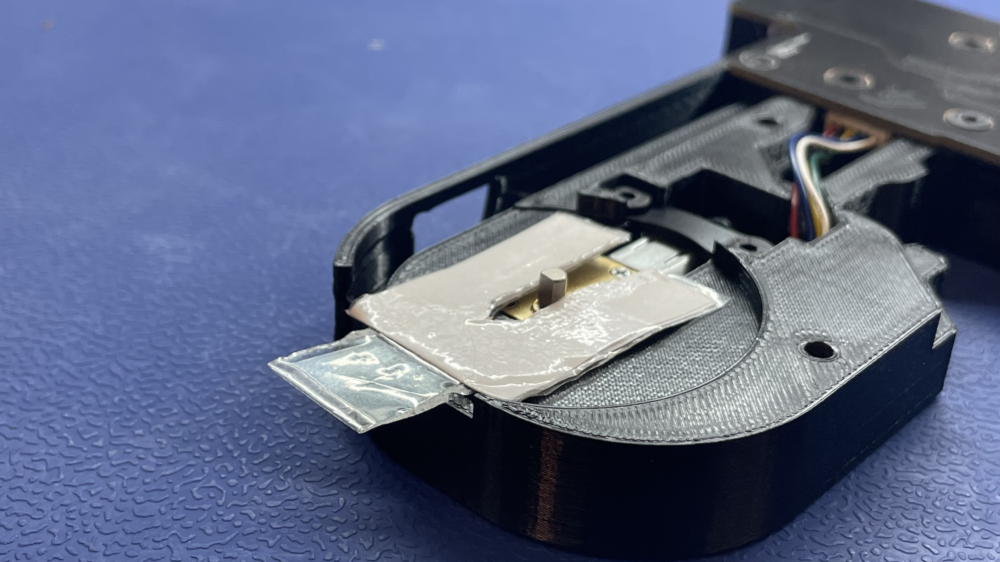

# Final Assembly

## Install the `peel-motor-asm` and `feeder-motherboard`

1. Plug the `peel-motor-asm` into the 2-pin connector on the PCB
   
   	

2. Slide the `peel-motor-asm` into its corresponding cavity in `feeder-frame-8mm`
	* Tuck the excess cable into the empty region behind the `peel-motor-asm` 
   
   	

3. Press the PCB flat into `feeder-frame-8mm`
	* Make sure the cable is not caught between them - it should lay flush
   
   	

4. Insert 3x `M3x15mm` flathead screws into the holes in the PCB as shown below
	* Make sure they fully engage with the `M3-hex-nut` pieces in the backside of `feeder-frame-8mm`
   
	
 
	!!! inspect "QC Check - Test if the buttons on `feeder-frame-8mm` can easily actuate the switches on the PCB before proceeding"

## Install the `release-lever`

!!!warning "Wearing safety glasses is required while installing springs"

5. Install the spring
	* Grab a spring and a `release-lever`, and hold the spring in the `release-lever` as shown 
	* Match the other end of the spring up with the circular cutout in the `feeder-frame-8mm` print
	* Finally, drop the `release-lever` into the `feeder-frame-8mm`
   
   	
   	

6. Insert an `M3x15mm` flathead screw from the backside and drive it in using the grey torque driver on the 4 setting (0.25 N*m).
	* Make sure the arm can still swivel easily
	* Make sure that the arm does not have any lateral movement
   
   	

## Install the `drive-motor`

7. Push a `drive-motor` into the cavity in `feeder-frame-8mm` as shown below
   
   

8. Make sure the back of the `drive-motor` is perfectly flush with the backside of `feeder-frame-8mm`
   
  	

9. Install a `drive-motor-bracket` while making sure the cutout matches up with the `feeder-frame-8mm` cutout for `drive-wheel-asm`
   
   	

10. Insert 2x `M3x12mm` flathead screws 
 	* Turn the screws in equal amounts before tightening them both to the final torque spec
 	* Tighten the 2x `M3x12mm` flathead screws to `15 cN.m (0.15 N.m)` with a `2mm` hex head driver

  	 
 	 

	!!! failure "*DO NOT OVER-TIGHTEN*" 
		Over-tightening can lead to bracket damage and motor skewing in the `feeder-frame-8mm`
			

11. Check that the `drive-motor` is still flush and hasn't skewed because of tightening
	* If it appears crooked or not flush, loosen the screws and readjust the `drive-motor`
   
   	
   	
   	
## Plug `drive-motor` into `feeder-motherboard`

16. Insert the `drive-motor` cable into the six-pin connector on the PCB
   
    
    

17. Ensure that the cable fully lays in the channel leading to the motherboard, as shown above

## Install the `drive-wheel-asm`

!!!info "Note on `drive-motor` shaft angle"
	Drive-motor units may come from factory with a shaft rotated at an angle that's not ideal for set-screw tightening. If this applies to the feeder you are handling, follow the steps below: 
	
	* Power up to the affected units by plugging it into Gundam
	* Press the feeder's jog-forward button until the shaft is at an optimal angle for subsequent assembly work 	

	
	
	

12. Place the `Drive Wheel Shim` in the `drive-wheel-asm` cavity as shown, with the `drive-motor` shaft sticking through it
   
   	

13. Drop the `drive-wheel-asm` onto the `drive-motor` shaft
   
	

14. With one hand,** press down firmly on ** `drive-wheel-asm` while using your free hand to tighten the `shaft-collar-asm` set-screw
	* Tighten the `M2.5x3mm-set-screw` to `30 cN.m (0.3 N.m)` with a `1.27mm` or `1.3mm` hex head driver
  
	 

15. Remove the `Drive Wheel Shim`
      
	 
	 

    	
## Install `drive-motor-cover`

18. Place a `drive-motor-cover` over the `drive-wheel-asm`
	* The `drive-motor-cover` should lay flat with none of the cables preventing it from being flush against `feeder-frame-8mm` 
   
    

19. Insert 3x `M3x15mm` flathead screws in the locations shown below
	* Ensure the screws fully engage with the `M3-hex-nut` pieces on the backside of `feeder-frame-8mm`
    
     `TO DO: REPLACE THIS IMAGE WITH ONE THAT SHOWS 3 screws instead of 2`
    
    
    
!!!success "You may now proceed to OQC"