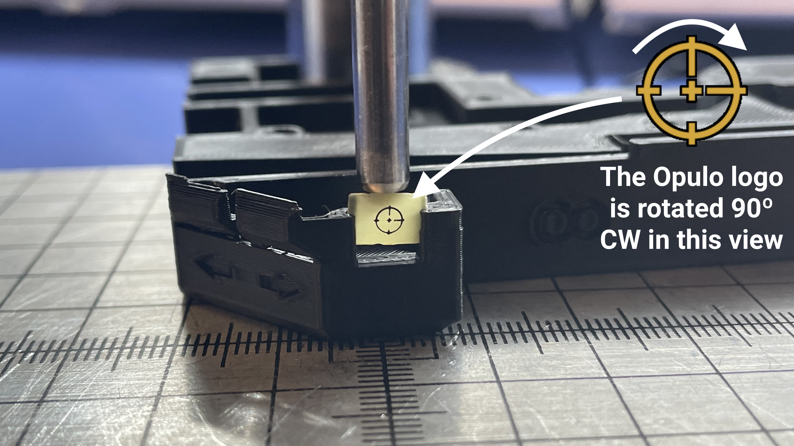
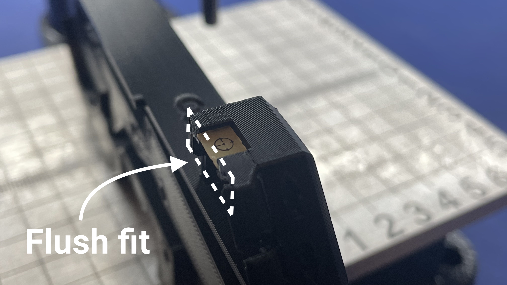

# 8mm Feeder Frame Assembly
This section will guide the reader through the process of installing various hardware components into `feeder-frame-8mm (FDM-0052-00)` in preparation for its use in final assembly.

## Prepare `feeder-frame-8mm` 
* Inspect the print for defects
	* Use a heat gun to remove any stringing
	* Check the first layer for a smooth surface
* Clean up any loose plastic in the hex nut pockets
* Firmly press the up and down buttons so that they can move freely
	

	!!! note "Note on button handling"
		* These buttons are print-in-place flexures, which means they need to be broken away from the layer of plastic between them and the rest of `feeder-frame-8mm` 
			* Exercise care here, as pressing these buttons too far inward can break them
		* The motherboard that is installed later will prevent this type of button over-travel damage

## Install Hex Nuts
* Use the `arbor-press-jig` to install 9x `m3-hex-nut` into `feeder-frame-8mm`
	
	
	
	

	

* Turn the `feeder-frame-8mm` upside down and lightly tap it against the workbench surface
	* If any `m3-hex-nut` pieces fall out, add a drop of `LOCTITE 435` to side of the nut before reinstalling into the respective pocket in `feeder-frame-8mm`

## Install Light Diffuser
* Use an `arbor-press-jig` to install `light-diffuser-pcb (PCB-0013-01)` into `feeder-frame-8mm`
	* The Opulo logo on `light-diffuser-pcb` should be in the correct orientation when the feeder is held in front of you

	
	
	
* The installed `light-diffuser-pcb` should be flush to the top-face of `feeder-frame-8mm` when installed correctly

	

## Install 8mm Fiducial Board
* Add a small amount of `LOCTITE 435` in the front pocket of the `feeder-frame-8mm`

	`TO DO: ADD PHOTO`

* Manually install `8mm-fiducial-board (PCB-0008-01)` into the front pocket of the `feeder-frame-8mm`
	*  The fiducial markers on 

	`TO DO: ADD PHOTO`

