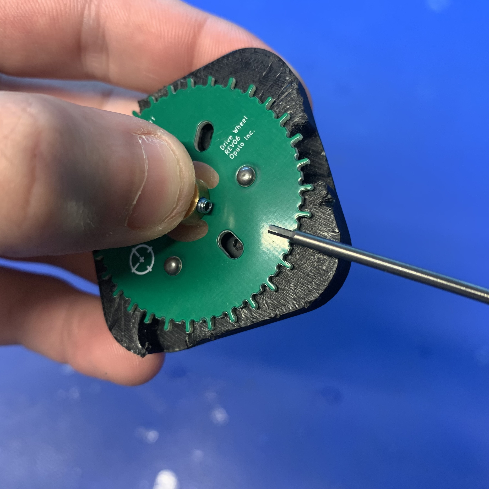
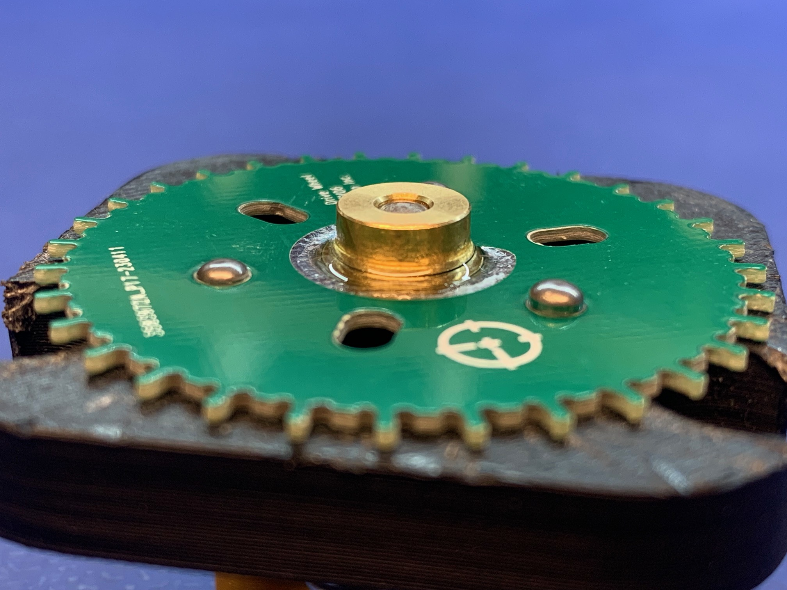

# Drive Wheel Assembly
This section will guide the reader on how to prepare and glue the `shaft-collar-asm` onto `drive-wheel` to create `drive-wheel-asm`.

## Prepare shaft-collar-asm

* Install the `set-screw` into the `shaft-collar` with a `1.3mm hex driver`

	

	
	
* Tighten the `set-screw` until it nearly passes into the inner bore

	

## Install shaft-collar-asm and drive-wheel onto shaft-alignment-jig

 

* Place `drive-wheel` onto the `shaft-alignment-jig`
	* Let the 3 slotted pins help align the `drive-wheel` into position
	* Push the `drive-wheel` down firmly to ensure it is fully seated on `shaft-alignment-jig`

	 

!!! warning "Make sure that no part of `drive-wheel` is touching the center post of `shaft-alignment-jig`"
		* Otherwise, something may become misaligned or unintentionally glued together
		* The image below shows a `drive-wheel` with OK clearance from the center post of `shaft-alignment-jig`

	 

* Place `shaft-collar` onto the center post of `shaft-alignment-jig`
 	* Orient `shaft-collar` so the `set-screw` is above the green soldermask on `drive-wheel` 

	 

* While firmly pressing `shaft-collar-asm` downward, tighten the set-screw to `0.2 N/M`

	!!! warning
		Make sure that the shaft-collar-asm does not lift up as you tighten the set-screw

		
	
	!!! warning "Inspect the WIP assembly for visible daylight between drive-wheel and shaft-collar-asm"
	
		If there is a noticeable gap between these two items, adjust and retighten shaft-collar-asm as needed.
		
* When the above steps are completed, the WIP assembly should match the image below -

	

		
## Glue shaft-collar-asm and drive-wheel together

* Apply `LOCTITE 435` to the seam between `shaft-collar-asm` and `drive-wheel`
	* Rotate around the `shaft-collar-asm` while slowly dispensing glue
	* Only apply glue to the C-shaped region of `drive-wheel`, being sure to avoid getting glue anywhere near the `set-screw`

	!!! note 
		If you accidentally dispense too much glue initially, **stop** and follow the note below
		
		* Gently swirl the `shaft-aligment-jig` with affixed WIP `drive-wheel-asm` around to spread the glue around the silver C-shaped pad
		* As usual, be sure to avoid getting glue anywhere near the `set-screw`

	

	
	
* Allow the `LOCTITE 435` to dry for **180 seconds** before proceeding
* Remove the completed `drive-wheel-asm` from the `shaft-alignment-jig`
	*  Loosen the `set-screw` while pinching down on the `shaft-collar`
		*  This will help to avoid unneeded stress to partially cured glue
	*  Remove the `drive-wheel-asm` by pressing the outer-edges of `shaft-collar-alignment-jig` downward to actuate the jig's ejector pins
	
	

	

* Allow the completed `drive-wheel-asm` to dry for 1 hour before using it in further processes
	* The `drive-wheel-asm` should sit flat on a table while it finishes drying 

	

* Once an hour has passed, check that the `shaft-collar` is glued on firmly by nudging it laterally
	* Note that the outer surface of the glue bond may remain tacky for several more hours

!!!failure "If the `shaft-collar` moved when testing the glue bond strength, scrap the `drive-wheel-asm` and record the wasted material"

!!!success "If the glue strength is OK, move the completed `drive-wheel-asm` to its corresponding storage bin at the feeder assembly workstation"
