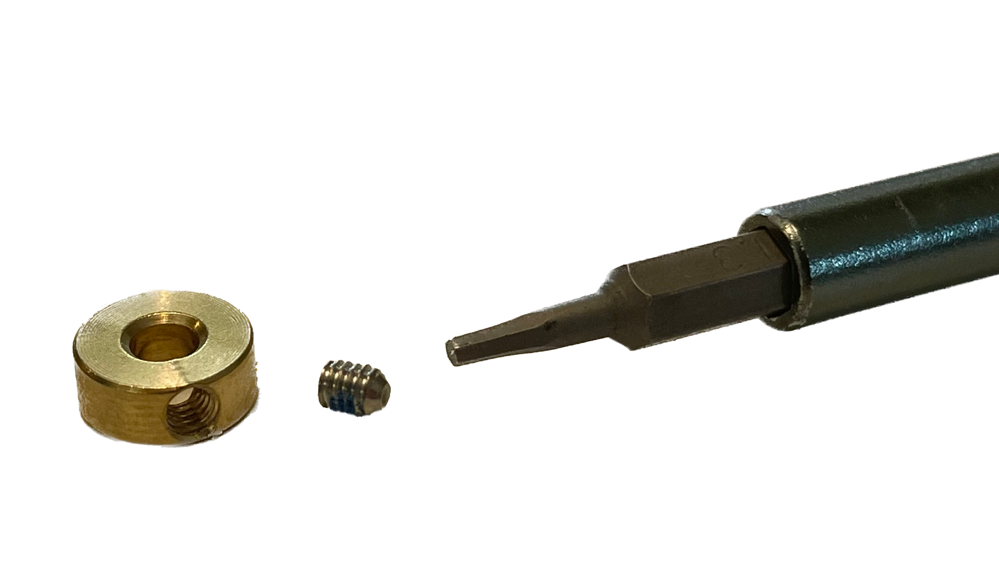
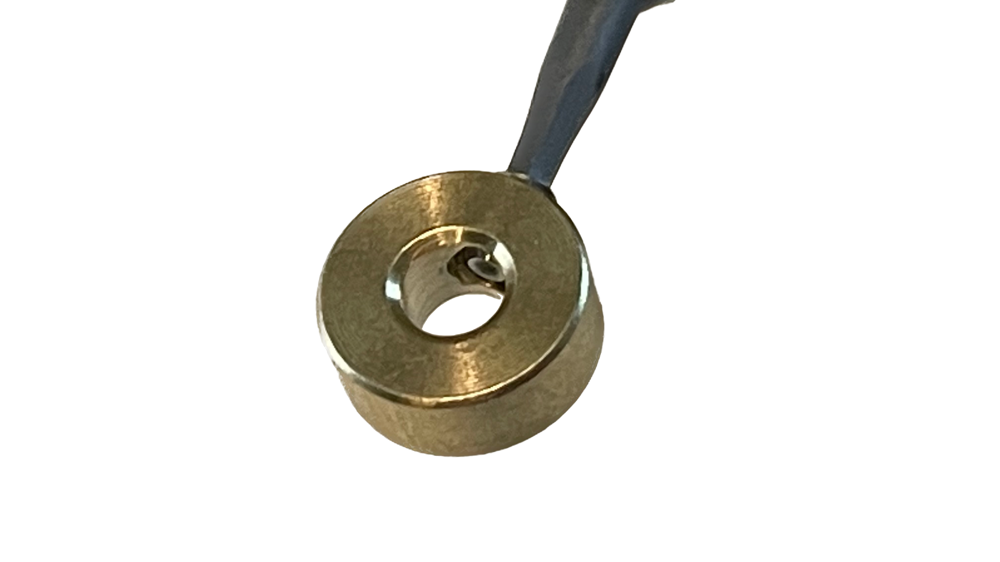
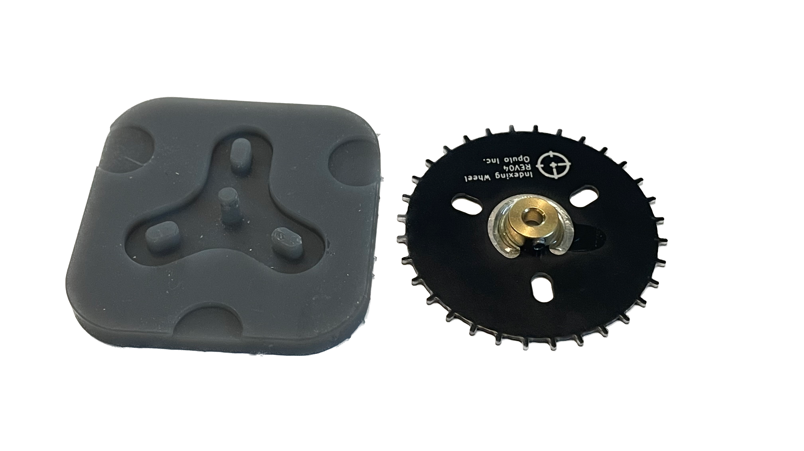

# Drive Wheel Assembly
This section will guide the reader on how to prepare and glue the shaft-collar-asm (ASM-0061-00) onto drive-wheel (PCB-0009-05) to create drive-wheel-asm (ASM-0060-00).

## Prepare shaft-collar-asm

* Install the set-screw into the shaft-collar with a `1.3mm hex driver`

	

	
	
* Tighten the set-screw until it nearly passes into the inner bore

	

## Install shaft-collar-asm and drive-wheel onto shaft-alignment-jig

 

* Place drive-wheel onto the shaft-alignment-jig 
	* Let the 3 slotted pins help align the drive-wheel into position
	* Push the drive-wheel down firmly to ensure it is fully seated on shaft-alignment-jig

	 

* Make sure that no part of drive-wheel is touching the center post of the shaft-alignment-jig, otherwise something may become misaligned or unintentionally glued together 

	 

* Place the shaft-collar onto the center post on the shaft-alignment-jig
 	* Orient the shaft-collar so that the set-screw is above the black soldermask on drive-wheel and facing towards 1 of 3 locating bumps on shaft-alignment-jig

	 

* While firmly pressing shaft-collar-asm downward, tighten the set-screw to `0.2 N/M`

	!!! warning
		Make sure that the shaft-collar-asm does not lift up as you tighten the set-screw

	
	
	!!! warning "Inspect the WIP assembly for visable daylight between drive-wheel and shaft-collar-asm"
	
		If there is a noticable gap between these two items, adjust and retighten shaft-collar-asm as needed.
		
* When the above steps are completed, the WIP assembly should match the image below -

	

		
## Glue shaft-collar-asm and drive-wheel together

* Apply LOCTITE 435 to the seam between shaft-collar-asm and drive-wheel
	* Rotate around the shaft-collar-asm while slowly dispensing glue
	* Only apply glue to the C-shaped region of the drive-wheel, being sure to avoid getting glue anywhere near the set-screw

	!!! note 
		If you accidentally dispense too much glue initially, **stop** and follow the note below
		
		* Gently swirl the shaft-aligment-jig with affixed WIP drive-wheel-asm around to spread the glue around the silver C-shaped pad
		* As usual, be sure to avoid getting glue anywhere near the set-screw

	

	
	
* Allow the LOCTITE 435 to dry for 180 seconds before proceeding
* Remove the completed drive-wheel-asm from the shaft-alignment-jig
	*  Lossen the set-screw while pinching down on the shaft-collar 
		*  This will help to avoid uneeded stress to partially cured glue
	*  Lift the drive-wheel-asm away from shaft-collar-asm with a gentile upward pull
	*  If more force is required, pry upward with a sharp wedge in the three lift-grooves on shaft-alighment-jig

	

* Allow the completed drive-wheel-asm to dry for 1 hour before using it in further processes
	* The drive-wheel-asm should sit flat on a table while it finishes drying 

	

* Once an hour has passed, check that the shaft-collar is glued firmly in place by nudging it laterally
	* Note that the outer surface of the glue bond may remain tacky for serveral more hours

	
 * If the glue strength is OK, move the completed drive-wheel-asm to the corresponding storage bin, found at the feeder assembly workstation
