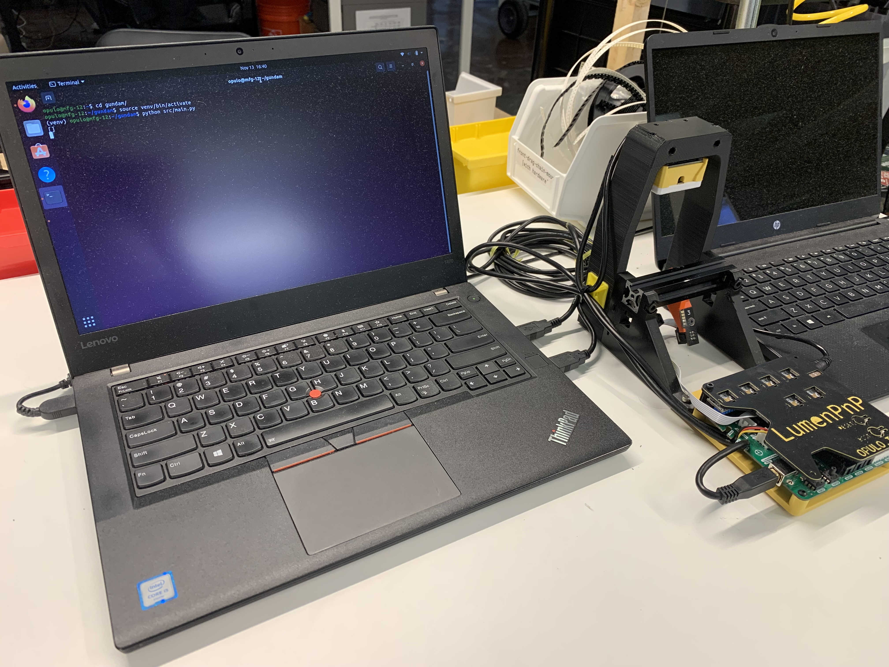
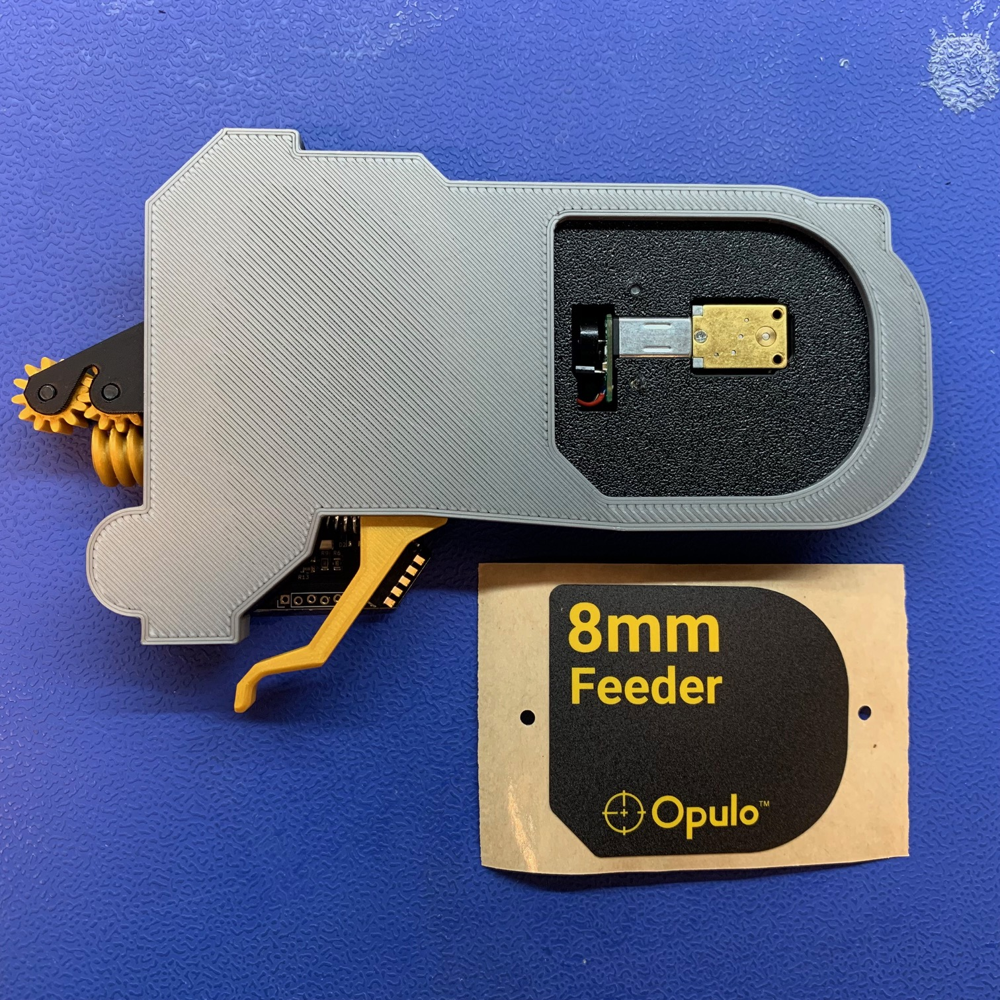
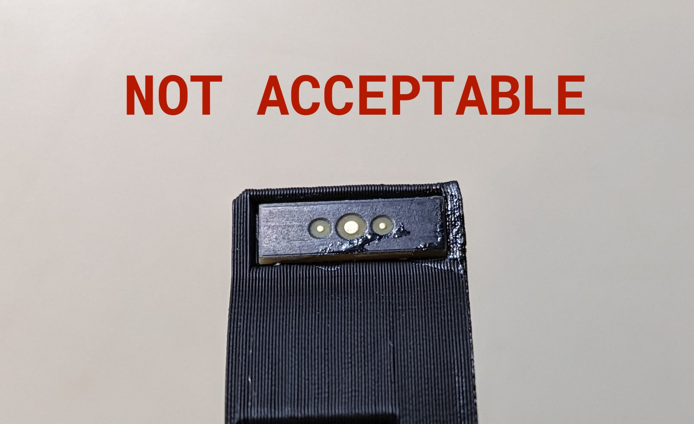

# Outgoing Quality Control (OQC)

## Update the firmware
!!!note "This step may have already been completed!" 
	If the motherboard on the feeder already has the feeder-rev-sticker adhered - if so, you may skip this step. The PCB should have already been programmed with the latest firmware version.
	
* Update the feeder to the latest firmware by connecting it to a UART dongle 
* Upload the code via STM32CubeProgrammer
* Adhere a `feeder-rev-sticker` onto the motherboard in the marked region

 	 
 	 

## Test Feeder with Gundam

1. Launch the Gundam Application by entering the commands shown in terminal

  	
  	
2. Load feeder into the `gundam-qc-jig` by installing it onto the orange feeder slot

	!!!note "Confirm correct programming"
		If the feeder LEDs flash white when installed onto the slot, your feeder has old firmware and will fail to pass the subsequent tests. If this is observed, unplug the respective feeder and update its firmware before resuming regular process flow. 

  	
  	

3. In the Gundam application window, click "Scan Ports" and choose the `/dev/tty/ACM0` device ID from the drop-down list
 
  	
  	
  	
4. Choose the appropriate test from the `Test to Run` drop-down menu
5. Click the `Run Test` button found at the bottom of the Gundam application window
6. Input the following information when the application prompts for data input:
	* `Please input the unit source version` - Enter the current production revision number (`v1.1.0` for example)
7. The Gundam application will now display a list of tests to run in sequential order
 	* Follow the Gundam test prompts to step through the testing process

  	

!!!failure "If any of the tests have failed, rework the feeder as needed to address issues"
	If a feeder is failing to pass Gundam checks after more than 10 minutes of rework activity, set it aside and revisit later
!!!success "Proceed onward if all tests show `PASS` results" 
	  	

## Install 8mm-feeder-sticker
1. Install `feeder-sticker-application-jig` on the backside of the feeder
	* It should sit snug on the feeder without being able to move around

     
     
2. Adhere the right-side of `8mm-feeder-sticker` to the feeder while using the top-left corner pocket of `feeder-sticker-application-jig` to align it into position
     
     
	  
3. Remove the `feeder-sticker-application-jig` and rub the sticker to ensure it is fully adhered to the `feeder-frame-8mm`
	  
	  
## Cosmetic Inspection
After completing all prior assembly and testing work, CHECK EVERY BULLET on EVERY FEEDER:

* Release Lever moves freely with a snappy action
* Release Lever does NOT move laterally
* Flexure buttons click easily and are not mushy
* Reset button clicks easily
* Fiducial board is inserted
* Fiducial board does NOT have any excess glue
    * 
    * 
* Diffusion board is inserted in the correct orientation
* All screws are flush with the print/PCB they're mounted into
* Drive motor is flush with the back face of the frame
* Cosmetic sticker has been applied over the drive motor
* Version number sticker has been applied to the PCB
* Drive-wheel-shaft-collar is flush or sub-flush to the surface of the drive-motor-cover

!!!success "If all final checks are OK, the feeder may proceed forward to packout"