# PCB Assembly

This section will guide the reader on how to properly assemble and test a `feeder-mobo` for further use in all width `feeder` variants.

## Solder Paste

1. Inspect the stencil. Make sure all the voids are clear of debris and solder paste.
   
    {: style="height:350px"}
    {: style="height:350px"}

1. If the stencil is not clean, squirt IPA onto the stencil.

    

1. Use a paper towel to **very lightly** wipe down the stencil. Do **not** apply hard pressure, as it'll cause the stencil to cut the paper towel and cause debris to form.

    
    

2. Grab a new feeder panel.

    

3. Insert the panel into the jig.

    

4. Check to make sure that the stencil is aligned with the pads on the panel.

    

5. Grab the jar of **FRESH** Loctite GC10 solder paste.

    

6. Remove the plug from the jar.

    
    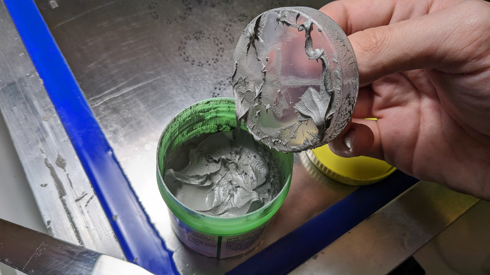

7. Remove some paste from the jar with the paddle, and spread it along the top of the stencil.

    

8. IMMEDIATELY replace the plug.

    

9. Grab the squeegee tool.

    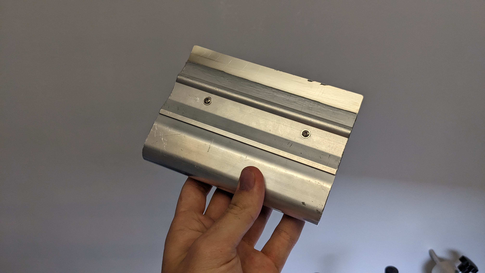

10. Align the squeegee on the stencil so that the **boltheads are facing up**.

    
    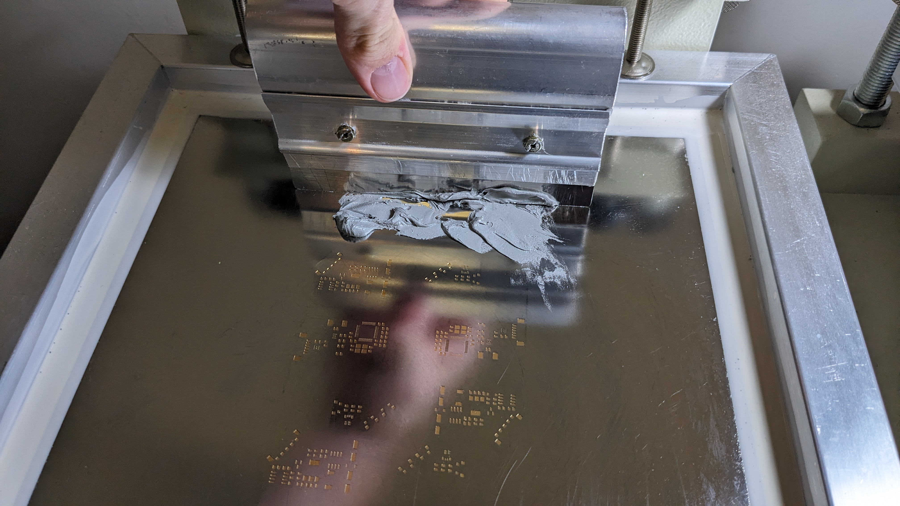

11. Squeegee paste across the panel. **Apply plenty of force**. Make sure you use the correct angle. An angle too high will result in not enough paste, and an angle too low will result in too much.

    
    
    
    

12. With a high angle, scrape up any remaining paste on the top of the stencil. Do this once in the Y axis, and twice in the X axis, covering the whole panel.

    
    

13. Lift the stencil away from the board in a smooth motion. **Do NOT bring the stencil back onto the PCB after lifting**.

    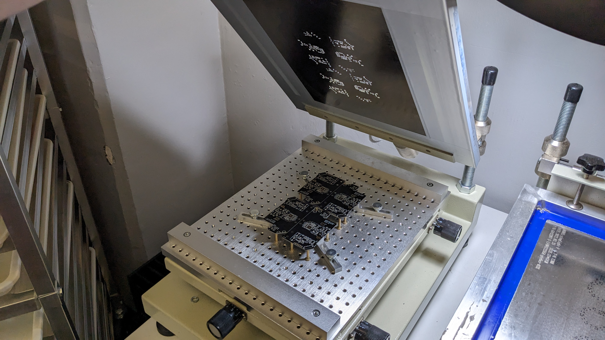

14. Inspect the paste. Make sure that there is a sufficient gap between pads. If the paste is heavily bridging, wipe off the paste and redo the process.

    
    

15. Clean the stencil like before.

    
    
    

16. Repeat the process of adding a blank panel, squeegeeing, and cleaning until the necessary amount of panels are pasted. Only paste what you are **SURE** you can populate and reflow in the same day. If you complete that number early, you can paste more boards and run more jobs, but leaving a panel pasted and not reflowed overnight is **not acceptable**.

17. If you are done pasting, scrape any remaining paste off of squeegee with the paddle, and scrape it into the **OLD Paste container**.

    
    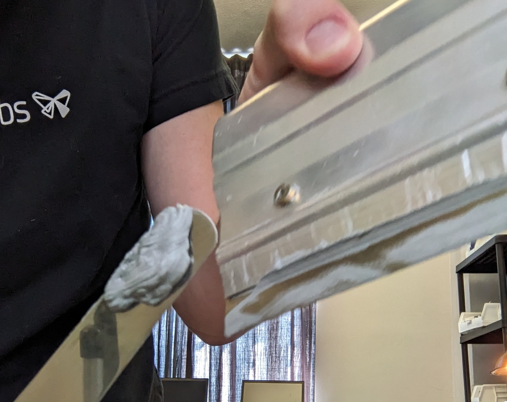
    

18. When done pasting, immediately wash your hands, and wipe down the work area. We do not use leaded solder paste at Opulo, but even the unleaded stuff isn't great to have hanging around.

    

## SMT

1. Identify the Lumen configured for feeder PCB production.

    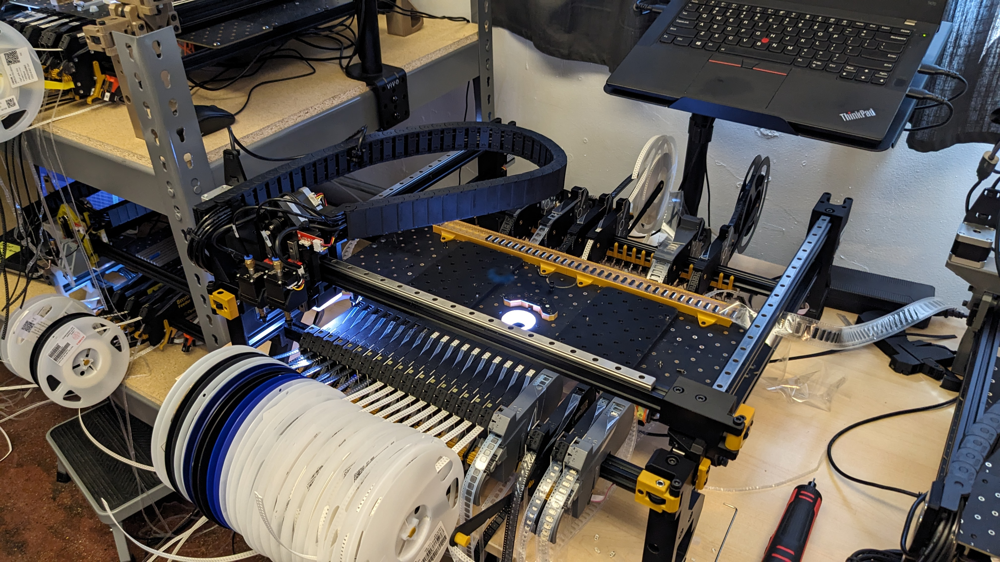

1. Place a panel onto each of the panel platters.

    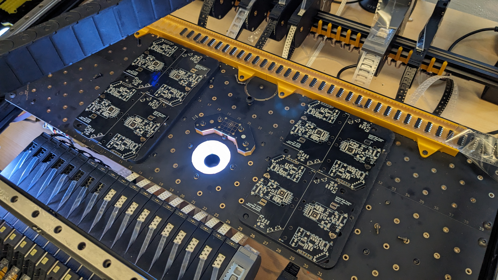

1. Use the M3x8mm screws to bolt the panel into the jig using the Populo screwdriver by the machine.

    
    
    
    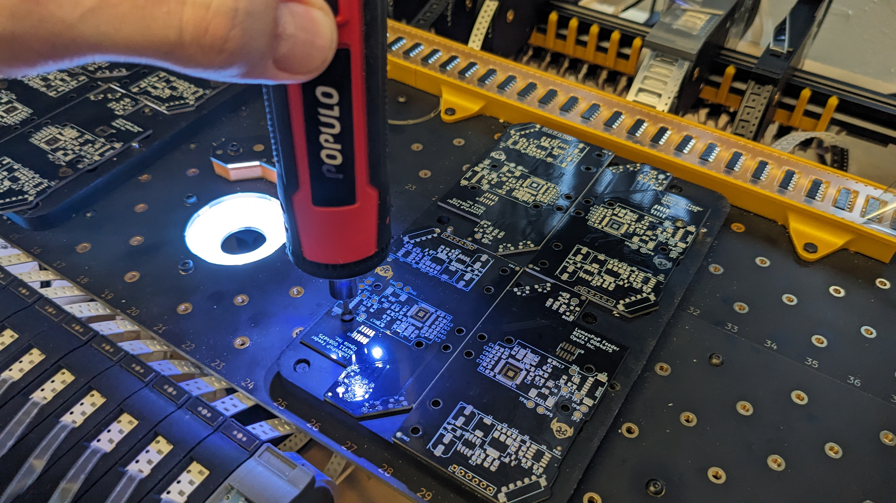

1. Log into the Thinkpad used to control the feeder Lumen.

    

1. If not already open, open OpenPnP by tapping the `Windows` key and typing "openpnp" and hitting enter.

    

2. Home the Lumen with the home icon in the bottom left of the UI.

    

3. As part of homing, the machine will find the homing fiducial. The screen should look similar to below.

    

4. The machine will also perform a nozzle tip calibration. The screen should look similar to below.

    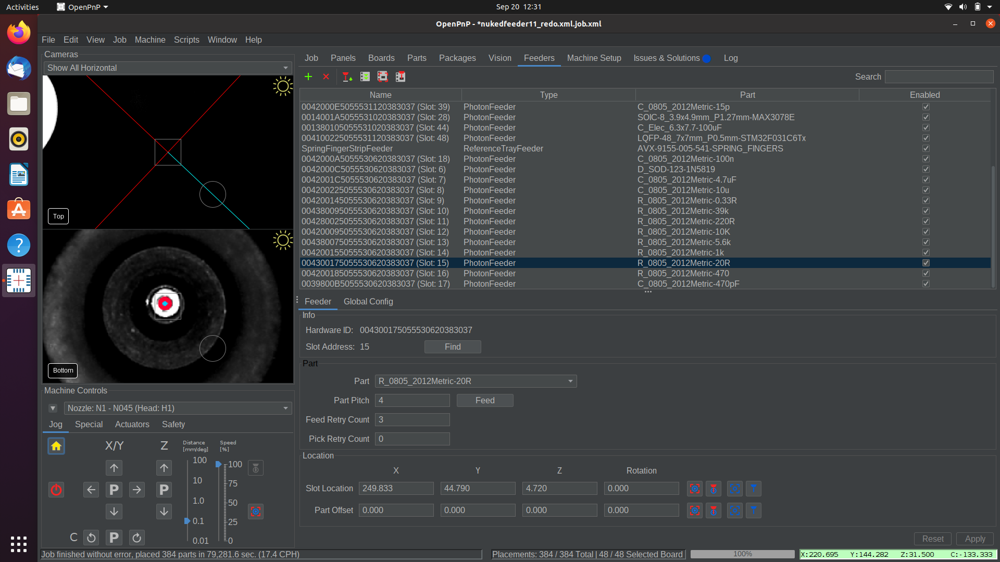

5. Click the `PLAY` icon along the top button bar.

    

6. Hit `Yes` to the reset placements popup.

    

7. The machine will perform a fiducial check. It will scan the fiducials on all 8 boards with the top camera, and use their location to get accurate placements. This will take a couple minutes. The screen should look similar to below.

    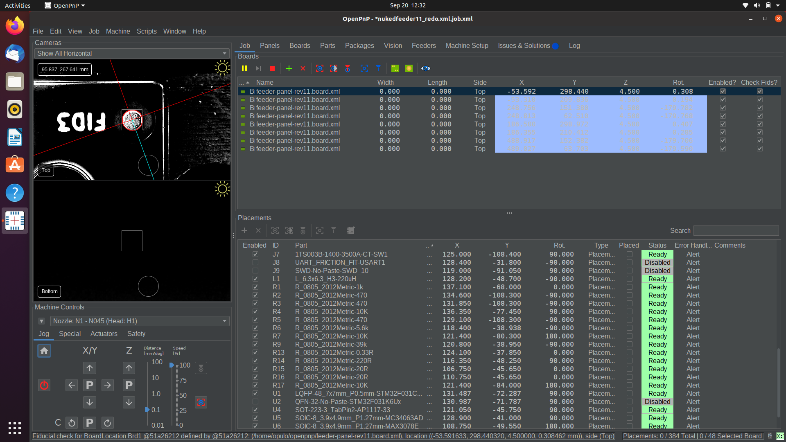

8. The machine will begin feeding a part with a feeder, pick it with the first nozzle, then feed another part, and pick it with the second nozzle. It will then hold the parts over the bottom camera to calibrate their position, then place them both. It will repeat this process until the job is done.

9. When the job is complete, remove the panels from the machine with the Populo screwdriver.

    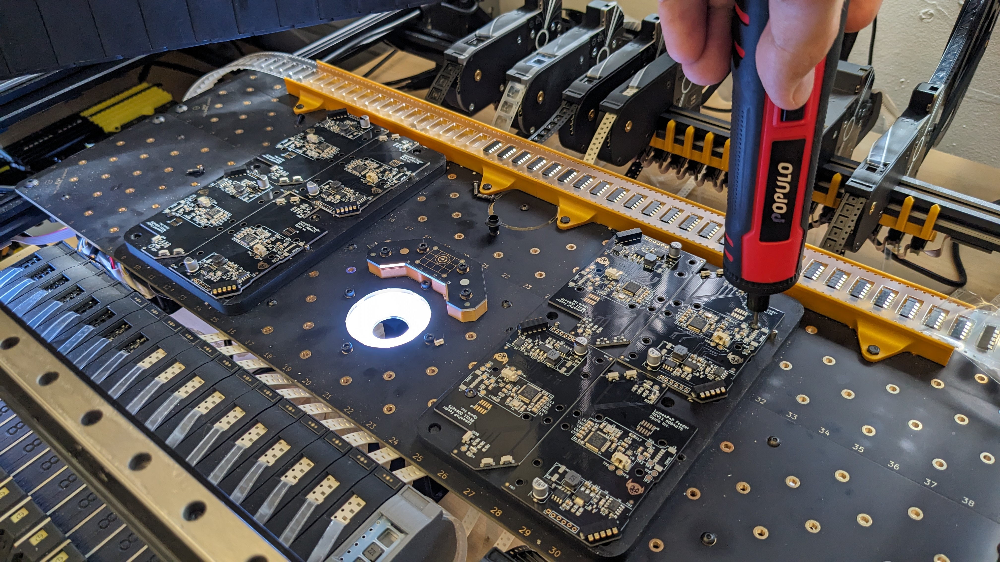

## Reflow

1. Inspect the panel for accuracy. Adjust any components necessary to ensure a successful reflow, and correct any calibration that could be causing an alignment error. Ask Stephen for help if you get stuck.

2. Insert the panel into the reflow oven.

    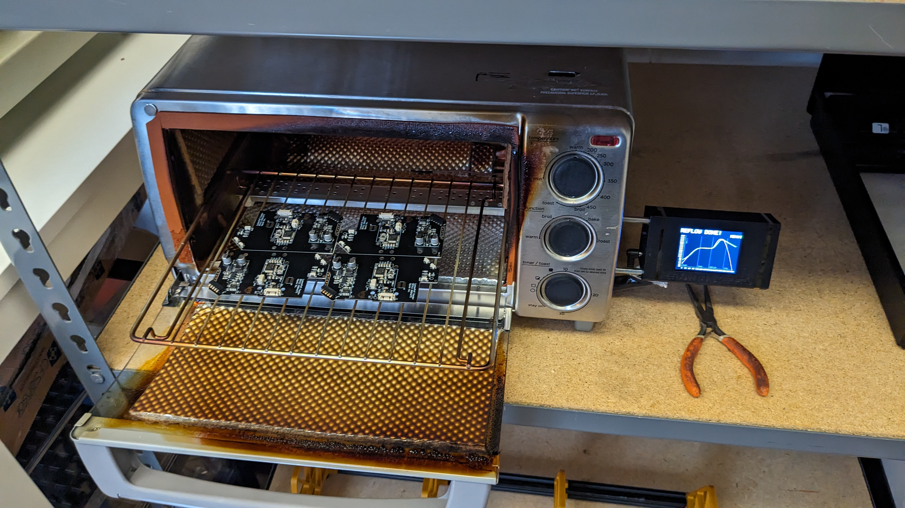

3. Press the top button to return to the menu.

    
  
4. Make sure the current setting is `Loctite GC10`, then press the top button to run the reflow cycle.

    
    

6. Work on another task until the Reflow Master beeps **and** says "REFLOW DONE!".

    

7. Using the pliers by the oven, grab the panel and place it in the `NEEDS TEST` tray in the rack.

    

8. After cooling, gently break apart the panel.

## QC

### Programming

1. Plug both motors into the board being tested.
  
    

1. While pushing down, secure the board into the jig by twisting the green retention arm, and the swiveling slot.
  
    
    

1. Lock the slot in place with the key.

    

1. Flash firmware by typing `flashphoton` into a terminal on the QC computer, then hit the enter key.

1. If you see the terminal say `Target voltage: 3.3v` at the beginning, and `[Inferior 1 (Remote target) killed]` at the end, the feeder was successfully programmed.

### Testing

With the `feeder-mobo` still loaded in the jig, check the following:

1. Tap the forward button. You should see:
   
    1. Peel motor spins.
    1. Drive motor spins forward a small amount.
    1. The LED turns pure white.
   
2. Tap the backwards button. You should see:
   
    1. Peel motor spins in the opposite direction.
    1. Drive motor spins one direction, then the other.
    1. LED turns pure white.

!!!failure "If any of this fails to happen, move the board to `NEEDS WORK`"

!!!success "If both motors move both directions, the led turns pure white, and both buttons work, move the board to `PASSED`"
  
## SMT Troubleshooting

### `Is the feeder inserted?` Error

* Find the feeder that has the `Enabled?` checkbox *unchecked*.
* In the settings menu for that feeder, click the `Find` button. Check to see that the slot address now has a number.
* Recheck the `Enabled?` checkbox for the feeder.
* Hit the play button on the job to resume.

### Mispick

* Set pick position. If it wasn't set well to begin with, try tuning it to be more accurate.
    * Select the feeder from the list under the `Feeders` tab in OpenPnP.
      
    * Click the `Move Nozzle To Position` button.
    * using the jog controls in OpenPnP, adjust the nozzle tip to be in the exact center of the part, and gently pressing into the part.
    * Capture the new, better pick position with the `Capture Nozzle Position` button.
    * Jog the nozzle up to prevent a collision.
    * Click the `Pick Part` button in OpenPnP to test the newly captured pick position.
* Check the nozzle tip for clogs.
    * If the nozzle tip has some solder paste stuck in the tip, it won't pick nearly as well.
    * Remove the nozzle tip from the nozzle, and hold it up to a light. Check to see if you can see light shining through the tip.
    * If there's a blockage, clear it with some magnet wire. If it's difficult to clear, try soaking in IPA. Ask your manager about doing this if you think it's necessary.
* Increase dwell time.
    * If the pick movement is too quick, it's possible that the pump doesn't pull enough vacuum to grab the part before moving away from the tape.
    * This can be adjusted in the OpenPnP `Machine Config` tab under the relevant nozzle tip in the `Nozzle Tips` section. Increase the value under `Pick Dwell Time`.