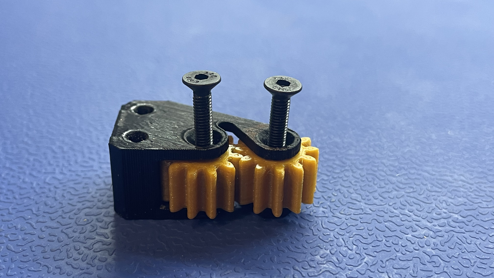
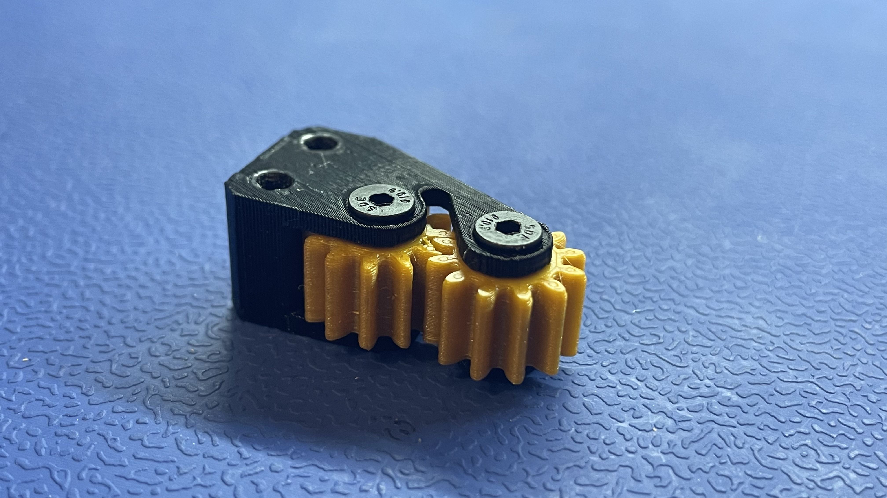

# Peel Gear Box
This section will guide the reader through the process of installing 2x `peel-gear` prints into `peel-gear-frame (FDM-00##-00)` to create `peel-gear-box (ASM-00##-00)` in preparation for its use in final assembly.

## Prepare `peel-gear-frame`
* Insert 2x `M3-hex-nut` pieces into `peel-gear-frame` with the arbor-press-jig

	
	

## Install 2x `peel-gear` into `peel-gear-frame`
* Pop the peel gears into the `peel-gear-frame`, aligning the bumps in the frame to the divots in the gears

	
	
	

* Use a torque screwdriver and a `2mm hex` bit to tighten  2x `M3x14` flathead screws into `peel-gear-frame`
	* Set the torque spec to `2 cN.m` to properly secure the peel gears

	
	
	
	
* After the screws have been torqued to spec, manually rotate the gears to check the friction
	* The tightened screws should not have add much (or any) resistance when spinning a `peel-gear` by hand
	* Loosen the screws a little bit if you observe a lot of friction in the `peel-gear-box`
	
!!! success "Your completed peel-gear-box should match the image shown below"
	
	
