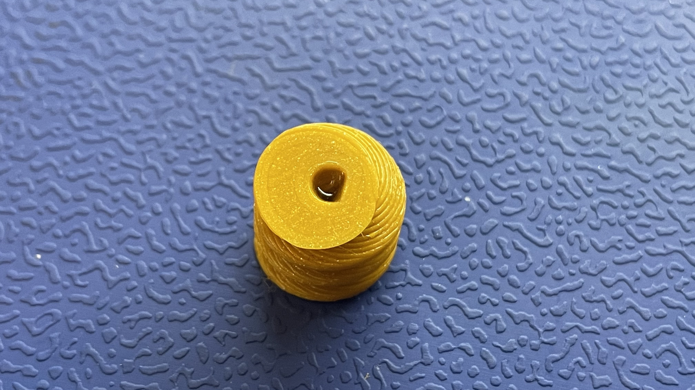
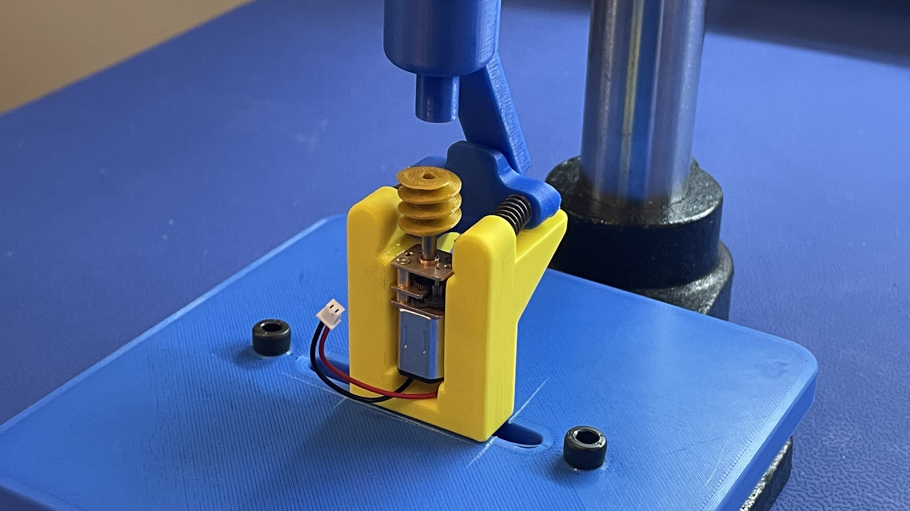
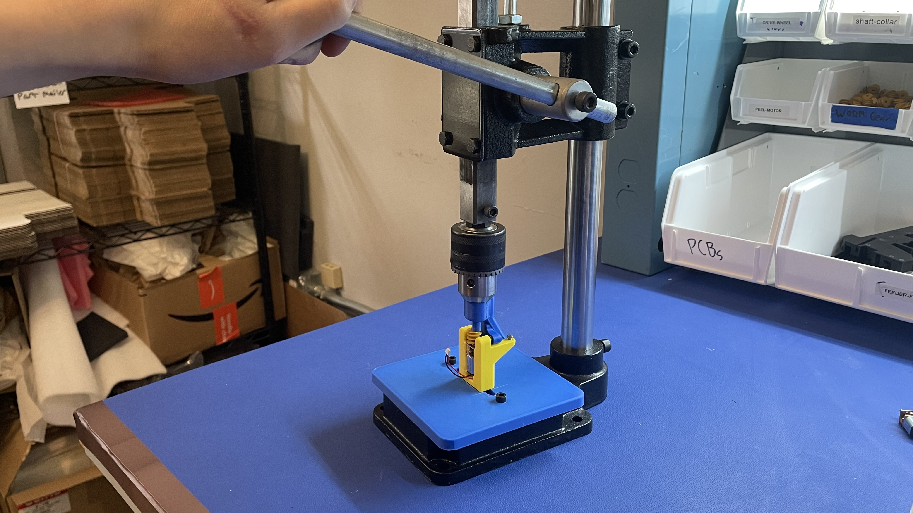
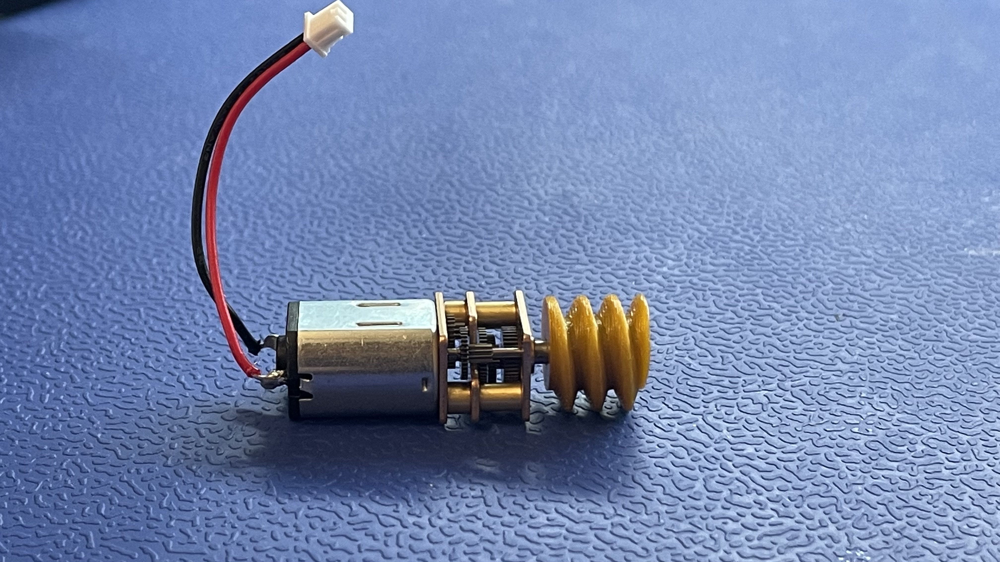

# Peel Motor Assembly

This section will guide the reader on how to properly glue the worm-gear (FDM-0058-00) onto the shaft of a peel-motor (MTR-0003-00) to create peel-motor-asm (ASM-0059-00).

* Add LOCTITE 435 Instant Adhesive to worm-gear
		
	* Dispense a few drops of LOCTITE 435 Instant Adhesive into the center hole of the worm-gear
	* Use enough adhesive for the glue to fully cover the top of the hole		
	* Lightly tap the worm-gear (with glued hole side up) against the workbench a few times to break the surface tension of the glue and get it sliding downward
* **Leading with the glued side**, manually install the worm-gear onto the first few milimeters of the peel-motor shaft

	

* Place the WIP peel-motor-asm into the arbor-press-jig

	
	

* Pull the lever of the arbor-press-jig downward to fully install the worm-gear onto the peel-motor  shaft

	!!! warning
		Only pull the lever enough to fully install the worm-gear, as excess force my damage the arbor-press-jig or peel-motor-asm!

	
		
		
* Release the arbor-press-jig lever to let the depth-stop actuate out of the way before removing the motor

	

*  Remove the completed peel-motor-asm from the arbor-press-jig 
	
	
* Move the completed peel-motor-asm to the corresponding storage bin, found at the feeder assembly workstation
