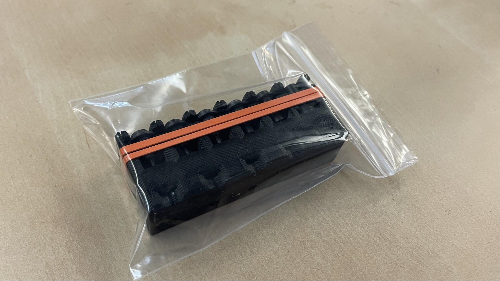
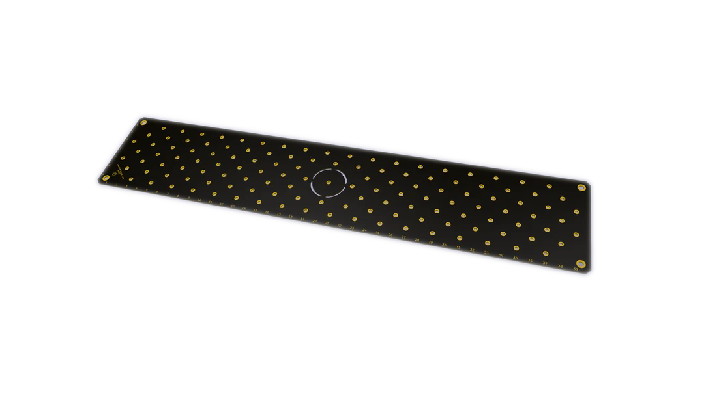
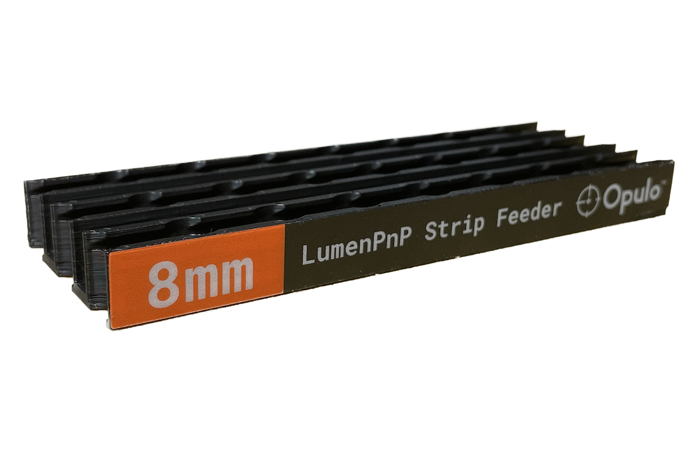

---
hide:
  - navigation
  - toc
---

# OHAI
Open Hardware Assembly Instructions for products made by Opulo Inc.
!!! note
	These instructions are maintained by and for the Opulo Manufacturing Team, and will specify the use of tools that are not apart of a regular LumenPnP  tool kit, including custom assembly jigs and QC equipment. We are constantly improving our production processes and do our best to keep these instructions up-to-date, however our team may deviate from these docs as needed.

## Assembly Standard Operating Procedures:

| | | |
|:-------------------------:|:-------------------------:|:-------------------------:|
|<a href="lumen/index.html">   LumenPnP</a> |<a href="feeder8/index.html">  8mm Feeder</a>|<a href="feeder-connection-kit/index.html">  Feeder Connection Kit</a>|
|<a href="misc/vac-and-valve-set/index.html">   Pump and Valve Kit</a> |<a href="misc/lumenpnp-toolhead-asm/index.html">  Toolhead Kit</a>|<a href="misc/cp40-noz-set/index.html">  Nozzle Tip Set</a>|
|<a href="misc/v3-pcb-kit/index.html">   PCB Kit</a> |<a href="misc/feeder-part-kit/index.html">   Feeder Part Kit</a>|<a href="misc/staging-plate-set/index.html">   Staging Plate Set</a> |
|<a href="misc/strip-feeder/index.html">   Strip Feeder</a>|<a href="placeholder2/index.html">   Placeholder 2</a>|<a href="placeholder3/index.html">   Placeholder 3</a>|

## Logistics Standard Operating Procedures:

- [Order Fulfillment SOP](operations/order-fulfillment/index.md)
- [Print Farm Managment SOP](operations/print-farm/index.md)
