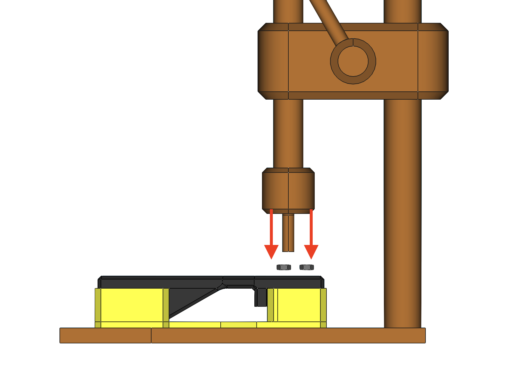

# Additional Parts

## Overview

This section of the work instructions covers the additional parts that must be packaged in a LumenPnP shipment prior to fulfillment. 

These parts and their respective quantities are as follows: 

* 1x  `bagged-extrusion-cable-clips`
* 2x `back-leg-extension` 
* 2x `front-leg-extension`
* 1x `front-drag-chain-mount`
* 1x `static-camera-foot`
* 1x `aux-staging-plate-foot`

## Work Instructions

### bagged-extrusion-cable-clips
- Place 10x `extrusion-cable-clip` pieces into a 3" x 4" plastic bag before sealing it shut
		
	
- Place each `bagged-extrusion-cable-clips` set into a  yellow NEEDS QC bin while it awaits inspection
	
- Weigh each `bagged-extrusion-cable-clips`, confirming it weighs `20g`
	 
- Place the `bagged-extrusion-cable-clips` pieces that pass weight check into a  green QC-Pass bin
	

### back-leg-extension
- Clean print of any observed stringing 
- Adhere 2x `rubber-foot` to each `back-leg-extension`, centering each in the circular cutouts
	
- Place each `back-leg-extension` into a  yellow NEEDS QC bin while it awaits inspection
	
	
### front-leg-extension
- Clean print of any observed stringing 
- Adhere 1x `rubber-foot` to each `front-leg-extension`, centering it in the circular cutout
	
- Place each `front-leg-extension` into a  yellow NEEDS QC bin while it awaits inspection
	

### front-drag-chain-mount
- Clean print of any observed stringing 
- Use an arbor press and the respective jig to insert 2x `M5-hex-nut` into `front-drag-chain-mount`
	
	
		
- Place each `front-drag-chain-mount` into a  yellow NEEDS QC bin while it awaits inspection
	

### static-camera-foot
- Clean print of any observed stringing 
- Adhere 1x `rubber-foot` to the bottom of `static-camera-foot`, centering it in the circular cutout
	
- Place each `static-camera-foot` into a  yellow NEEDS QC bin while it awaits inspection
	

### aux-staging-plate-foot
- Clean print of any observed stringing 
- Use an arbor press to insert 1x `M3-square-nut` into `aux-staging-plate-foot`
	
	
	
- Thread an `M3x14-bolt` into the top-side of `aux-staging-plate-foot`, leaving a few mm of bolt threading exposed
	
	
- Adhere 1x `rubber-foot` to the bottom of `aux-staging-plate-foot`, centering it in the circular cutout
	
- Place each `static-camera-foot` into a  yellow NEEDS QC bin while it awaits inspection
	
