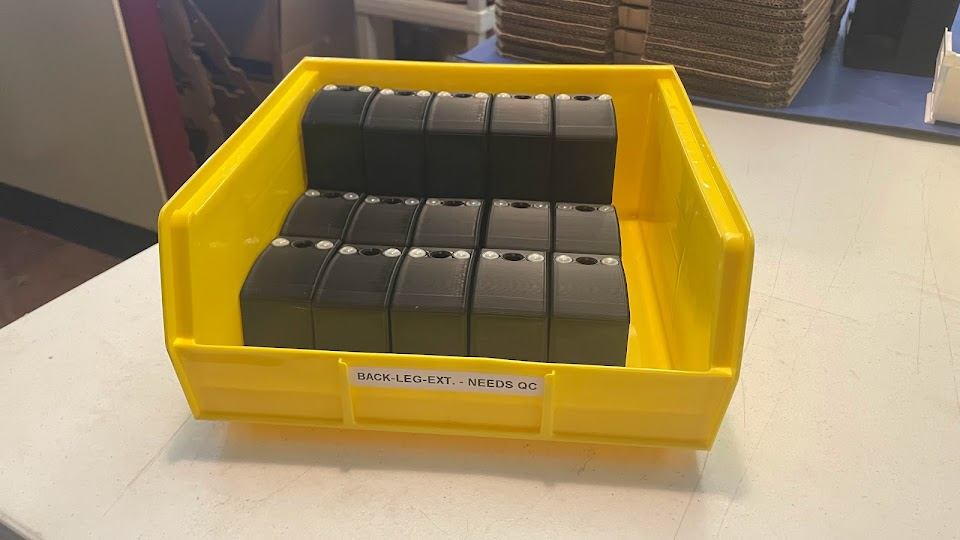
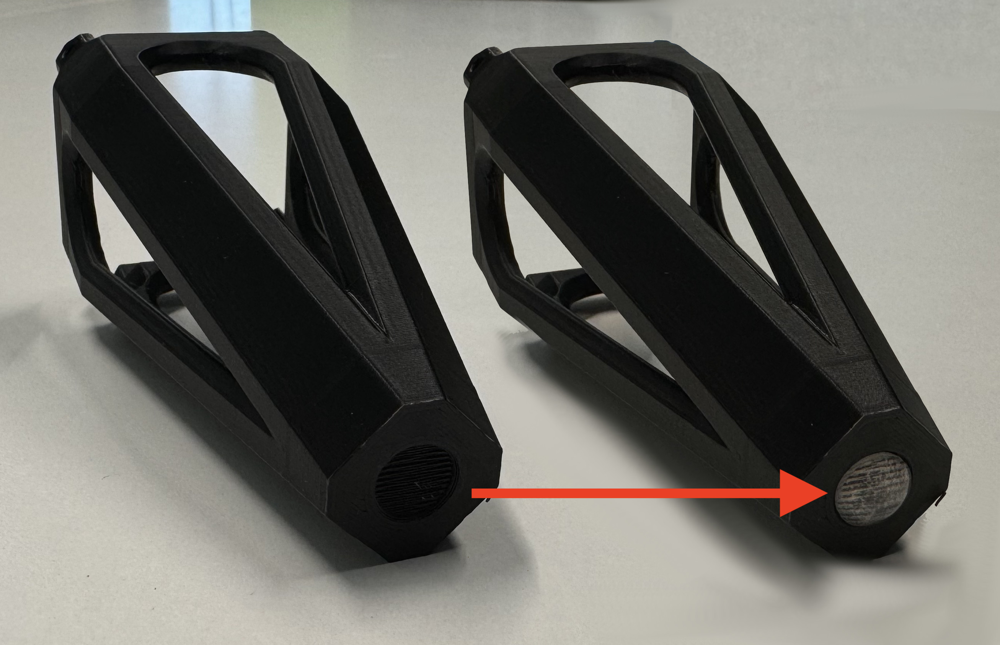
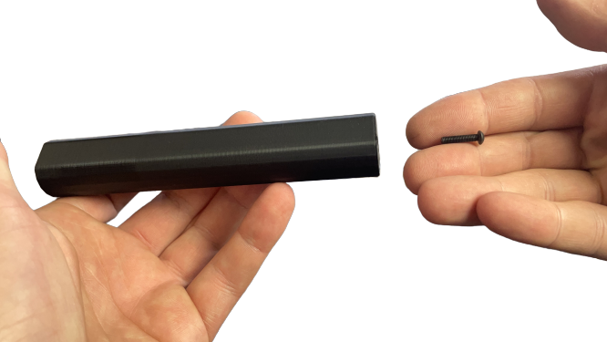
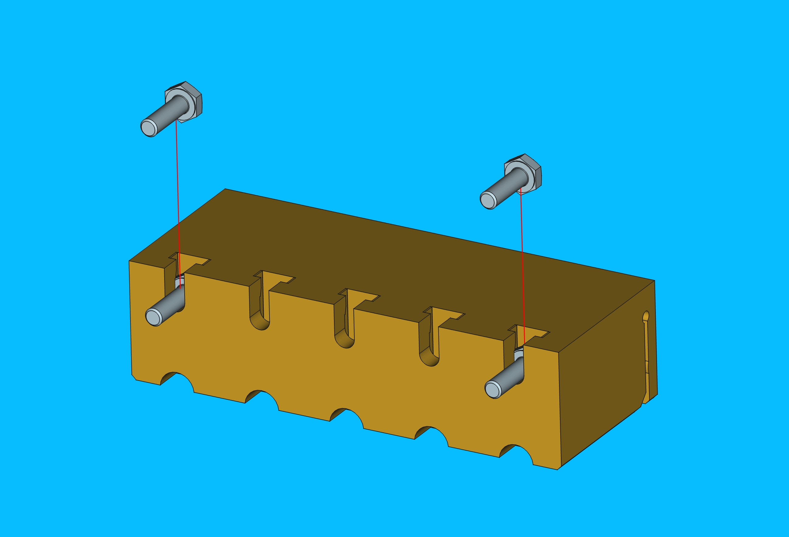

# Additional Parts

## Overview

This section of the work instructions covers the additional parts that must be packaged in a LumenPnP shipment prior to fulfillment.

These parts and their respective quantities are as follows:

- 1x `bagged-extrusion-cable-clips`
- 2x `back-leg-extension`
- 2x `front-leg-extension`
- 1x `y-limit-striker`
- 1x `static-camera-foot`
- 1x `aux-staging-plate-foot`
- 1x `nozzle-rack`

## Work Instructions

### bagged-extrusion-cable-clips
- Place 10x `extrusion-cable-clip` pieces into a `3x4-bag` before sealing it closed
	
	
- Place each `bagged-extrusion-cable-clips` set into a  yellow NEEDS QC bin while it awaits inspection
	
- Weigh each `bagged-extrusion-cable-clips`, confirming it weighs `20g`
	
- Place the `bagged-extrusion-cable-clips` pieces that pass weight check into a  green QC-Pass bin
	

### back-leg-extension
- Clean print of any observed stringing 
- Adhere 2x `rubber-foot` to each `back-leg-extension`, centering each in the circular cutouts
	
- Place each `back-leg-extension` into a  yellow NEEDS QC bin while it awaits inspection
	
	
### front-leg-extension
- Clean print of any observed stringing
- Adhere 1x `rubber-foot` to each `front-leg-extension`, centering it in the circular cutout
	
- Place each `front-leg-extension` into a  yellow NEEDS QC bin while it awaits inspection
	

### y-limit-striker
- Clean print of any observed stringing 
- Place `y-limit-striker` into its arbor press fixture
	

- Use an arbor press to insert 1x `M5-lock-nut` into `y-limit-striker`
	

- Thread a `M5-thumb-screw` into the `M5-lock-nut` previously installed into `y-limit-striker`
	

- Use a feeler gauage and tighten `M5-thumb-screw` until there is a `##mm` gap between back of screw and print
	

	!!!note "TO DO: ADD A VALUE FOR GAUGE THICKNESS"

- The completed `y-limit-striker` should match the image below
	

- Place each completed `y-limit-striker` into a  yellow NEEDS QC bin while it awaits inspection
	

### static-camera-foot
- Clean print of any observed stringing 
- Adhere 1x `rubber-foot` to the bottom of `static-camera-foot`, centering it in the circular cutout
	
- Place each `static-camera-foot` into a  yellow NEEDS QC bin while it awaits inspection
	

### aux-staging-plate-foot
- Clean print of any observed stringing
- Use an arbor press to insert 1x `M3-square-nut` into `aux-staging-plate-foot`
	
	
	
- Thread an `M3x14-bolt` into the top-side of `aux-staging-plate-foot`, leaving a few mm of bolt threading exposed
	
	
- Adhere 1x `rubber-foot` to the bottom of `aux-staging-plate-foot`, centering it in the circular cutout
	
- Place each `aux-staging-plate-foot` into a  yellow NEEDS QC bin while it awaits inspection
	

### nozzle-rack

- Insert 2x `m3-hex-head-bolt` into the left and right outermost slots on `nozzle-rack`

    

- Place a `M3-wing-nut` onto each `m3-hex-head-bolt`

    

- Install all 6 different nozzles onto `nozzle-rack`, ensuring that each nozzle can pop in and out relatively easily

 	

- Place a `rubber-band` around `nozzle-rack` to secure each nozzle in place

	

- Place the completed `nozzle-rack` into a `2x3-bag` before sealing it shut

	
	

- Place the completed `nozzle-rack` assemblies in a bin on the packout shelf while they await future use
