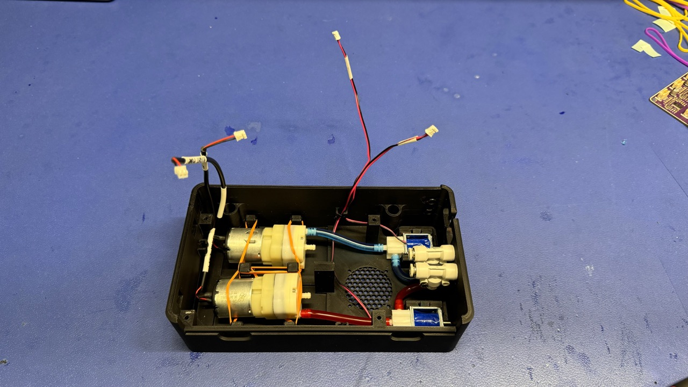

# LumenPnP Control Box
## Introduction
The purpose of these work instructions is to cover the assembly process for the LumenPnP's Control Box. This assembly is used by the LumenPnP to contain its microcontroller and pnumatics system.

## Assemble `control-box`

