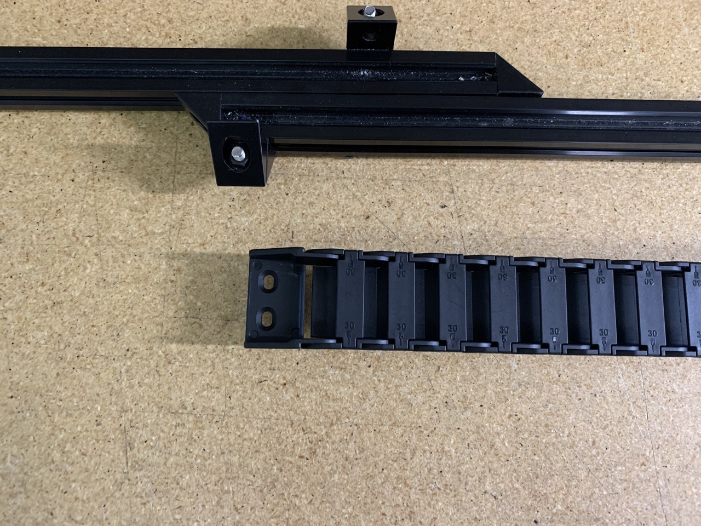
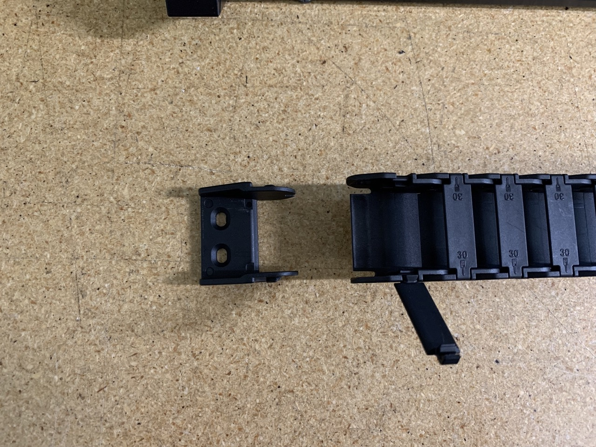
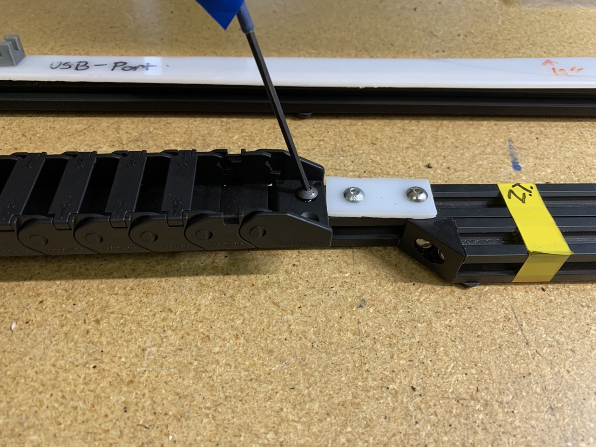
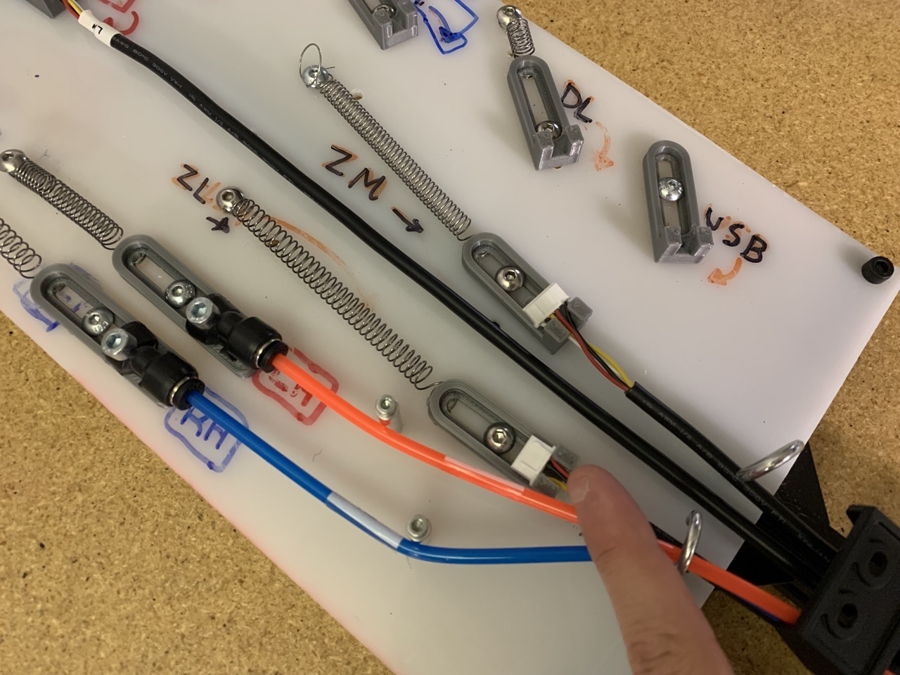
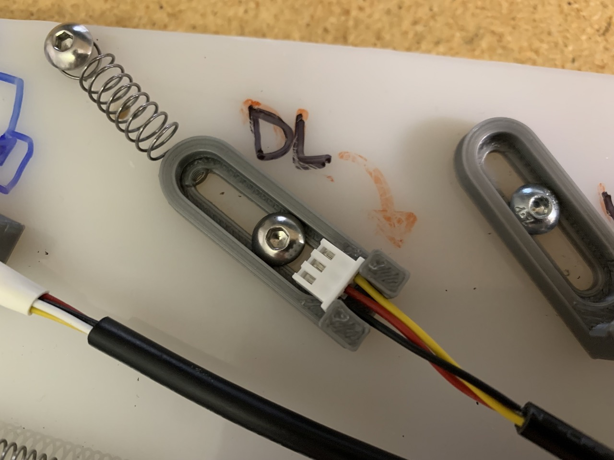
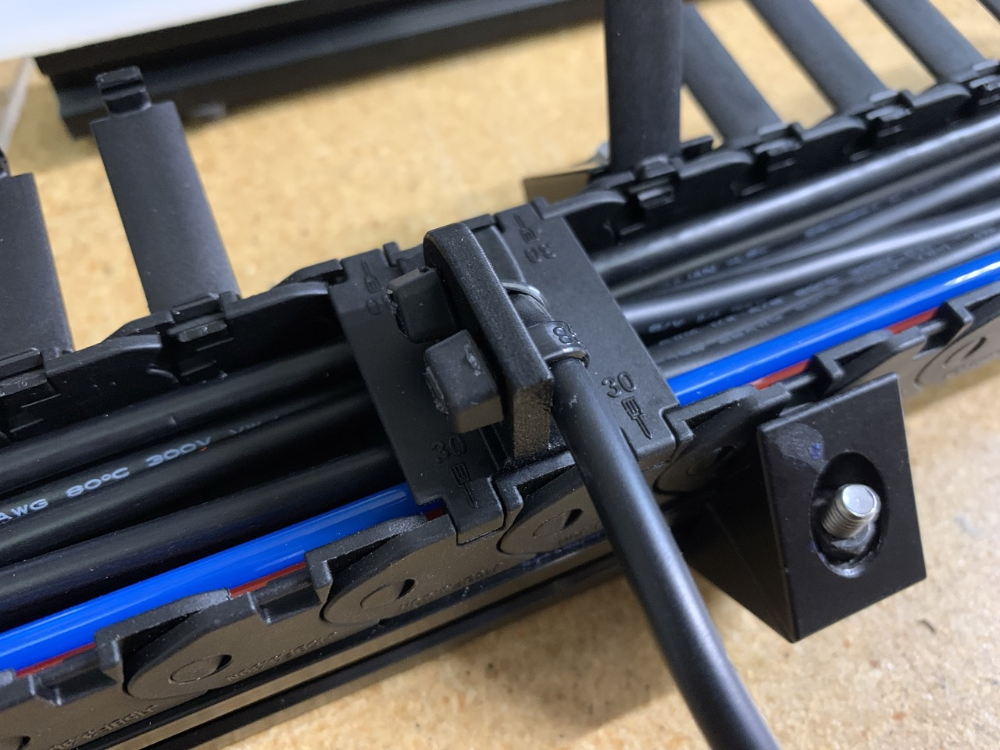
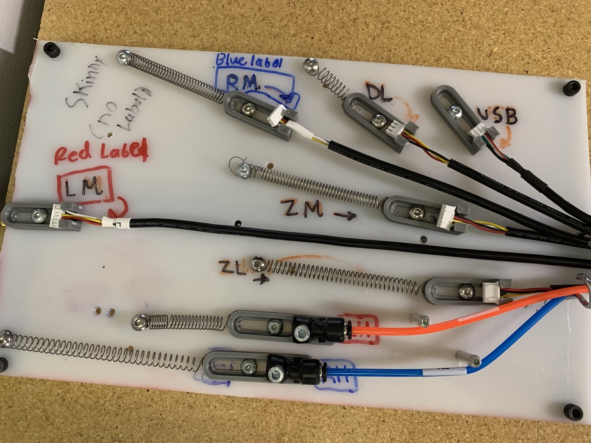
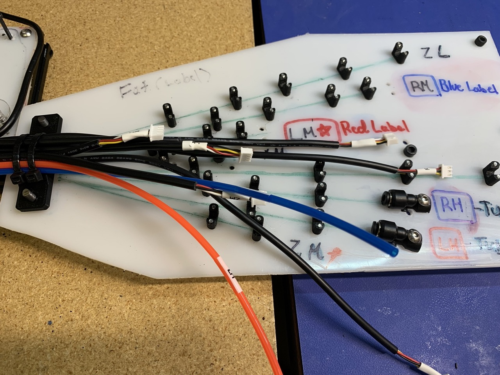
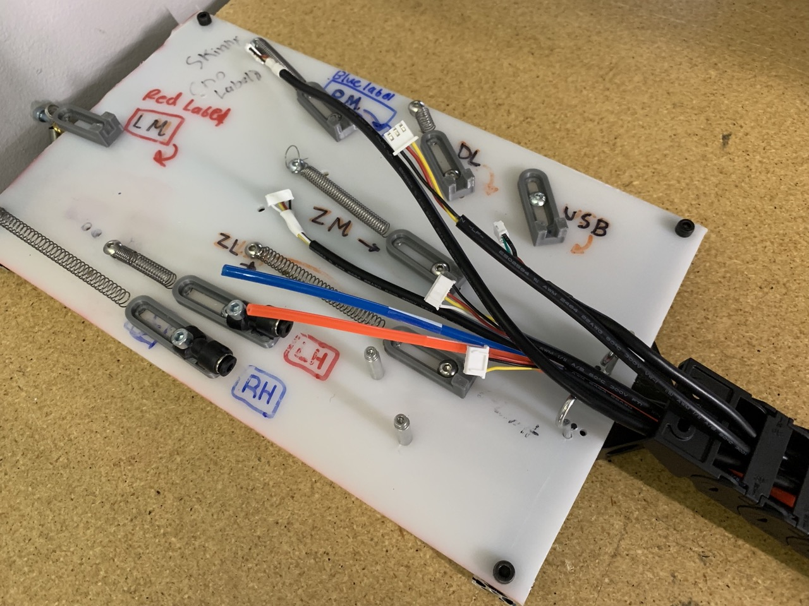

# Drag Chain Assembly

This section will guide the reader on how to properly assemble the LumenPNP v3.1 Drag Chain Assembly

## Preparing the Drag Chain

1. Obtain your drag chain

    

1. Remove end link of drag chain

    

1. Reinstall end link, reverse its orientation so the screw mounting face is towards the drag chain covers

    

##Assembling the Drag Chain

1. Mount the drag chain onto the cable routing jig. Ensure the side with the end link in the original orientation is faced towards the motherboard end of the cable routing jig, and the side with the end link reversed from the previous step is faced towards the X Gantry side of the jig. 

1. Fix in place with a screw on the motherboard side end link

    

1. Use the drag chain opening tool to open the covers of the drag chain. Open these covers as far as possible for maximum access

    
    
    

1. Install the `umbilical-cable-strain-relief` on the motherboard side of the cable routing jig

    

1. Install 2 zip ties on the `umbilical-cable-strain-relief`

    

## Routing the Cables

1. Install LM Cable

    
    

1. Install RH Tube

    
    

1. Install LH Tube

    
    

1. Install ZM Cable

    
    

1. Install ZL Cable 

    
    

1. Install RM Cable 

    
    

1. Install DL Cable. This cable is routed through the chain differently from the rest, with the cable exiting between the final cover and the end link. See image for example

    
    
    

1. Install USB Cable. Route this cable the same as the DL Cable from the previous step, with the cable exiting the drag chain between the final cover and end link

    
    
    

1. Prepare `x-cable-chain-bracket`. Ensure the retaining end of the zip tie is opposite the side the the bracket that the XM cable is run through, as shown

    

1. Install XM cable onto right side of the cable routing jig

    

1. Route XM Cable through the zip ties and the retaining slot of `x-cable-chain-bracket`. Cable retaining slot of the bracket should face towards the motherboard side of the drag chain, with the XM cable exiting towards the user once in final position. 

    

1. Install the bracket between the 12th and 13th drag chain covers. Slide the drag chain covers into the slots in the side of `x-cable-chain-bracket`

1. Close the drag chain covers holding the `x-cable-chain-bracket` in place. Pull XM cable through until slack is removed. 

    

1. Tighten zip ties on `x-cable-chain-bracket`, then cut off excess. 

    

1. Install 3 zip ties around all cables between the drag chain and the motherboard end of the cable routing jig. Locations are marked with yellow tape on the jig. Cut off excess after tightening

    

1. Tighten 2 zip ties on `umbilical-cable-strain-relief`, then cut off excess

    

1. Close all drag chain covers that are not already closed

    

1. Prepare `x-motor-cable-guide` by running 2 zip ties through it, as shown

    

1. Run XM cable through the looped end of the zip ties on `x-motor-cable-guide` in the orientation shown. Ensure the side of the connector with two lines is facing away from the print. Tighten zip ties and cut off excess

    
    

1. Ensure all cables are present, and your assembly looks like the example shown

    Right (Motherboard) side

    

    Left (X Gantry) Side

    

1. If your assembly looks like the examples, remove all cables and tubes from their mounting features

    
    

1. Remove umbilical cable strain relief from its mounting posts

    

1. Remove screw holding drag chain in place. You may now remove the drag chain from the cable routing jig. 

    

## OQC Checks

	
* Inspect the *x-gantry side* of `drag-chain` and confirm the following cables are present and installed in the correct direction

	!!!info "A quick way to tell which side of the `drag-chain` is the *x-gantry side*: it is the side where the cables are shorter exiting the `drag-chain`"
	
	*  `LM` cable: 6-pin connector with `LM` label
	*  `RM` cable: 6-pin connector with `RM` label
	*  `ZM` cable: 6-pin connector with **NO** label
	*  `ZL` cable: 3-pin connector with **NO** label
	*  	`DL` cable: 3-pin connector with **NO** label, exits `drag-chain` between end-link and final cover
	*  	`USB` cable: 4-pin connector with **NO** label, exits `drag-chain` between end-link and final cover
	
* Inspect the `drag-chain` and confirm the following tubes are present and labeled correctly on both sides
	*  	**Red** `4mm-pneumatic-tubing` with `LH` label
	*  	**Blue** `4mm-pneumatic-tubing` with `RH` label
* Confirm `zip-tie`'s are trimmed flush and present in the following locations:
	*  2x on `umbilical-cable-strain-relief`
	*  2x on `x-cable-chain-bracket` where `XM` cable leaves the drag-chain
		* While here, confirm that `XM` cable exits `drag-chain` in place of the 12th `drag-chain-cover`
	*  2x connecting `x-motor-cable-guide` to end of `XM` cable
	*  3x evenly spaced between `drag-chain` and `umbilical-cable-strain-relief`

!!!success "If all checks pass, place the completed `drag-chain` into a  yellow NEEDS QC bin found on the pack-out shelf while it awaits peer-review"
