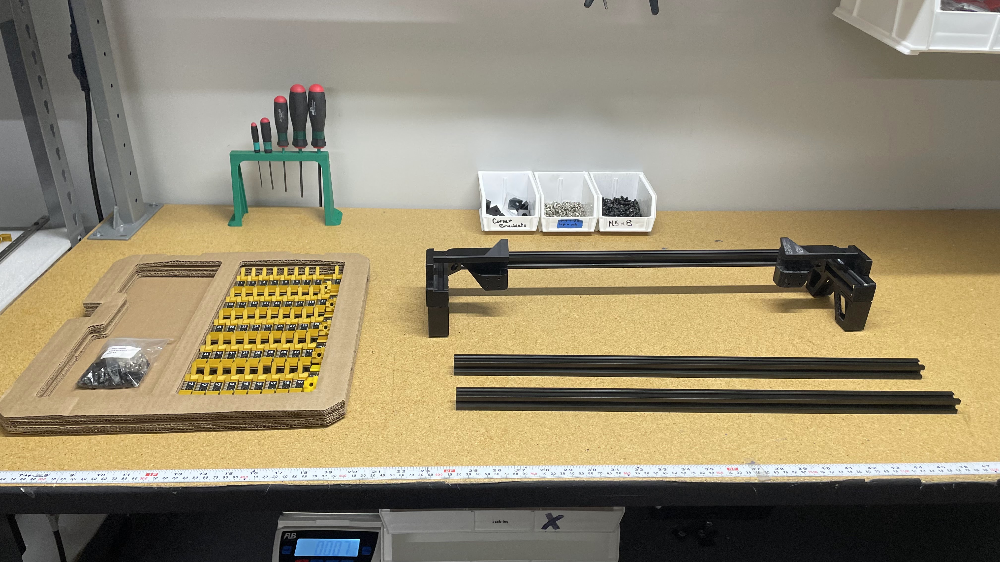
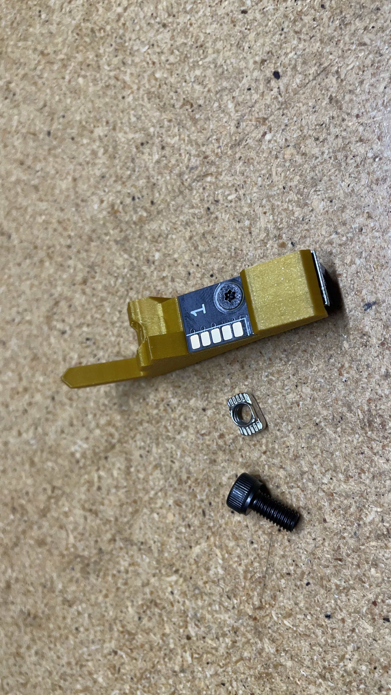
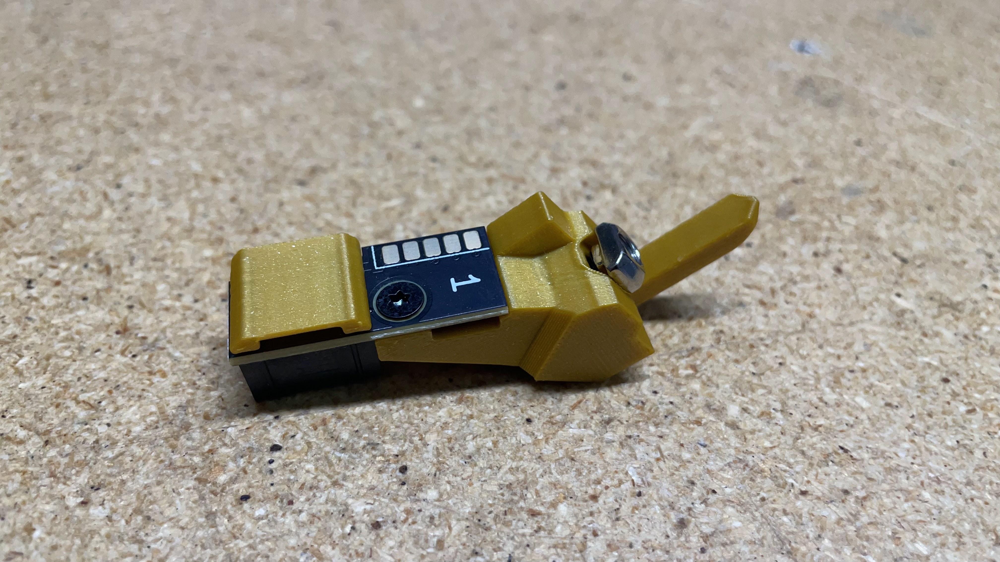
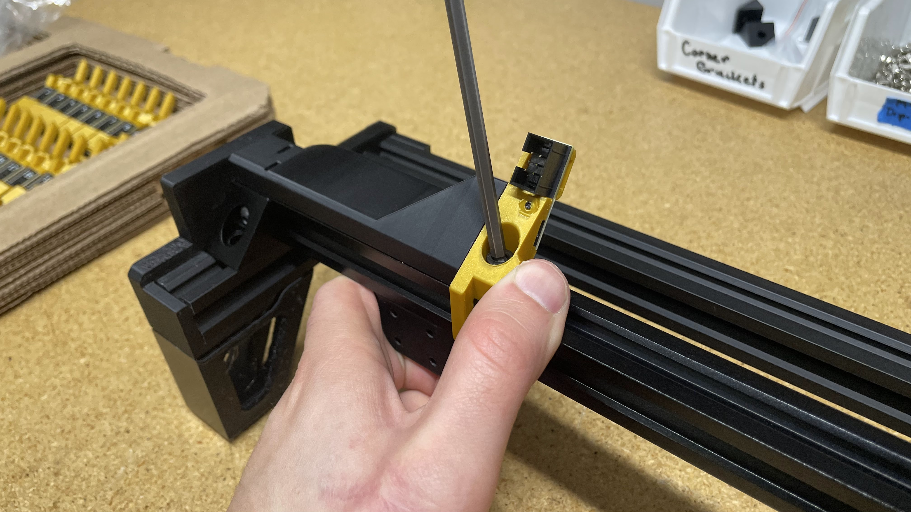
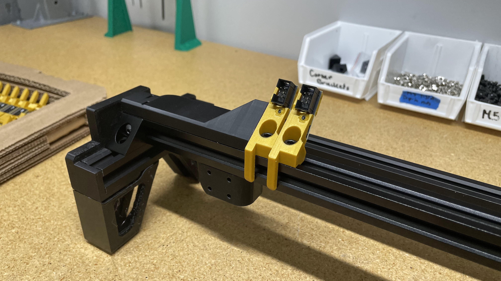
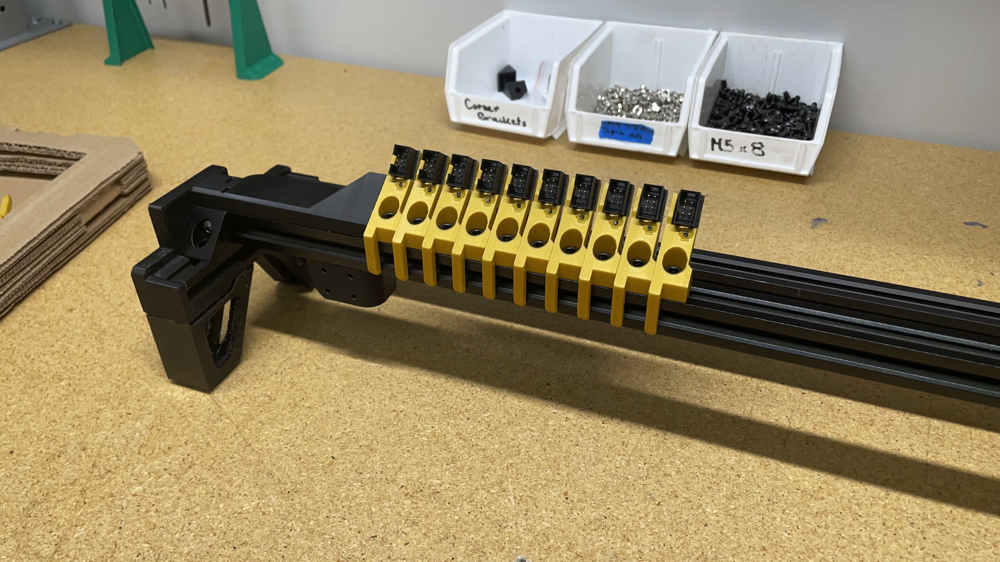
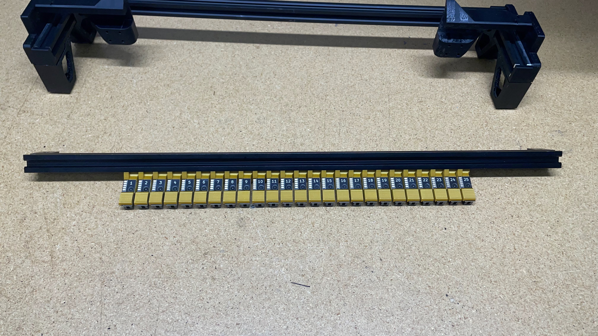
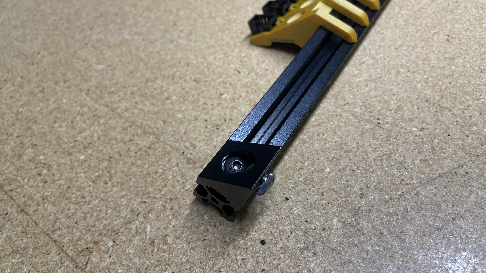

#Front-feeder-rail / Rear-feeder-rail

## Introduction
The purpose of these work instructions is to cover the assembly process for the LumenPnP's front and rear feeder rail. These rails are used by the LumenPnP to space its two y-gantry assemblies apart. These rails also allow for auto feeders to be installed onto the LumenPnP and electronically connected via the 50x mounted feeder slots.

Before:
   
   

After:
 
   

## Assemble front-feeder-rail
### Insert extrusion into assembly jig
1. Insert a piece of `2020-alu-extrusion` into the `feeder-rail-asm-jig`
	
	
	

### Install corner brackets
2. Loosely install a `M5x8-bolt` and `M5-t-nut` onto 2x `corner-bracket` 
	
	
3. Position a `corner-bracket` onto the front left side of the `2020-alu-extrusion` previously placed in the `feeder-rail-asm-jig` 
	
	
4. Press the `corner-bracket` downward and inward (towards the sidewall of the jig) while tightening the `M5x8-bolt` to `0.7N/M`
	
5. Repeat the previous two steps on the opposite side of `2020-alu-extrusion`  
	
6. Confirm the WIP `front-feeder-rail` matches the image below
	

### Install feeder slots
7. Collect a `feeder-slot-set` and `feeder-slot-hardware-set` from inventory
	
8. Empty the contents of the `feeder-slot-hardware-set` into the empty cavity of the `feeder-accessory-tray`
	
9. Install fasteners onto `Slot #1`
    * Begin by placing an `M5x10-bolt` through the `slot-bracket` print before loosely threading a `M5-t-nut` onto the end of the bolt
	
	 
	 
	
10. Install `Slot #1` onto the front left side of the `2020-alu-extrusion`
    * Press `Slot #1` downward and inward (towards the sidewall of the jig) while tightening the `M5x10-bolt` to `0.7N/M`
	
	
	

11. Repeat the two previous steps to install `Slot #2` - `#Slot 25`
	
	
	

### Install additional fasteners
12. Pull the WIP `front-feeder-rail` outward to remove it from `feeder-rail-asm-jig`
	

13. Install an additional `M5x8-bolt` and `M5-t-nut` into each `corner-bracket` 
    * These bolts should be installed hand-tight (`<0.2N/M`) 
	
	
	
	
	

### OQC
Perform the following quality control checks:

* `Slot #1` - `#Slot 25` are installed sequentially from left to right
* Wiggle all of the installed slots to ensure none are loose, retightening any if needed
* **2x** additional `M5x8-bolt` and `M5-t-nut` are installed into each `corner-bracket` 
* The 2x installed `corner-bracket` pieces are flush to the `2020-alu-extrusion`

## Assemble rear-feeder-rail
This section of the work instruction will be a little less detailed than the above section on `front-feeder-rail` as it builds off the same process.

### Insert extrusion into assembly jig
1. Insert a piece of `2020-alu-extrusion` into the `feeder-rail-asm-jig`
	
	
	

### Install corner brackets
1. Loosely install a `M5x8-bolt` and `M5-t-nut` onto 4x `corner-bracket` 
	
	
2. Position a `corner-bracket` onto the front left side of the `2020-alu-extrusion` 
	
	
3. Press the `corner-bracket` downward and inward (towards the sidewall of the jig) while tightening the `M5x8-bolt` to `0.7N/M`
	
4. Repeat the previous two steps on the opposite side of `2020-alu-extrusion`  
	
5. Confirm the WIP `rear-feeder-rail` matches the image below before proceeding to install 2x `corner-bracket` on the backside of the `2020-alu-extrusion`
	
6.	Position a `corner-bracket` onto the back right side of the `2020-alu-extrusion` 
	
	

7. Press the `corner-bracket` downward and inward (towards the sidewall of the jig) while tightening the `M5x8-bolt` to `0.7N/M`
	
	
8. Repeat the previous two steps to install a `corner-bracket` onto the back left side of `2020-alu-extrusion`  
	
9. Confirm the WIP `rear-feeder-rail` matches the image below
	

### Install feeder slots

1. Install fasteners onto `Slot #26`
    * Begin by placing an `M5x10-bolt` through the `slot-bracket` print before loosely threading a `M5-t-nut` onto the end of the bolt

	

2. Install `Slot #26` onto the left side of `2020-alu-extrusion`
    * Press `Slot #26` downward and inward (towards the sidewall of the jig) while tightening the `M5x10-bolt` to `0.7N/M`
	
	
	

3. Repeat the two previous steps to install `Slot #27` - `#Slot 50`
	
	 
	
	

### Install additional fasteners
1. Pull the WIP `rear-feeder-rail` outward to remove it from `feeder-rail-asm-jig`
	
2.  Install **2x** additional `M5x8-bolt` and `M5-t-nut` into each `corner-bracket` 
    * These bolts should be installed hand-tight (`<0.2N/M`) 
	
	
	

### OQC
Perform the following quality control checks:

* `Slot #26` - `#Slot 50` are installed sequentially from left to right
* Double-check that `#Slot 50` is printed in yellow plastic
* Wiggle all of the installed slots to ensure none are loose, retightening any if needed
* **4x** additional `M5x8-bolt` and `M5-t-nut` are installed into each `corner-bracket` 
* The 4x installed `corner-bracket` pieces are flush to the `2020-alu-extrusion`

