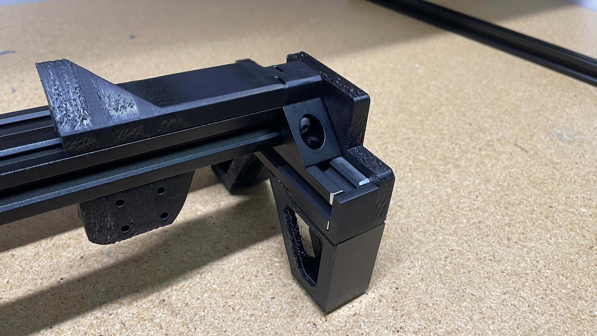
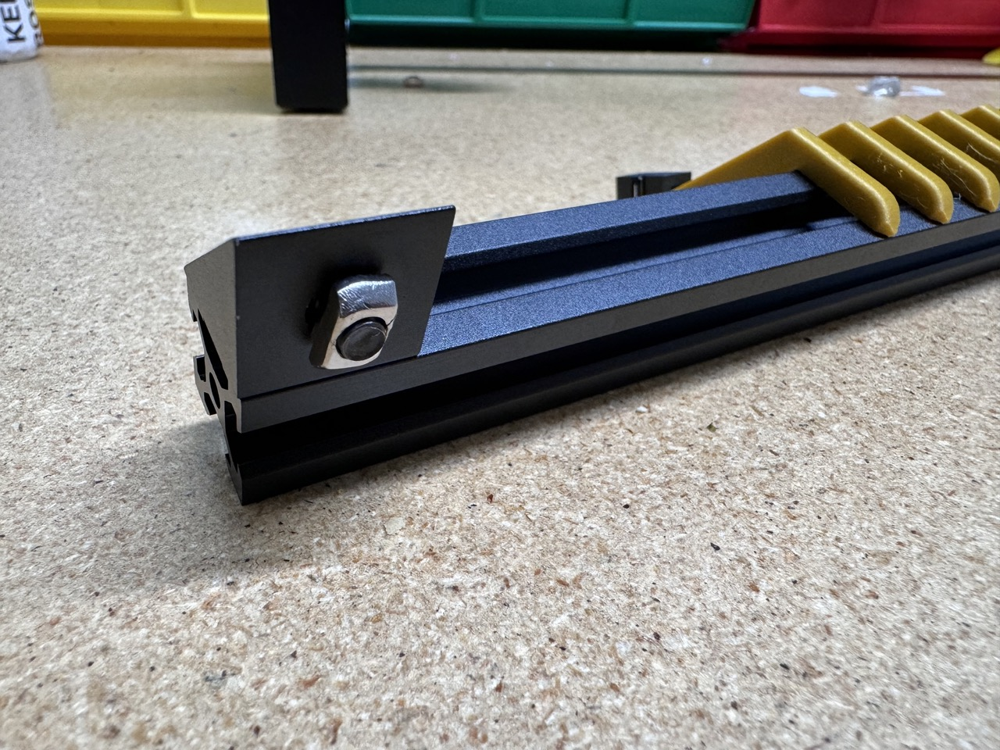
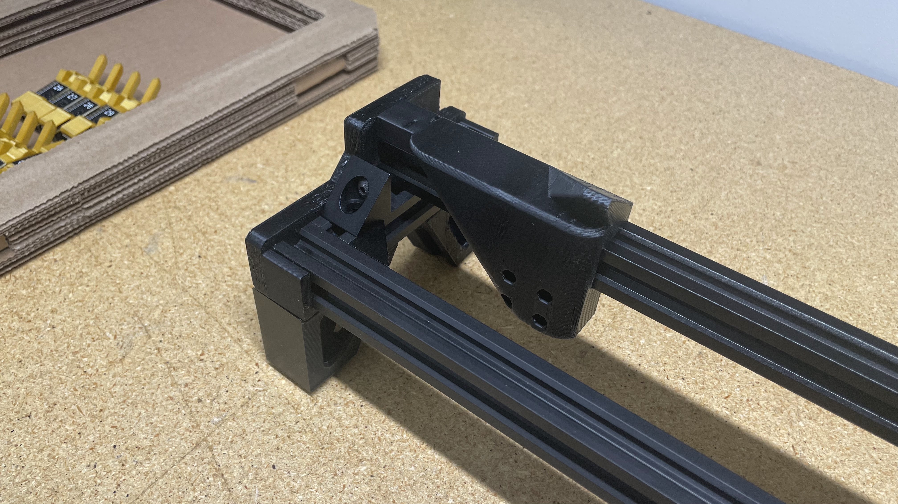
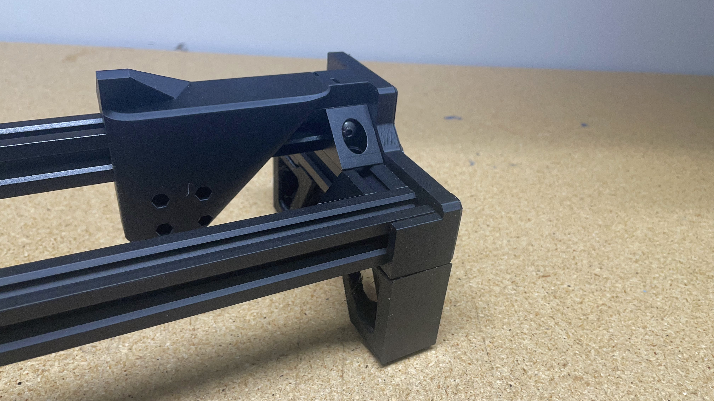

#Feeder Rail (Front and Rear)
## Introduction
The purpose of these work instructions is to cover the assembly process for the LumenPnP's front and rear feeder rail. These rails are used by the LumenPnP to space its two y-gantry assemblies apart. These rails also allow for auto feeders to be installed onto the LumenPnP and electronically connected via the 50x mounted feeder slots.

Before:
   

After:
	
   
## Assemble front-feeder-rail
### Insert extrusion into assembly jig
1. Insert a piece of `2020-alu-extrusion` into the `feeder-rail-asm-jig`
	
	
	

### Install corner brackets
2. Loosely install a `M5x8-bolt` and `M5-t-nut` onto 2x `corner-bracket` 
	
	
3. Position a `corner-bracket` onto the front left side of the `2020-alu-extrusion` previously placed in the `feeder-rail-asm-jig` 
	
	
4. Press the `corner-bracket` downward and inward (towards the sidewall of the jig) while tightening the `M5x8-bolt` to `0.7N/M`
	
5. Repeat the previous two steps on the opposite side of `2020-alu-extrusion`  
	
6. Confirm the WIP `front-feeder-rail` matches the image below
	

### Install feeder blades
7. Collect a `feeder-blade-set` from inventory
	
	
10. Install Feeder Slot Blade (#1 - #12) onto the front left side of the `2020-alu-extrusion`
    * Press the blade assembly downward and inward (towards the sidewall of the jig) while tightening the 5x `M5x10-bolt` to `0.7N/M`, starting with the center screw and tighening the screws in pairs moving outwards
	
	
	
11. Repeat the two previous steps to install Feeder Slot Blade (#13 - #25)
	
	

### Install additional fasteners
12. Pull the WIP `front-feeder-rail` outward to remove it from `feeder-rail-asm-jig`
	

13. Install an additional `M5x8-bolt` and `M5-t-nut` into each `corner-bracket` 
    * These bolts should be installed hand-tight (`<0.2N/M`) 
	
	

### OQC
Perform the following quality control checks:

* Feeder blades are installed sequentially from left to right
* Wiggle the installed blades to ensure no screws are loose, retightening any if needed
* Ensure the print is free of defects and fits flush to `2020-alu-extrusion
* Confirm the slit in the `2x3-idc-connector` faces towards the left of the `feeder-slot`
* The 2x installed `corner-bracket` pieces are flush to the `2020-alu-extrusion`
* The 2x installed `corner-bracket` pieces each have a spare `M5x8-bolt` and `M5-t-nut` installed into the unused holes
	* Total 2x `M5x8-bolt` and `M5-t-nut`

!!!success "If all checks pass, bring the completed `front-feeder-rail` to the shelf for peer-review and pack-out."

## Assemble rear-feeder-rail
This section of the work instruction will be a little less detailed than the above section on `front-feeder-rail` as it builds off the same process.

### Insert extrusion into assembly jig
1. Insert a piece of `2020-alu-extrusion` into the `feeder-rail-asm-jig`
	
	
	

### Install corner brackets
1. Loosely install a `M5x8-bolt` and `M5-t-nut` onto 4x `corner-bracket` 
	
	
2. Position a `corner-bracket` onto the front left side of the `2020-alu-extrusion` 
	
	
3. Press the `corner-bracket` downward and inward (towards the sidewall of the jig) while tightening the `M5x8-bolt` to `0.7N/M`
	
4. Repeat the previous two steps on the opposite side of `2020-alu-extrusion`  
	
5. Confirm the WIP `rear-feeder-rail` matches the image below before proceeding to install 2x `corner-bracket` on the backside of the `2020-alu-extrusion`
	
6.	Position a `corner-bracket` onto the back right side of the `2020-alu-extrusion` 
	
	

7. Press the `corner-bracket` downward and inward (towards the sidewall of the jig) while tightening the `M5x8-bolt` to `0.7N/M`
	
	
8. Repeat the previous two steps to install a `corner-bracket` onto the back left side of `2020-alu-extrusion`  
	
9. Confirm the WIP `rear-feeder-rail` matches the image below
	

### Install feeder blades

2. Install Feeder Slot Blade (#26 - #37) onto the left side of `2020-alu-extrusion`
    * Press the blade downward and inward (towards the sidewall of the jig) while tightening the 5x `M5x10-bolt` to `0.7N/M`, starting with the center screw and tighening the screws in pairs moving outwards
	
	
	

3. Repeat the two previous steps to install Feeder Slot Blade (#38 - #50)
	
	

### Install additional fasteners
1. Pull the WIP `rear-feeder-rail` outward to remove it from `feeder-rail-asm-jig`
	
2.  Install **2x** additional `M5x8-bolt` and `M5-t-nut` into each `corner-bracket` 
    * These bolts should be installed hand-tight (`<0.2N/M`) 
	
	
### OQC
Perform the following quality control checks:

* Feeder blades are installed sequentially from left to right
* Wiggle the installed blades to ensure none are loose, retightening any if needed
* The 2x installed `corner-bracket` pieces are flush to the `2020-alu-extrusion`
* Confirm the slit in the `2x3-idc-connector` faces towards the left of the `feeder-slot`
* The 4x installed `corner-bracket` pieces are flush to the `2020-alu-extrusion`
* The 4x installed `corner-bracket` pieces each have a spare `M5x8-bolt` and `M5-t-nut` installed into the unused holes
	* Total 4x `M5x8-bolt` and `M5-t-nut`

!!!success "If all checks pass, bring the completed `rear-feeder-rail` to the shelf for peer-review and pack-out."
