# LumenPnP Motherboard (REV04)

This section will guide the reader on how to properly assemble and test a `mobo` for further use in the LumenPnP.

## Solder Paste

1. Inspect the stencil. Make sure all the voids are clear of debris and solder paste.
   
    {: style="height:350px"}
    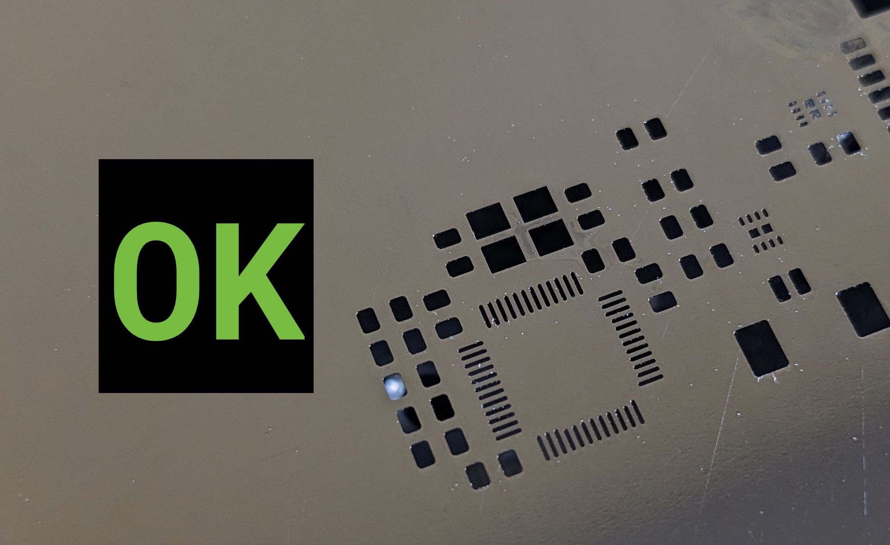{: style="height:350px"}

1. If the stencil is not clean, squirt IPA onto the stencil.

    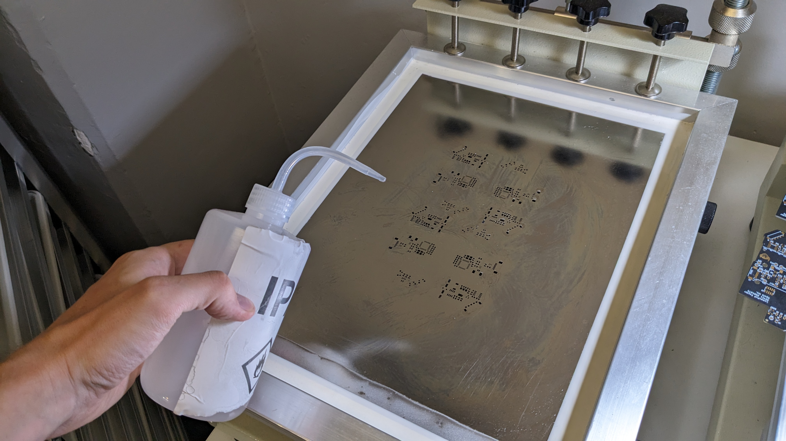

1. Use a paper towel to **very lightly** wipe down the stencil. Do **not** apply hard pressure, as it'll cause the stencil to cut the paper towel and cause debris to form.

    
    

1. Grab a new mobo panel.

2. Insert the panel into the jig.

3. Check to make sure that the stencil is aligned with the pads on the panel.

    

4. Grab the jar of **FRESH** Loctite GC10 solder paste.

    

5. Remove the plug from the jar.

    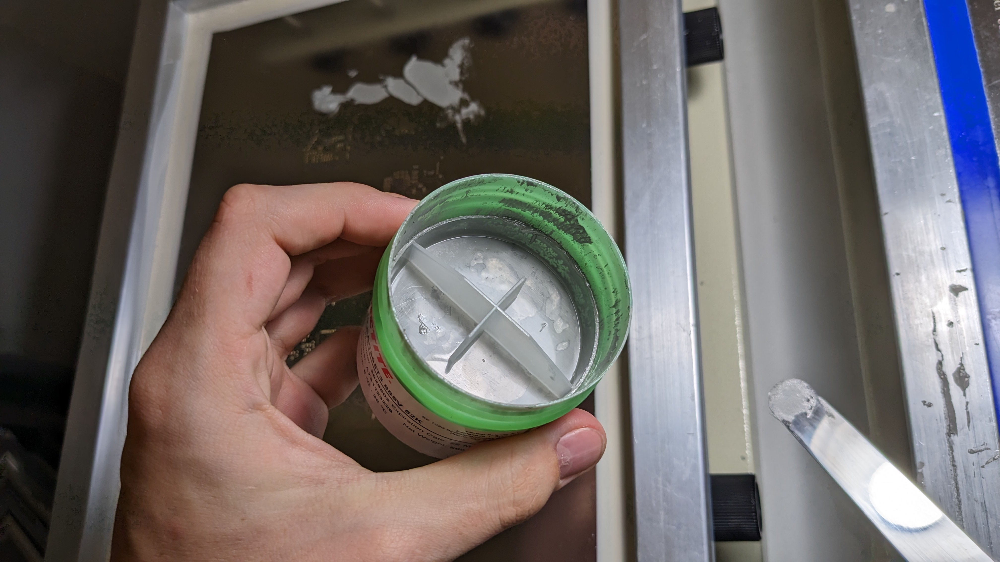
    

6. Remove some paste from the jar with the paddle, and spread it along the top of the stencil.

    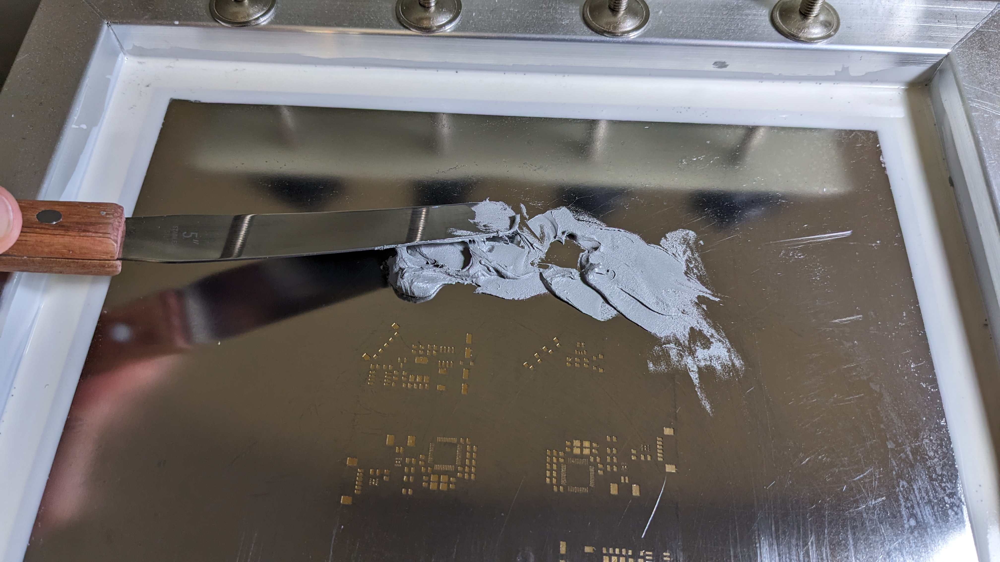

7. IMMEDIATELY replace the plug.

    

8. Grab the squeegee tool.

    

9. Align the squeegee on the stencil so that the **boltheads are facing up**.

    
    

10. Squeegee paste across the panel. **Apply plenty of force**. Make sure you use the correct angle. An angle too high will result in not enough paste, and an angle too low will result in too much.

    
    
    
    

11. With a high angle, scrape up any remaining paste on the top of the stencil. Do this once in the Y axis, and twice in the X axis, covering the whole panel.

    
    

12. Lift the stencil away from the board in a smooth motion. **Do NOT bring the stencil back onto the PCB after lifting**.

    

13. Inspect the paste. Make sure that there is a sufficient gap between pads. If the paste is heavily bridging, wipe off the paste and redo the process.

    
    

14. Clean the stencil like before.

    
    
    

15. Repeat the process of adding a blank panel, squeegeeing, and cleaning until the necessary amount of panels are pasted. Only paste what you are **SURE** you can populate and reflow in the same day. If you complete that number early, you can paste more boards and run more jobs, but leaving a panel pasted and not reflowed overnight is **not acceptable**.

16. If you are done pasting, scrape any remaining paste off of squeegee with the paddle, and scrape it into the **OLD Paste container**.

    
    
    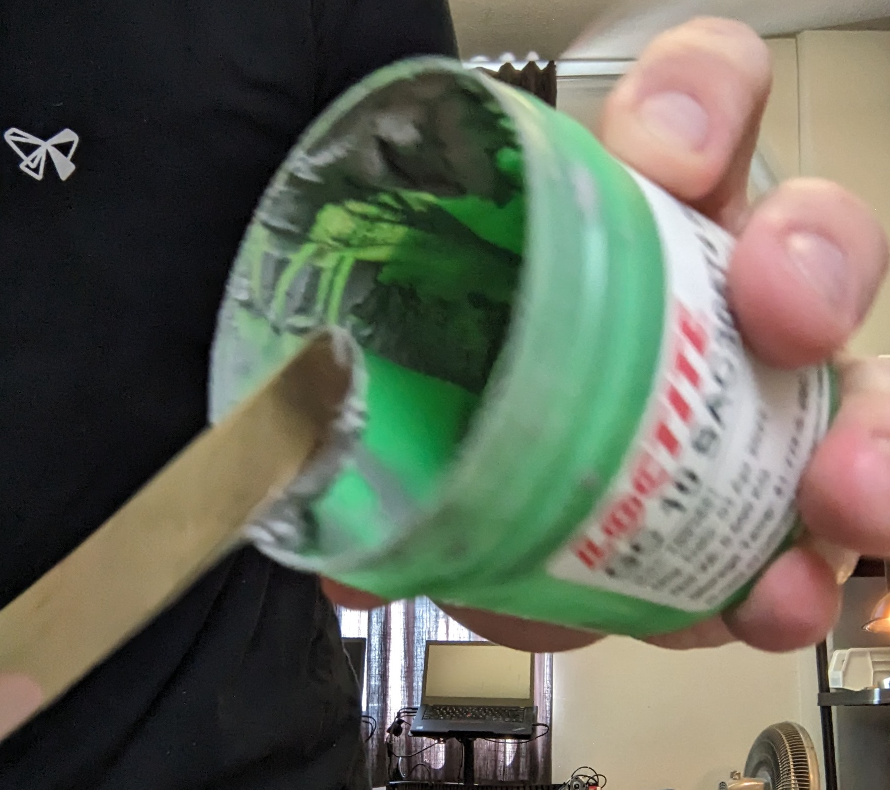

## SMT

1. Identify the Lumen configured for Motherboard production.

    

2. Place a panel onto the panel platter.

3. Use the M3x8mm screws to bolt the panel into the jig using the Populo screwdriver by the machine.

4. Log into the computer used to control the mobo Lumen.

    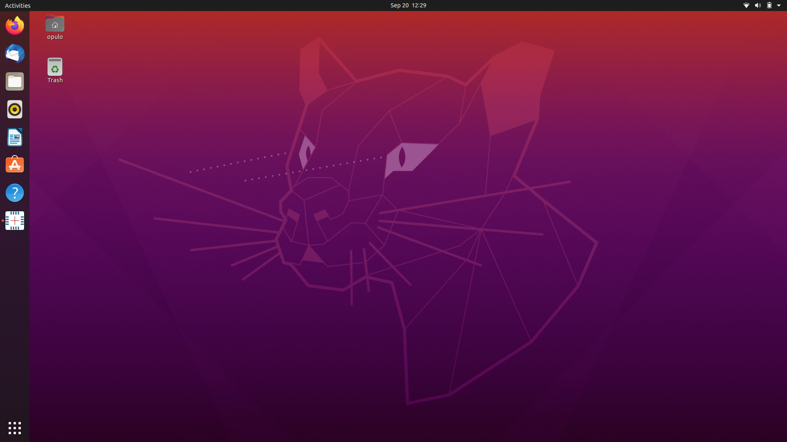

5. If not already open, open OpenPnP by tapping the `Windows/Command` key and typing "openpnp" and hitting enter.

    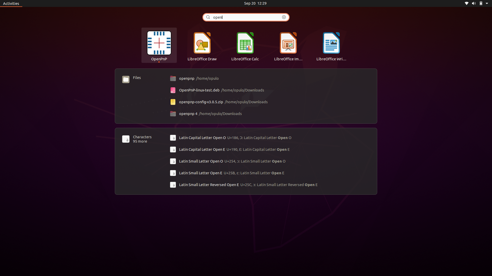

6. Home the Lumen with the home icon in the bottom left of the UI.

    

7. As part of homing, the machine will find the homing fiducial. The screen should look similar to below.

    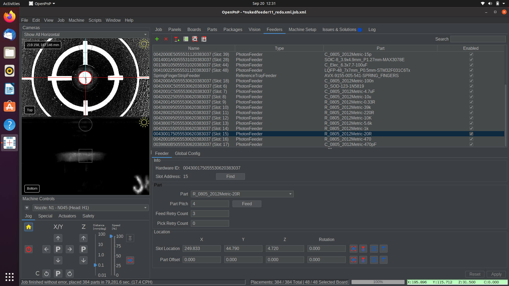

8. The machine will also perform a nozzle tip calibration. The screen should look similar to below.

    

9. Click the `PLAY` icon along the top button bar.

    

10. Hit `Yes` to the reset placements popup.

    

11. The machine will perform a fiducial check. It will scan the fiducials on both boards with the top camera, and use their location to get accurate placements. This will take a couple minutes. The screen should look similar to below.

    

12. The machine will begin feeding a part with a feeder, pick it with the first nozzle, then feed another part. It will then hold the part over the bottom camera to calibrate its position, then place it. It will repeat this process until the job is done.

13. When the job is complete, remove the panel from the machine with the Populo screwdriver.

## Reflow

1. Inspect the panel for accuracy. Adjust any components necessary to ensure a successful reflow, and correct any calibration that could be causing an alignment error. Ask Stephen for help if you get stuck.

1. Insert the panel into the reflow oven.

2. Press the top button to return to the menu.

    
  
3. Make sure the current setting is `Loctite GC10`, then press the top button to run the reflow cycle.

    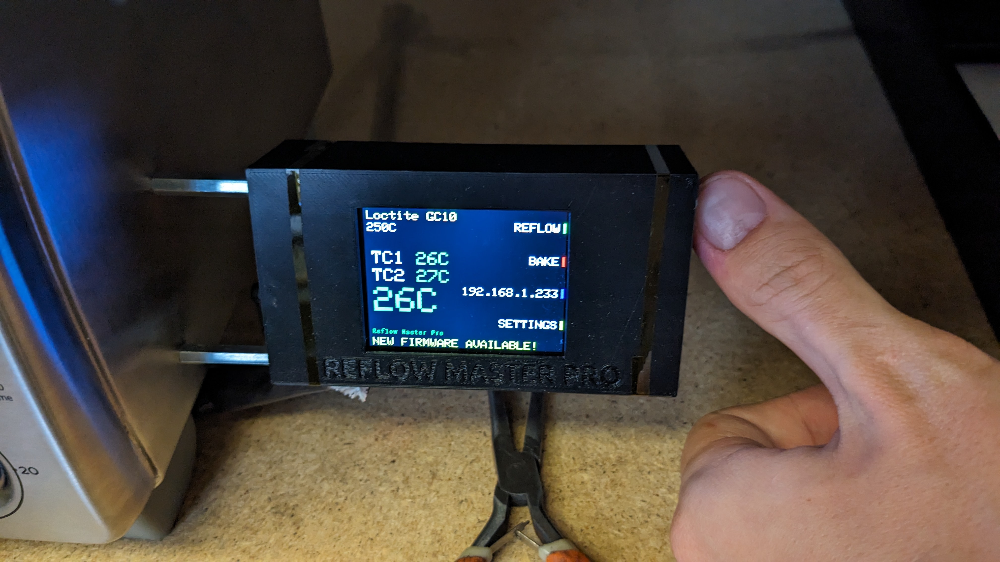
    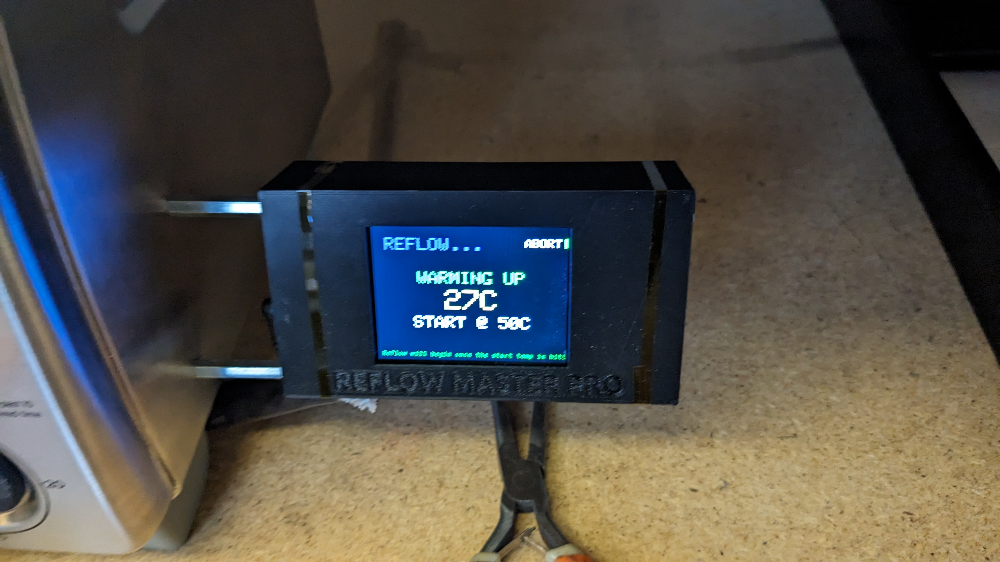

4. Work on another task until the Reflow Master beeps **and** says "REFLOW DONE!".

    

5. Using the pliers by the oven, grab the panel and place it in the Motherboard `NEEDS POGO` tray in the rack.

## NEEDS Pogo

1. Depanel the boards from the panel using the depaneling tool.

    

1. The board now needs to be run through the pogo pin jig.

    !!! warning "Do not use the pogo pin jig."

        The motherboard pogo pin jig, albeit useful, is fragile and easy to break. If you have boards in this tray that need to move forward, ask Stephen to perform the pogo test.

## Needs USB Checks

### USB Connector

1. Mount the board in the Omnivice and put the receipt tucked under the mat.

1. Solder on the USB type B connector.

1. Give the connector a strong push and try to rip it off. It is important that it is very strongly soldered into the board.

1. If it succeeds, check the “USB Connector” checkbox on the receipt.

### Ferrite Beads

1. Check to see if all the ferrite beads connected to the output of the stepper motor drivers are soldered correctly. To do this, we’ll use continuity mode on the multimeter and check that we get a beep between every pin in every stepper motor connector, and an adjoining output pin in the stepper drivers. Use the schematic to reference which stepper motor connector pins should be connected to which stepper driver pins.

1. If all ferrite beads produce a beep, check off the “Bead Probe” checkbox.

### DFU

1. Open a new terminal window on the QC computer, and type “dfu” and hit enter.

1. Hold down the “BOOT” button on the motherboard.

1. Plug the motherboard into the computer using a USB-B cable. Hold the Boot button until you see your terminal output change. If you never do, put the board in the MRB tray.

1. If you do see a change, it means we’ve booted into DFU mode successfully. Check off the “DFU” checkmark on the receipt.

1. Type `CTRL-C` into terminal to cancel the dfu command.

### Serial

1. With the motherboard still plugged into the computer in DFU mode, type `flashmarlin` into the terminal and wait for the firmware upload to complete

2. Press the reset button on the motherboard, and go to [debug.opulo.io](https://debug.opulo.io/) in Chrome on the QC computer. Click "Connect" in the upper right, and select the `MARLIN_OPULO_LUMEN` option. Type `M115` in the console and hit enter. Look for an output like the following (doesn’t have to be exact):

        Cap:EEPROM:1
        Cap:AUTOREPORT_TEMP:1
        Cap:PROGRESS:0
        Cap:AUTOLEVEL:1
        Cap:Z_PROBE:1
        Cap:SOFTWARE_POWER:0
        Cap:TOGGLE_LIGHTS:0
        Cap:EMERGENCY_PARSER:1  

3. If any part of this fails to occur, put the board in the “MRB” tray. If successful, check the serial connection box on the receipt, and move to the `Needs THT` tray.

## Needs THT

1. Populate the through hole components in the motherboard, as shown below. Double check the polarity using the silkscreen for reference.

    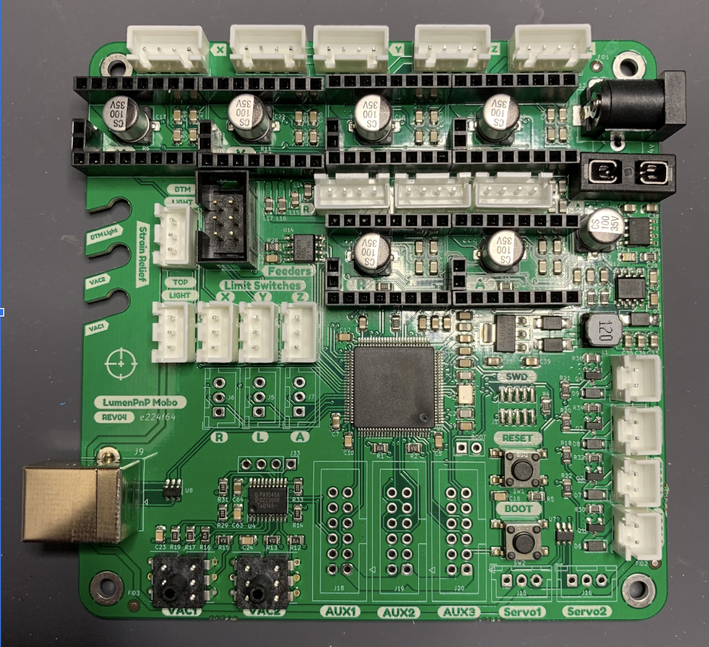

2. Bolt it to the jig.

3. Flip it over and solder the pins.

## Needs Jaeger

1. Install stepper motor drivers into the six slots.

2. Using the black plastic jig, affix a heatsink to each driver.

3. Insert a fuse into the fuse holder.

4. Open VSCode on your computer, and boot up Gundam.

5. Affix the motherboard to the Jaeger jig using two screws and the nearby allen key, and plug in all the cables and tubing, EXCEPT FOR THE POWER PLUG.

6. Plug in the power plug last, after everything has been connected.

7. Plug the motherboard into your computer using the USB-B cable.

8. Hit “Scan Ports” and look for a port to populate the dropdown menu.

9. Select the “REV04-Mobo.json” test from the dropdown menu, then hit “Run Test”.

10. Gundam will prompt you for the motherboard serial number. Enter it in the format “MB00000” where the zeros are the serial number. Be sure to include all five digits, even if the serial has leading zeros. You can find this on the bottom of the board, or on the test receipt.

11. Gundam will prompt you for a revision. Enter “REV04”.

12. Give the app a moment to log the data, then the test page will appear. 
Proceed through each subtest and follow the instructions for each one.

1. If some of the tests fail, continue through the rest of the test until every test has been run.

2. Remove the board from the jig by first unplugging the usb port and power, then unplugging all of the cables to the actuators. Then unscrew the screws mounting the board to the jig.

3. If the test succeeded, you can mark the receipt checkbox for “Jaeger Jig”, then put the board and its receipt into the PASS tray.

4. If the test failed, address the issue with rework and retest.

  
## SMT Troubleshooting

### `Is the feeder inserted?` Error

* Find the feeder that has the `Enabled?` checkbox *unchecked*.
* In the settings menu for that feeder, click the `Find` button. Check to see that the slot address now has a number.
* Recheck the `Enabled?` checkbox for the feeder.
* Hit the play button on the job to resume.

### Mispick

* Set pick position. If it wasn't set well to begin with, try tuning it to be more accurate.
    * Select the feeder from the list under the `Feeders` tab in OpenPnP.
      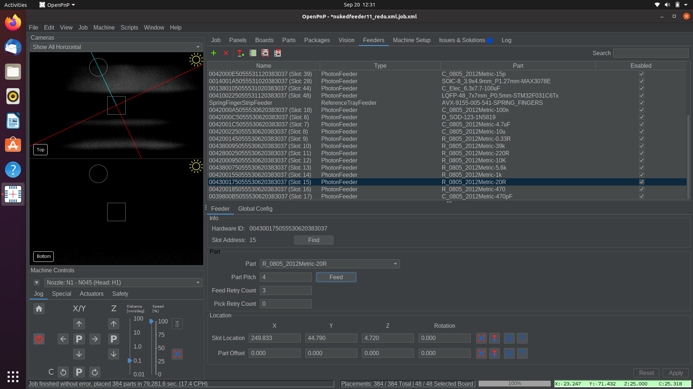
    * Click the `Move Nozzle To Position` button.
    * using the jog controls in OpenPnP, adjust the nozzle tip to be in the exact center of the part, and gently pressing into the part.
    * Capture the new, better pick position with the `Capture Nozzle Position` button.
    * Jog the nozzle up to prevent a collision.
    * Click the `Pick Part` button in OpenPnP to test the newly captured pick position.
* Check the nozzle tip for clogs.
    * If the nozzle tip has some solder paste stuck in the tip, it won't pick nearly as well.
    * Remove the nozzle tip from the nozzle, and hold it up to a light. Check to see if you can see light shining through the tip.
    * If there's a blockage, clear it with some magnet wire. If it's difficult to clear, try soaking in IPA. Ask your manager about doing this if you think it's necessary.
* Increase dwell time.
    * If the pick movement is too quick, it's possible that the pump doesn't pull enough vacuum to grab the part before moving away from the tape.
    * This can be adjusted in the OpenPnP `Machine Config` tab under the relevant nozzle tip in the `Nozzle Tips` section. Increase the value under `Pick Dwell Time`.

## MRB

This process depends greatly on the error that the test jig threw. After attempting to rework the issue, rerun the board through the test jig again, and continue to rework based on the output. The following is a list of rework tips for fixing the problems the jig catches.

It always helps to just give the board a once-over and check for any miscellaneous mistakes or solder shorts, especially on the STM32. Check for polarity of parts as well.
Use the KiCAD source file for the board to diagnose which pin is having a connection issue. Trace the pin on the board to the location where the test jig probes it (almost always a through hole) and ensure everything is soldered through that whole process.
Using the multimeter, check for continuity between the pin leg and the pad (or another pad you’d expect the pin to be connected to).
When in doubt, add a ton of flux and hit it with hot air for a minute. Allowing the part to reflow and settle into its pads can sometimes clear up a hidden short or bad solder joint.
When reworking any pins, always use flux. And don’t be shy about your usage of it. It’s always great to add a ton of the stuff. We can always clean it up later.