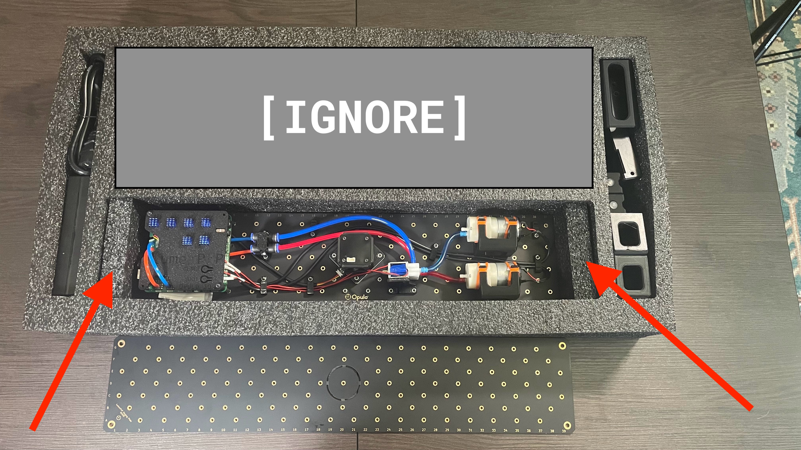

#Packaging LumenPnP V3.1

## Package lower foam tray
1. Gather the following components for packaging into the lower foam tray:
    * `y-gantry-left`
    * `y-gantry-right`
    * `x-gantry`
    * `getting-started-kit`
    * `Tool-kit`

1. Insert `tool-kit` into the middle region of the tray
	* Orient the `tool-kit` so the Opulo logo faces towards the `x-gantry` 

1. Insert `getting-started-kit` into the lower region of the tray

1. Insert `x-gantry` into the tray

    

1. Insert `y-gantry-right` into the tray

    

1. Insert `y-gantry-left` into the tray
  
    
    
1.  Confirm the lower foam tray matches the image shown below before continuing:

    
  
 1. Place the packaged lower foam tray into the LumenPnP packaging
	* Orient the tray so that the packaged `x-gantry` is closer to the Opulo logo side of the box 
 
    

## Package upper foam tray
1. Gather the following components for packaging into the upper foam tray:
    * `primary-staging-plate` & `static-camera-foot`
    * `aux-staging-plate` & `aux-staging-plate-foot`
	 * `2x front-leg-extension`
	 * `2x back-leg-extension` 
    * `drag-chain-assembly`
    * `front-drag-chain-mount`
    * `24v6A-power-supply` 
    * `power-cable` 
    * `front-feeder-rail`(w/25 feeder slots installed)
    * `rear-feeder-rail` (w/25 feeder slots installed)
    * `feeder-slot-cable-harness`
    * `Bagged-10x-extrusion-cable-clips`

1. Insert the following into the right-side cavity of the foam tray:
    * `2x front-leg-extension`
    * `2x back-leg-extension` 
    * `front-drag-chain-mount`
    * `aux-staging-plate-foot`
    * `static-camera-foot`
    * `Bagged-10x-extrusion-cable-clips`

1. Insert the following into the left-side cavity of the foam tray:
    * `24v6A-power-supply`
    * `power-cable` 

1. Insert the `primary-staging-plate` into the foam tray

1. Insert a foam block above each side of `primary-staging-plate`

 	

1. Insert `aux-staging-plate` on top of `primary-staging-plate`

1. Insert `front-feeder-rail` and `rear-feeder-rail` into the foam tray
 
 	

1. Insert `drag-chain-assembly` above the feeder rails
 
  	 
 
1. Confirm the upper foam tray matches the image shown below before continuing:

 	

1. Place the packaged upper foam tray into the LumenPnP packaging
    * Orient the tray so that the staging plates are closer to the Opulo logo side of the box
 
    
    
    
## Serialize the outer box
    
 1. Install the `machine-serial-label` onto the LumenPnP graphic side of the box in the region shown 

 	!!!warning "It is **critical** that this label matches the serial number listed on the underside of the `primary-staging-plate"

    

## Add top foam sheet
1. Install a `top-foam-sheet` above the `upper-foam-tray`

	!!!note "Is this LumenPnP being shipped with feeders?"
		Use `feeder trays` and a `top-cardboard-pad` instead of a `top-foam-sheet` **if** the LumenPnP order includes either feeders and/or items that use a `feeder-accessory-tray`. 

1. Fill out a `getting-started-card` with the machine's version number

    

1. Use double-sided tape to attached the `getting-started-card` to the `top-foam sheet` 
    * Orient the card so that it's bottom edge faces toward the Opulo logo side of the box
    
    

## Adhere shipping documents
* Print out and install all relevant shipping documentation onto the top left side of the box flap 

## OQC
* Every single LumenPnP that's produced must go through outgoing quality control in a process that's guided by the [LumenPnP - Serial Tracker and OQC Form](https://docs.google.com/forms/d/e/1FAIpQLSddZwlLa26bw81xRC3UofJ12yaRr4eiF1ZQTFnbHVbXxjBo6A/viewform?usp=sharing).
	
	

* After a LumenPnP has gone through OQC, tape the box shut before adhering an orange fragile sticker to the top-right corner of the box.

!!!success "The LumenPnP should now be ready fulfillment!" 