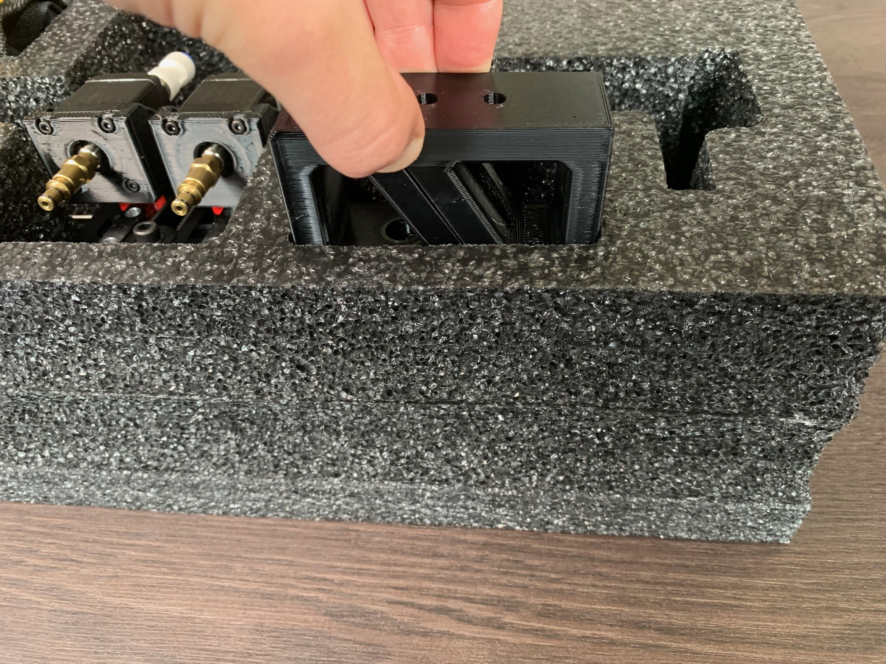
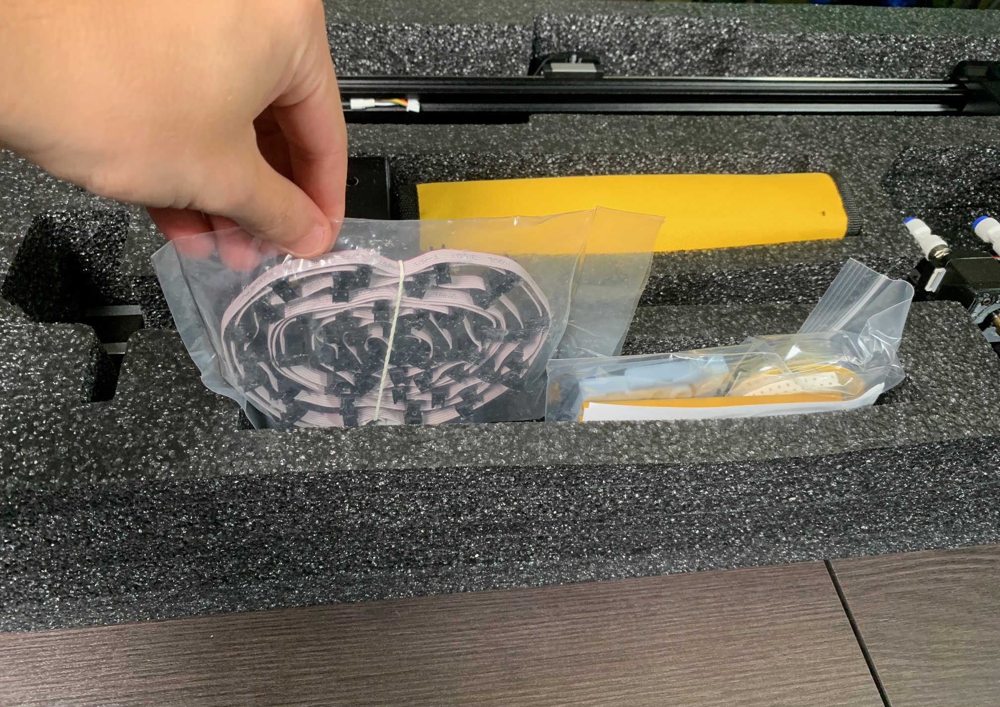
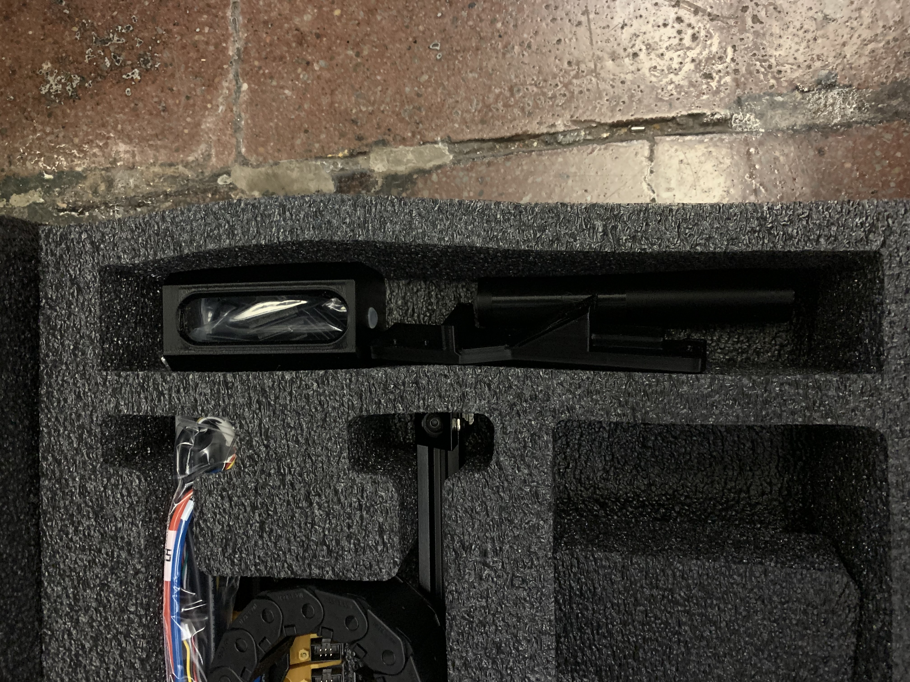
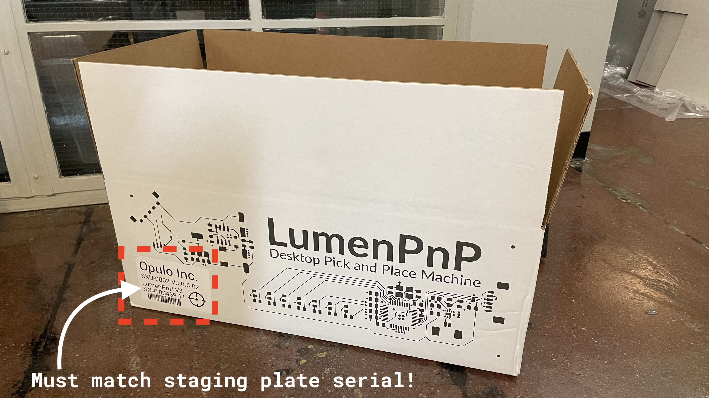
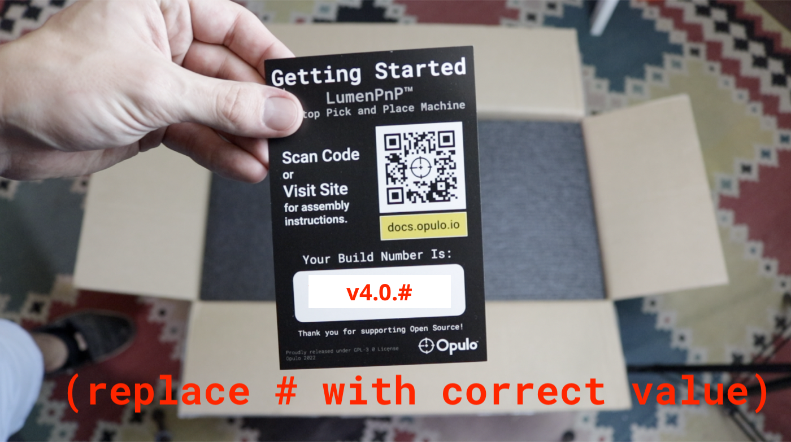

#Packaging LumenPnP V3.1

## Reviewing packaging layout

1. The following components are packaged into the `lower-foam-tray`:
    * `y-gantry-left`
    * `y-gantry-right`
    * `x-gantry`
    * `getting-started-kit`
    * `Tool-kit`
    * `feeder-slot-cable-harness`
    * 2x `front-leg-extension`
	 * 2x `back-leg-extension` 
     
2. The following components are packaged into the `upper-foam-tray`:
    * `primary-staging-plate`
    * `static-camera-foot`
    * `aux-staging-plate`
    * `aux-staging-plate-foot`
    * `bagged-10x-extrusion-cable-clips`
    * `drag-chain-assembly`
    * `front-drag-chain-mount`
    * `24v6A-power-supply` 
    * `power-cable` 
    * `front-feeder-rail`
    * `rear-feeder-rail`
 

## Package `lower-foam-tray`

!!!warning "The following steps must be conducted by someone other than the original assembler."

###Packaging `tool-kit` 
* Perform `tool-kit` QC
	* Confirm `QC PASS sticker` is  present on `lumen-v3.1-hardware-kit` bag
	* Confirm `bottom-camera-cable` was added to zipped pouch
	* Confirm `squaring-bracket` was added to zipped pouch
	* Confirm `feeder-programmer` was added to zipped pouch
	* Confirm `DRIVE-WHEEL-ASM Adjustment Hex Key` was added to zipped pouch

	!!!success "If all checks pass, continue onward"

* Add `tool-kit` into the middle region of `lower-foam-tray`
	* Orient the `tool-kit` so the Opulo logo faces towards the `x-gantry` 

###Packaging `getting-started-kit`
* Insert `getting-started-kit` into the lower region of the tray
	* Only pull these items from a  green QC-Pass bin.

###Packaging `x-gantry`
* Perform `x-gantry` QC
	* `GT2-belt` has been trimmed to appropriate length
	* Camera is installed with two bolts
	* Camera lens cap is present
	* The wire connectors on both `NEMA-11-stepper-motor` units face away from each other, sitting adjacent to their respective cable strain relief points
	* Each `CP40-holder` has been lubricated and fit-tested with a nozzle
	* `Z-belt-loop` feels appropriately tensioned when plucked
	* Each `z-gantry` moves smoothly when actuated back-and-forth by hand
	* 2x `M5-hex-nut` are installed in `x-gantry-back` for use with `drag-chain` attachment 
	* `NEMA-17-stepper-motor` wire connector faces towards `drag-chain` mounting location on `x-gantry-back`
	* `Linear-rail` is centered atop `aluminum-extrusion`
	* `x-idler-mount` and `x-motor-mount` are secured to `600mm-alu-extrusion` with 2x `M5x10-bolt` per side
	* 2x `M5-hex-nut` are installed in `x-motor-mount` for use with the `x-motor-cable-guide`
	* `Tensioner-arm` is installed on `x-idler-mount` in the correct orientation (IE acorn-nut facing touches print)
	* `Timing-pulley` is tightened down and at proper height
	* `GT2-belt` lays flat and is roughly centered in the `600mm-alu-extrusion` channels
	* `GT2-belt` has been correctly tensioned
	* `X-gantry-toolhead` moves smoothly when actuated back and forth by hand
		
		!!!success "If all checks pass, continue onward"
	
	* Package `x-gantry` into `lower-foam-tray`, in the region shown below

	   	 

###Packaging `y-gantry-right`
* Perform `y-gantry-right` QC
	* Confirm M5 bolts are installed in every counterbored region
	* `M5-hex/square-nut` installed where required:
		* 2x `M5-hex-nut` pressed into bottom of `front-right-leg`
		* 1x `M5-hex-nut` pressed into bottom of `back-leg`
		* 2x `M5-hex-nut` pressed into `y-gantry`
	* `GT2-belt` has been trimmed to appropriate length
	* `GT2-belt` has been correctly tensioned
	* `Tensioner-arm` is installed on `front-right-leg` in the correct orientation (IE acorn-nut facing touches leg)
	* `Linear-rail` is centered atop `aluminum-extrusion`
	* `y-gantry` feels smooth and free of friction across the y-min to y-max travel range when actuated by hand
	* `GT2-belt` lays flat in the `600mm-alu-extrusion` channels 
	* 3x `extrusion-cable-clip` have been installed onto the `y-gantry-left`'s lower `600mm-alu-extrusion`
	* `Timing-pulley` is tightened down and at proper height
	*  `Y2` cable is secured with a zip-tie and exits the port labeled `Y2`

	!!!success "If all checks pass, continue onward"

*  Package `y-gantry-right` into `lower-foam-tray`, in the region shown below
  
 	

###Packaging `y-gantry-left`
* Perform `y-gantry-left` QC
	* Confirm M5 bolts are installed in every counterbored region
	* 2x `M5-hex-nut` pressed into bottom of `front-left-leg`
	* 1x `M5-square-nut` pressed into side of `front-left-leg` for use with `front-drag-chain-mount`
	* 1x `M5-hex-nut` pressed into bottom of `back-leg`
	* 2x `M5-hex-nut` pressed into `y-gantry`
* `GT2-belt` has been trimmed to appropriate length
* `GT2-belt` has been correctly tensioned
* `Tensioner-arm` is installed on `front-right-leg` in the correct orientation (IE acorn-nut facing touches leg)
* `Linear-rail` is centered atop `aluminum-extrusion`
* `y-gantry` feels smooth and free of friction across the y-min to y-max travel range when actuated by hand
* `GT2-belt` lays flat in the `600mm-alu-extrusion` channels 
* 3x `extrusion-cable-clip` have been installed onto the `y-gantry-left`'s lower `600mm-alu-extrusion`
* `Timing-pulley` is tightened down and at proper height
* `Y1` cable is secured with a zip-tie and exits the port labeled `Y1`

	!!!success "If all checks pass, continue onward"

*  Package `y-gantry-left` into `lower-foam-tray`, in the region shown below

	

### Packaging `front/back-leg-extension`
1. Insert 2x `back-leg-extension` into the tray in the region shown below
	* Confirm both pieces have `rubber-feet` installed 

   		 

1. Insert 2x `front-leg-extension` into the tray
	* Confirm both pieces have `rubber-feet` installed 

   		 
   		 
   		 
### Packaging `feeder-slot-cable-harness`
1. Insert `feeder-slot-cable-harness` into the tray in the region shown below 

    
    
    
### Confirm the contents of `lower-foam-tray`
Confirm the `lower-foam-tray` matches the image shown below before continuing:

   
 
## Package `upper-foam-tray`

!!!warning "The following steps must be conducted by someone other than the original assembler."

### Packaging misc. parts
* Insert the following items into the **right-side** cavity of `upper-foam-tray`

	!!!note "Packaging each of the following items while inspect them for their given QC inspection criteria"

	* `front-drag-chain-mount` - confirm 2x `M5-hex-nut` installed into print
	* `aux-staging-plate-foot` - confirm top-side M3 bolt and bottom-side `rubber-foot`
	* `static-camera-foot` - confirm bottom-side `rubber-foot`
	* `Bagged-10x-extrusion-cable-clips`
		* Only pull these items from a  green QC-Pass bin.
	
		

1. Insert the following into the **left-side** cavity of the foam tray:
    * `24v6A-power-supply`
    * `power-cable` 

### Packaging `primary-staging-plate` and `aux-staging-plate`
1. Inspect `primary-staging-plate` before packaging it into the foam tray
	* Confirm `QC PASS sticker` is  present underneath the `staging-plate` 
	* Confirm the `machine SN label` matches the `mobo QC receipt`'s serial number
	* Confirm the `machine SN label` matches the box SN label that's clipped to the `primary-staging-plate`
	* Review the `primary-staging-plate` for the presence of all major components (checking to see if the original QC inspector missed anything):
		* 2x vacuum-pump
		* 2x solenoid-valve
		* 1x nozzle-rack w/6 nozzles
		* mobo-top-cover
		* bottom-camera assembly
	* Confirm tubing is installed correctly:
		* Red `Vac1` line appears unkinked and runs to `LH` y-coupler
		* Blue `Vac2` line appears unkinked and runs to `RH` y-coupler

 	!!!success "If all checks pass, continue onward"
 	
1. Place the `primary-staging-plate` into `upper-foam-tray` in the region shown below

1. Insert a foam block above each side of `primary-staging-plate`

 	

1. Insert `aux-staging-plate` on top of `primary-staging-plate`

###Packaging `front/rear-feeder-rail`

1. Perform `front-feeder-rail` and `rear-feeder-rail` QC before installing each into the foam tray
	* `Front-feeder-rail` QC: 
		* `Slot #1` - `#Slot 25` are installed sequentially from left to right
		* Wiggle all of the installed slots to ensure none are loose, retightening any if needed
		* The 2x installed `corner-bracket` pieces are flush to the `2020-alu-extrusion`
		* The 2x installed `corner-bracket` pieces each have a spare `M5x8-bolt` and `M5-t-nut` installed into the unused holes
			* Total 2x `M5x8-bolt` and `M5-t-nut`

	* `Rear-feeder-rail` QC:
		* `Slot #26` - `#Slot 50` are installed sequentially from left to right
		* Confirm that `#Slot 50` is printed in yellow plastic
		* Wiggle all of the installed slots to ensure none are loose, retightening any if needed
		* The 4x installed `corner-bracket` pieces are flush to the `2020-alu-extrusion`
		* The 4x installed `corner-bracket` pieces each have a spare `M5x8-bolt` and `M5-t-nut` installed into the unused holes
			* Total 4x `M5x8-bolt` and `M5-t-nut`

 		!!!success "If all checks pass, continue onward" 
 
 2. Place the finished feeder rails into the `upper-foam-tray`"
 
	 	

###Packaging `drag-chain`

1. Perform `drag-chain-assembly` QC before inserting the assemble above the feeder rails
 
	* Inspect the toolhead side of `drag-chain` and confirm the following cables are present and installed in the correct direction
		*  `LM` cable: 6-pin connector with `LM` label
		*  `RM` cable: 6-pin connector with `RM` label
		*  `ZM` cable: 6-pin connector with **NO** label
		*  `ZL` cable: 3-pin connector with **NO** label
		*  	`DL` cable: 3-pin connector with **NO** label, exits `drag-chain` between end-link and final cover
		*  	`USB` cable: 4-pin connector with **NO** label, exits `drag-chain` between end-link and final cover
	* Inspect the `drag-chain` and confirm the following tubes are present and labeled correctly on both sides
		*  	Red `4mm-pneumatic-tubing` with `LH` label
		*  	Blue `4mm-pneumatic-tubing` with `RH` label
	* Confirm `zip-tie`'s are trimmed flush and present in the following locations:
		*  2x on `umbilical-cable-strain-relief`
		*  2x on `x-cable-chain-bracket` where `XM` cable leaves the drag-chain
			* While checking this, confirm that `XM` cable exits `drag-chain` in place of the 10th cover
		*  2x connecting `x-motor-cable-guide` to end of `XM` cable
		*  3x evenly spaced between `drag-chain` and `umbilical-cable-strain-relief`
		
	!!!success "If all checks pass, continue onward"
 
 1. Install a 2" x 9" bag over both sides of `drag-chain`
 2. Place the `drag-chain` into the `upper-foam-tray`
 
  	 
 
### Confirm the contents of `upper-foam-tray`

1. Confirm the `upper-foam-tray` matches the image shown below

 	

    
## Packing the box
 1. Place the packaged `lower-foam-tray` into the LumenPnP packaging
	* Orient the tray so that the packaged `x-gantry` is closer to the Opulo logo side of the box 
 
    
    
2. Place the packaged `upper-foam-tray` into the LumenPnP packaging
    * Orient the tray so that the staging plates are closer to the Opulo logo side of the box
 
    
    
   
1. Remove the `machine-serial-label` from the `upper-foam-tray` and install it onto the LumenPnP graphic side of the box in the region shown 

 	!!!warning "It is **critical** that this label matches the serial number listed on the underside of the `primary-staging-plate"

   	

## Add top foam sheet
1. Install a `top-foam-sheet` above the `upper-foam-tray`

	!!!note "Is this LumenPnP being shipped with feeders?"
		Use `feeder trays` and a `top-cardboard-pad` instead of a `top-foam-sheet` **if** the LumenPnP order includes either feeders and/or items that use a `feeder-accessory-tray`. 

1. Fill out a `getting-started-card` with the machine's `version number`

    

1. Use double-sided tape to attached the `getting-started-card` to the `top-foam sheet` 
    * Orient the card so that it's bottom edge faces toward the Opulo logo side of the box
    
    

## Adhere shipping documents
* Print out and install all relevant shipping documentation onto the top left side of the box flap 

## OQC
* Every single LumenPnP that's produced must go through outgoing quality control in a process that's guided by the [LumenPnP - Serial Tracker and OQC Form](https://docs.google.com/forms/d/e/1FAIpQLSddZwlLa26bw81xRC3UofJ12yaRr4eiF1ZQTFnbHVbXxjBo6A/viewform?usp=sharing).
	
	

* After a LumenPnP has gone through OQC, tape the box shut before adhering an orange fragile sticker to the top-right corner of the box.

!!!success "The LumenPnP should now be ready for fulfillment!" 