### Install hardware onto 3D printed components 
* Insert the given quantities of M3 hex nuts into the following 3D prints with an arbor press:
    * 2x for y-coupler-bracket 
    * 3x valve-mount
    * 4x for bottom-camera mount

    !!! note
        Be sure to change the arbor press tip for the different prints as needed. 
          
	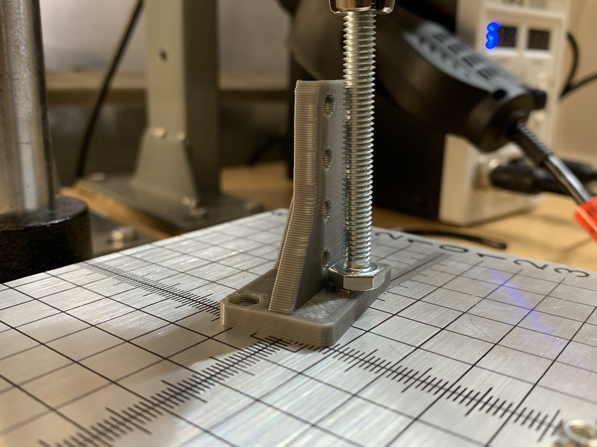
	
	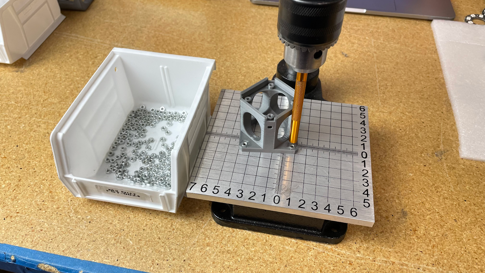
	
* Use an M3x16 bolt to draw 4x M3 hex nuts into the pockets of **2x** vacuum-pump-mount (2x per pcs) by tightening the bolt with an electric screwdriver 
	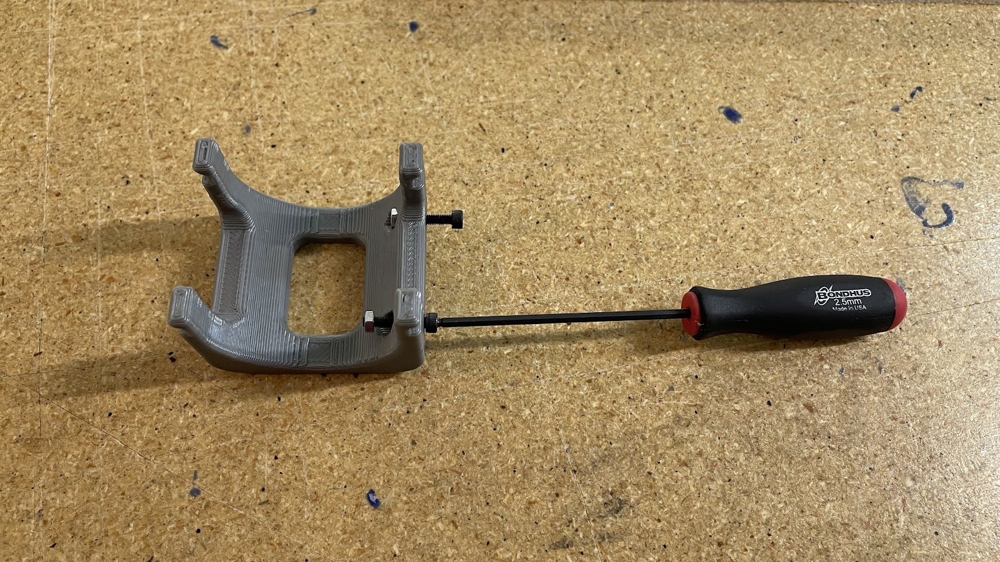
	
	
	
*   Install 4x rubber-band onto **2x** vacuum-pump-mount (2x per pcs) 
	
	
	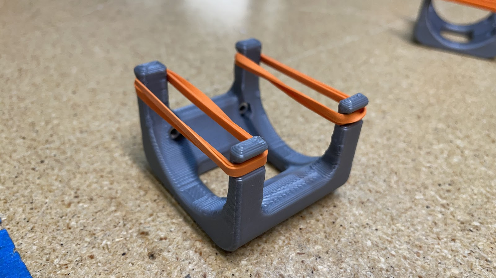
	
* * *

### Preparing pneumatics system

#### Cutting tubing to length

Produce the required QTY of each of the pneumatic tubing lines described in the section that follows.

`PNU-0005-00` [pneumatic-tubing-4mmOD] 
	This is the black tubing

| Tube ID:         | Y Coupler #1 to Vac #1             | Y Coupler #2 to Vac #2             |
|------------------|------------------------------------|------------------------------------|
| Cut Length:      | 225mm                              | 225mm                              |
| Labels to apply: | Y Coupler #1 - N/A Vac #1 - N/A | Y Coupler #2 - N/A Vac #2 - N/A |

`PNU-0006-00` [pneumatic-tubing-6mmOD] 
	This is the more rigid clear tubing

| 1x Valve #1 to Y Coupler #1                            | 1x Valve #2 to Y Coupler #2                            |
|--------------------------------------------------------|--------------------------------------------------------|
| Cut Length:| 0.### meters                              |0.### meters                                            |
| Labels to apply:| Y Coupler #1 - N/A Vac #1 - N/A   | Y Coupler #2 - N/A Vac #2 - N/A                     |

`PNU-0007-00` [pvc-tubing-6mmOD] 
This is the more flexible clear tubing

| Tube ID:         | Pump #1 to Valve #1                |
|------------------|------------------------------------|
| Cut Length:      | 60mm                               |
| Labels to apply: | Pump #1 - N/A Valve #1 - N/A    |

* * *

#### Attaching vacuum-pump cables

Prepare the following assemblies:

*   `ASM-0004-01` [Left Head Wired Vacuum Pump Assembly]
*   `ASM-0052-01` [Right Head Wired Vacuum Pump]

Build the assemblies per [SOP-0002](https://www.google.com/url?q=https://docs.google.com/document/d/1hMRAmM29XZzHmccATX8Q8MbUrGxbqCV75g616Mhpzyw/edit%23&sa=D&source=editors&ust=1675029454647598&usg=AOvVaw3XxlKVmcSSyAQVoBsWG_MU) and be sure to follow recent updates to `Step 2` for the new labeling process:
> 
> *   Place and shrink a heat shrink tubing label onto `CHA-0011-00` that says “P2”
> *   Position the new “P2” label so that it covers over the original “P1” label, with the text orientation matching the image below
> 
> 		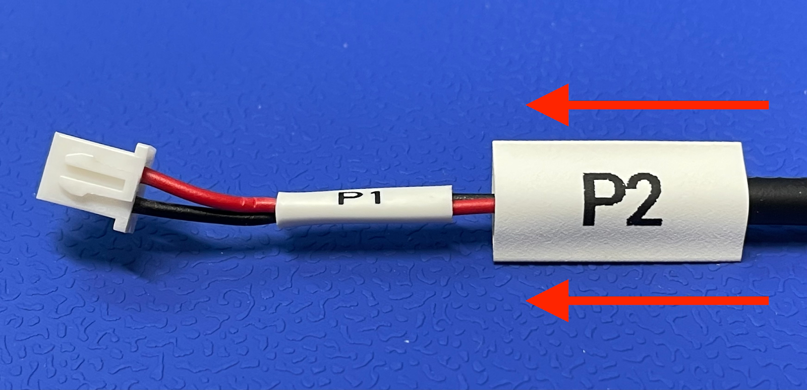
> 		
		
*   Set completed assemblies aside for later use
***

#### Labeling solenoid-valve cables

*   Use `FBO-0022-00` [Epson LABELWORKS 224VSLPX Tape] to label `PNU-0004-00` [solenoid-valve] cables the following way:
	*   Half of the solenoid-valve units in a given production batch must be labeled “MOS 2” for left head pnumatics (LH/P1)
	*   Half of the solenoid-valve units in a given production batch must be labeled “MOS 4” for right head pnumatics (RH/P2)
*   Attach the labels in the near the end of the cable connector as shown below -
	

!!! note
	Templates for these label can be found on the Docker workstation PC’s `Documents` folder
	
***

#### Assembling left head / right read pneumatic systems

Connect all relevant pneumatic tubes to their respective values, pumps, and couplers by referencing the images shown below

**Left Head Pneumatic System (P1)
**

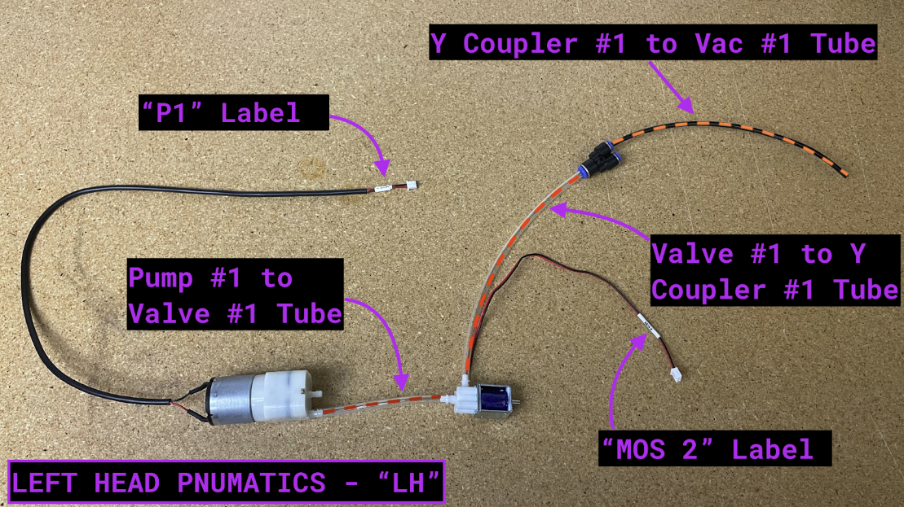

**Right Head Pneumatic System (P2)
**

***

#### Connect the left and right pneumatic systems together
Connect these two separate pneumatic systems together by installing y-coupler-bracket and valve-mount between the two halves

*   Attach each solenoid-valve to valve-mount with 2x M3x8 bolts
*   Make sure that the valves are installed in the correct location by matching them up with the embedded text found on valve-mount

	

*   After completing this step, set the completed pneumatics system aside for later use

***

### Prepare additional components

#### Removing punch-out from `PCB-0003`

*   Remove the punch-out from center of `PCB-0003` with flush cutters

	
	
	

*   Clean up hole with a razer blade after punch-out has been removed

	

*   Clean both sides of `PCB-0003` with an IPA-soaked shop rag
        
***

#### Focus the bottom-camera
Use the bottom-camera-focus-jig to pre-focus the bottom-camera

* Loosen the set screw on the side of the lens, this will let the lens focal-point be adjusted
	* Be careful not to loosen it too much or the screw may fall out and get lost!

		 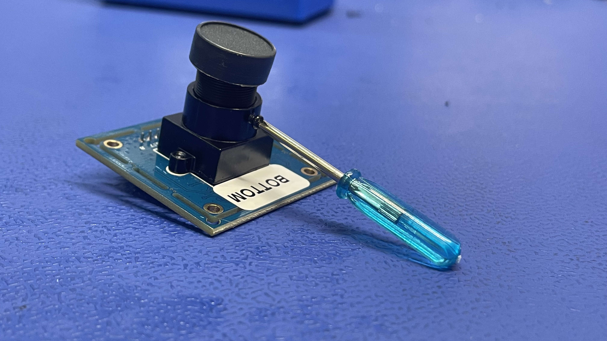

* Install the bottom-camera fully into the bottom-camera-focus-jig
	* Put the JST-side of the bottom-camera into the jig first

 		

	* Remove the lens cap from bottom-camera
	* Connect the JST-side of the USB cable into the bottom-camera PCB

 		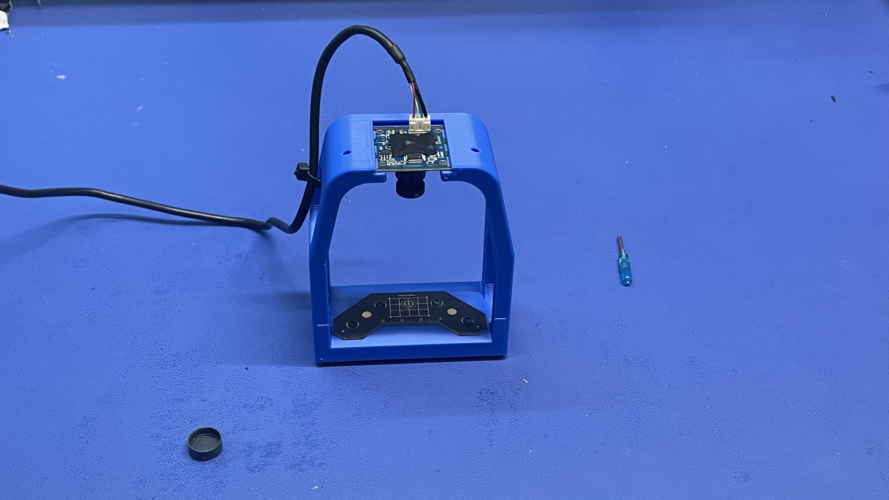

* Connect the USB cable on bottom-camera-focus-jig (if attached) to a laptop and open a native camera viewing application
	* Use Photobooth if on Mac OSX 
	* Use Cheese if on Linux
* Within the camera viewing application, change the selected camera to `PnP Bottom` to view the camera feed of the bottom-camera

	!!! Warning
		 If the listed camera is something other than `PnP Bottom`, the device may either be incorrectly programmed or mixed up with a top-camera module

* Rotate the camera lens until the live viewport shows the datum board as focused as possible
	* Before and after lens focusing:
 	
 		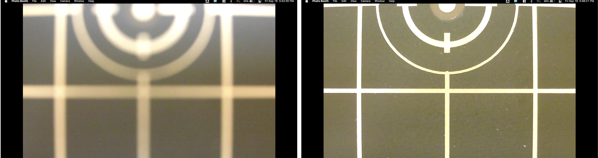
 	
* Once the camera is focused, tighten the set screw to lock in the focus adjustment
* Put a blue dot on the camera PCB with a sharpie to denote that the camera has passed testing

 	

* Remove the bottom-camera from the bottom-camera-focus-jig and immediately replace the lens cap
* Return the bottom-camera to the red esd-safe bag

 	

***

#### Creating bottom-camera-assembly

*   Attach bottom-camera and bottom-camera-cover to bottom-camera-mount with 4x M2.5x8 bolts

	
	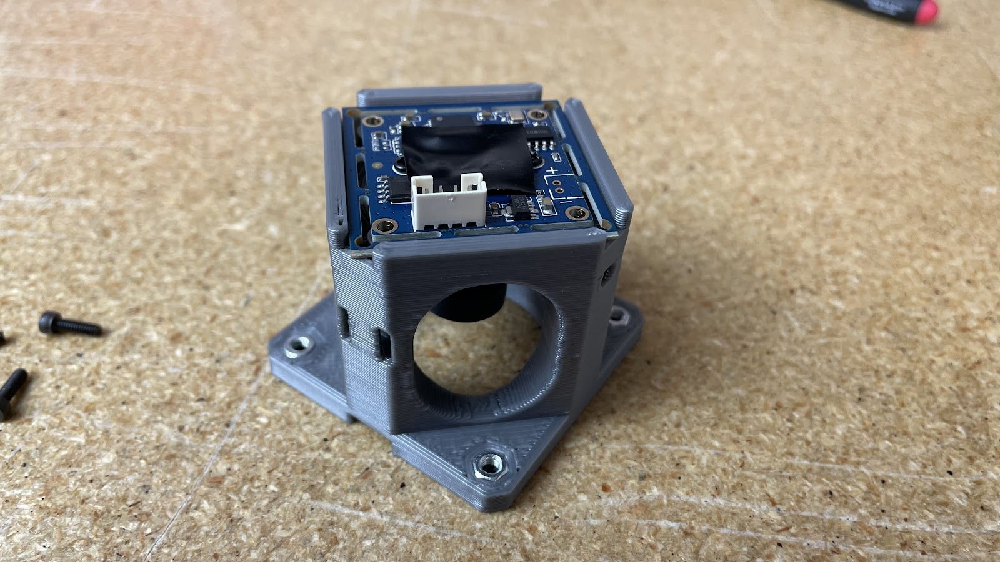
	

*   Install bottom-ring-light into bottom-light-mount

	
	
	
***

#### Assemble nozzle-rack

*   Install all 6 different nozzles onto the nozzle-rack, ensuring that each nozzle can pop in and out relatively easily

	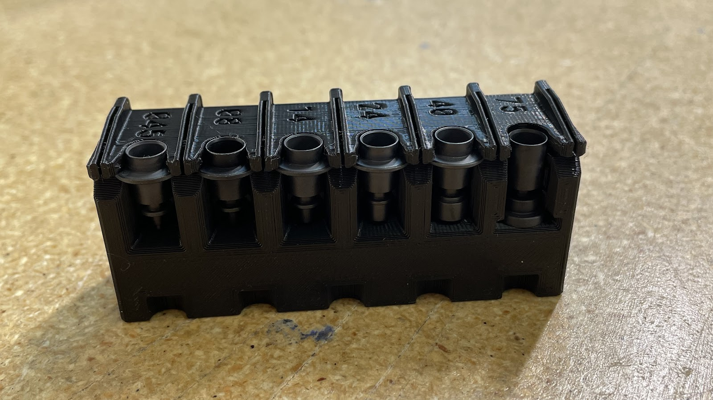

*   Place a rubber-band around the nozzle-rack after the nozzles have been installed to keep them from falling off the staging-plate in transit to the customer

	

*   Insert 2x hex nut into the left and right outermost slots on the nozzle-rack
    	
    
    
    !!! note
    		These slots have a loose fit so use care to avoid losing a hex nut during handling

***

### Begin final assembly

#### Installing bottom-camera-assembly

*   Attach bottom-camera-assembly onto staging-plate with 4x M3x16 bolts

	

*   The JST cable connector found on bottom-ring-light should match the orientation shown below when installed - as close to the Opulo logo as possible and in line with staging-plate column 18

	

*   The usb-cable connector found on bottom-camera should match the orientation shown below when installed - as close to the Opulo logo as possible

	
	
***

#### Installing pneumatics-system

*   Attach y-coupler bracket onto staging-plate with 2x M3x10 bolts
*   Attach pump-mount onto staging-plate with 2x M3x10 bolts
*   Attach valve-mount onto staging-plate with 3x M3x8 bolts

	
	

***
 
#### Installing nozzle-rack
	
*   Attach the finished nozzle-rack to the staging-plate with 2x M3x10 bolts and 2x M3 hex nuts
	*   The text on nozzle-rack should match the orientation of the staging-plate column numbers

	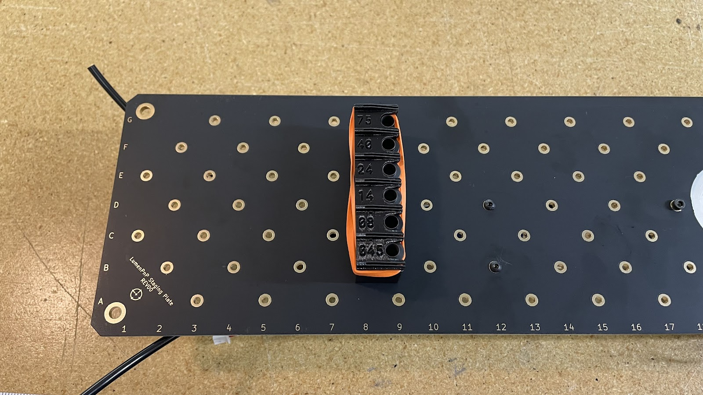

* * *

#### Installing the motherboard

*   Install 4 M3x25mm standoffs onto staging-plate
*   Place in positions shown below with 4x M3x10 bolts

	

*   Install bottom-ring-light cable
	*   This cable should pass through the bottom and top right standoffs on its way to bottom-ring-light
	*   Make sure that “UL” label is on the side of the cable closer to the motherboard

		

*   Pass the RH/LH vacuum lines and UL cable through the mobo-bottom-cover and motherboard
	*   Take care to avoid having the vacuum lines twist around eachother between the y-coupler pieces and mobo-bottom-cover
	
	
	
	
*   Connect the vacuum lines and cable into the motherboard where appropriate
	* LH --> VAC1 on motherboard
	* RH --> VAC2 on motherboard  

	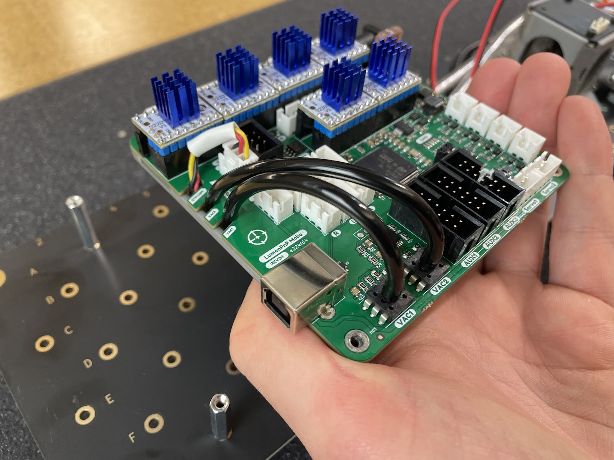

*   Bolt motherboard to standoffs in 2 initial locations with M3x10 bolts- bottom left and top right
	*   Inspect both vacuum lines to see if either appears pinched on the backside of the motherboard
	*   If either vacuum line appears pinched, push the line into the motherboard to increase the slack in the line between mobo-bottom-cover and the respective y-coupler

	

*   Connect all pump and valves cables into the motherboard while matching the cable labels to the motherboard connector labels

	*   Avoid needless twisting of the cabling
	
	

*   Install mobo-top-cover
	
	*   Bolt mobo-top-cover to the top left and bottom right standoffs with 2x M3x30 bolts

	*   Hand tight is OK as the customers need to be able to remove this piece during machine setup

	
	
*   Slide the mobo QC reciept between mobo-bottom-cover and staging-plate after the mobo-top-cover is attached

	

***

#### Install datum-board and datum-board-mount

*   Use four M3x16mm screws and four M3 nuts to secure the datum board and datum board mount to the staging plate on the rear of the bottom camera, through holes: B18, A19, A21, B22.
	* Use a 2.5mm hex wrench and a 5.5mm (6mm if 5.5mm is unavailable) socket wrench to tigthen these M3x16mm screws
	* The fisheye calibration pattern should be facing down, and the gold grid lines and fiducial in the center of the Opulo logo facing upwards

	
	
***

#### Attach Machine Serial # Label

*   Install a unique Machine Serial # sticker onto the bottom of the staging-plate

	

***

#### Performing cable management
*   Clamp cables in the locations shown below with 6x peek-cable-clamps, 6x m3-hex-nuts, and 6x m3x14 bolts

	
	
	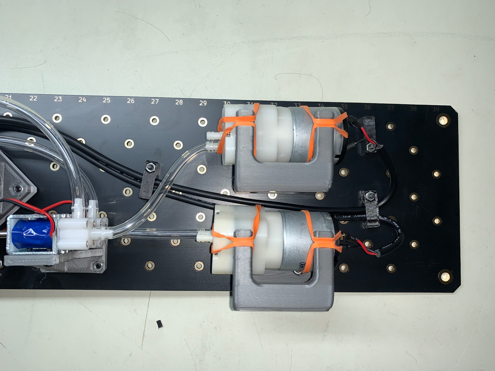

* * *

### QC Checklist

Run the staging plate assembly through the QC inspection form found here:

[https://docs.google.com/forms/d/e/1FAIpQLSf1HXndxFzhRyJsBtHUMHoJEiU\_ig9z8cUJpGCH4vcM8OR5mQ/viewform](https://www.google.com/url?q=https://docs.google.com/forms/d/e/1FAIpQLSf1HXndxFzhRyJsBtHUMHoJEiU_ig9z8cUJpGCH4vcM8OR5mQ/viewform&sa=D&source=editors&ust=1675029454657858&usg=AOvVaw12puD4NK5Y2xleOU-dRT_L) 

!!! note
    The QC inspection form will ask you if the bottom-camera was correctly focusesed, which can be checked with the orange version of the bottom-camera focus jig. Use this jig in the same way the blue one is operated, while leaving the camera installed on the staging-plate.
    
 	    
 	 
 	 If the camera is out of focus, remove it from the assembly and repeat [bottom-camera focusing](#focus-the-bottom-camera).
	