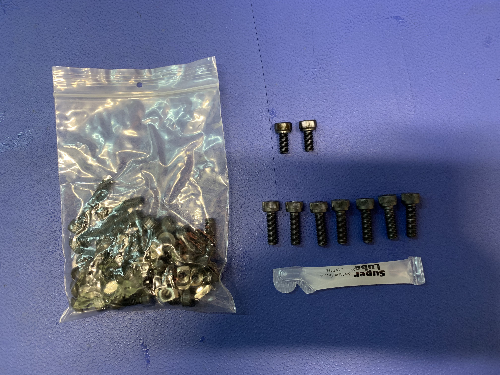
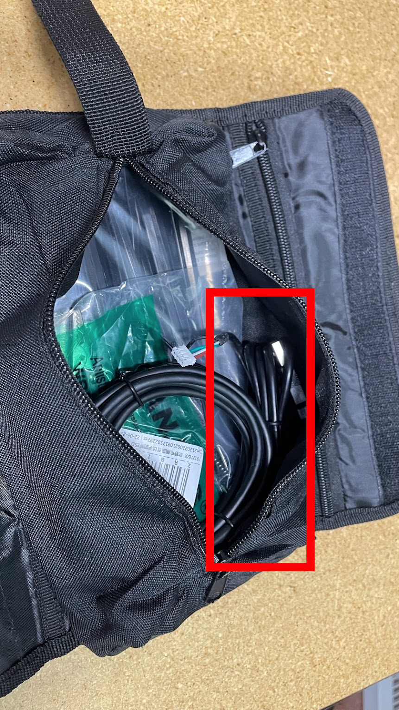
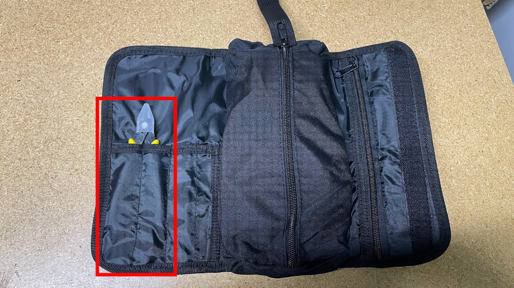
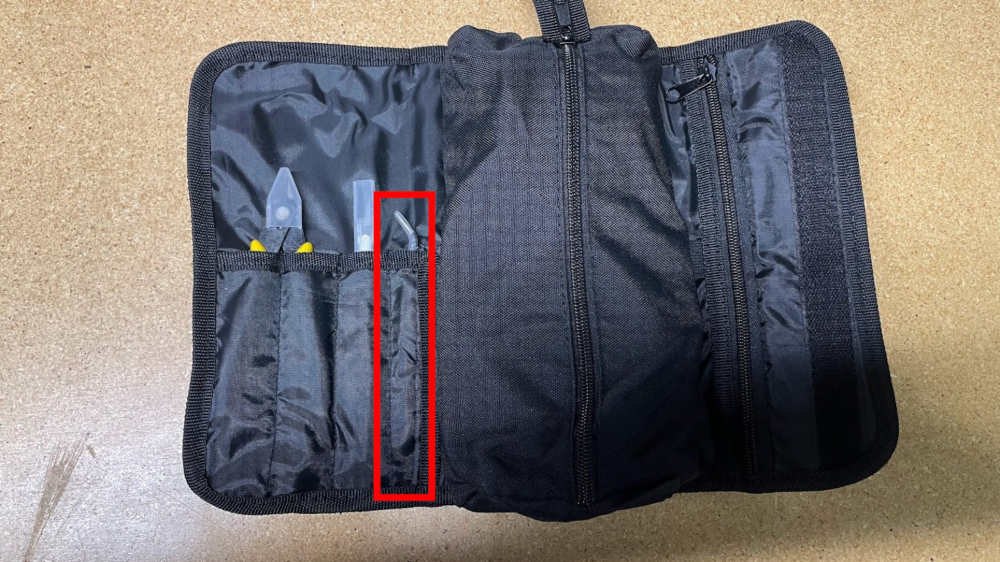

#Preparing LumenPnP Tool Kit

## Prepare `lumen-v3.1-hardware-kit` (ASM-0048-03)
We purchase the `lumen-v3-hardware-kit` as a premade assembly but it's contents can become out of date with machine updates. It is important to ensure that customers always have a revision of this bag that matches the revision required by a given LumenPnP revision's BOM. 

Currently, we have repurchased several hundred pieces of `ASM-0048-02` which must be reworked to match the BOM listed in `ASM-0048-03`. You can confirm that a `lumen-v3-hardware-kit` **requires rework** into `lumen-v3.1-hardware-kit` if it weights `95.8g +/- 0.5g`.

* Pre-purchased  pieces of `ASM-0048-02` in inventory must have the following components added into the bag to convert them in a `lumen-v3.1-hardware-kit` before they're to be used in further assembly processes:

	* +7 pcs `M5x16-bolt`
	* +2 pcs `M5x10-bolt`
	* +2 pcs `silicone-grease-packet`
	* +4pcs `M5 t-nut`
	* +4PCS `M5x8-bolt`

	

### QC Check
* After reworking inventory to match the latest requirements of a `lumen-v3.1-hardware-kit`, proceed with a weight check.
	* Confirm each bag weighs between `139.70g` - `140.50g`
	* If a bag weighs less than this, recount the pieces and rework as needed before proceeding
	* After a bag passes weight check, add a `QC Pass` sticker to the outside of the bag
		
	!!!note "Stockpiling `lumen-v3.1-hardware-kit` pieces"
		If more pieces of `lumen-v3-hardware-kit` are reworked than what's needed for a given production batch, place the excess in a  green QC-Pass bin labeled `lumen-v3.1-hardware-kit (ASM-0048-04)`

## Assemble Tool Kit
* Gather components shown:

	

* Start by placing the `zip-tie-bag` into the `tool-kit-bag`’s zipped pouch

	

* Next place the `ESD wrist strap` into the zipped pouch

	 

* Place the `USB-A to USB-B cable` above the `ESD wrist strap`, towards the bottom of the zipped pouch

	 

* Place the `bottom-camera-usb-cable` into the zipped pouch, beside the `zip-tie-bag`

	

* Place the `squaring-bracket` into upper area of the pouch, on top of the `zip-tie-bag`

	

* Place the `lumen-v3.1-hardware-kit` into the `tool-kit-bag`’s pouch

	!!!warning "It is **critical** to ensure that this hardware kit has been [reworked as needed](#prepare-lumen-v31-hardware-kit-asm-0048-03)" 

	

* Place the tiny `phillips screwdriver` into the `tool-kit-bag`’s pouch

	

* Place the `feeder programmer` into the `tool-kit-bag`’s pouch
	
    
	
	 
	 
* Place the `DRIVE-WHEEL-ASM Adjustment Hex Key` into the `tool-kit-bag`’s pouch

    
    
    

* Zip up the pouch

	

* Unwrap the protective plastic from the `flush-cutter` and install it into the left side of `tool-kit-bag`

	

	

* Place the `xacto-knife` into the next remaining pocket in the `tool-kit-bag`

	* Make sure the protective cap is on tightly and that the blade clamp is tight

	

* Insert the `ESD-safe-tweezer` into the last remaining pocket on the left side of the `tool-kit-bag`

	

* Secure the `allen-wrench-set` into the right side of the `tool-kit-bag` with the elastic strap

	

* Close up the `tool-kit-bag` and gently work out any bulges so that it may take up less space in the LumenPnP packaging 

	