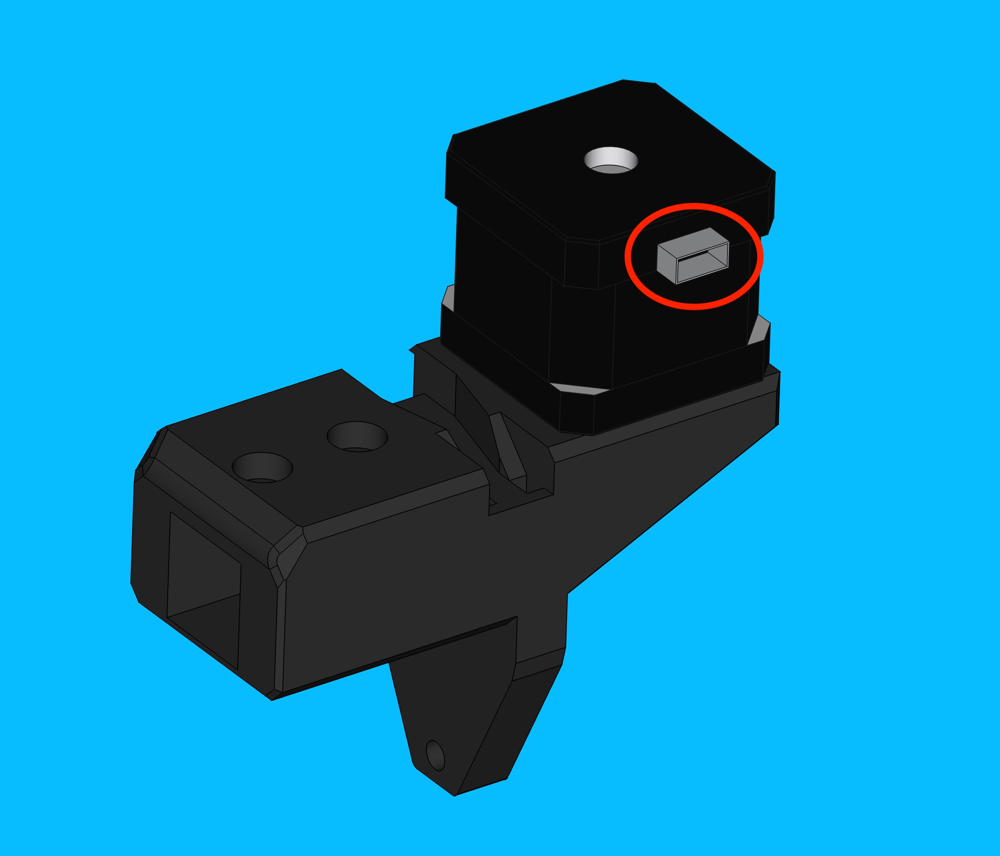
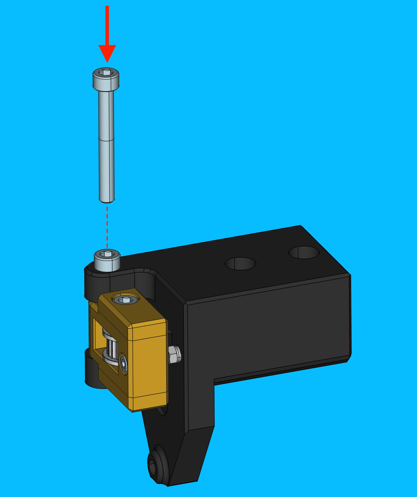
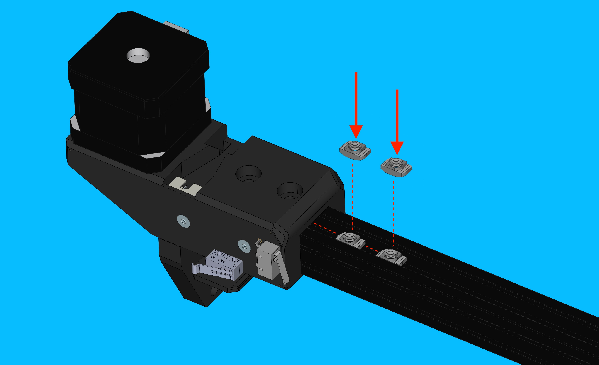
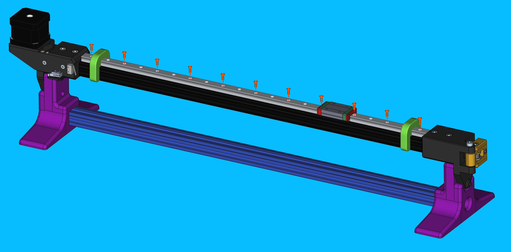
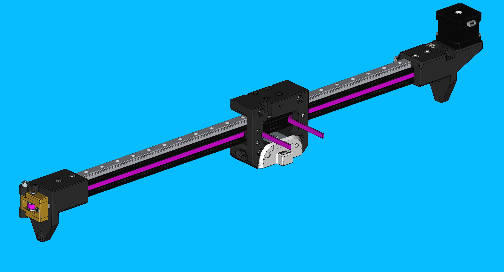
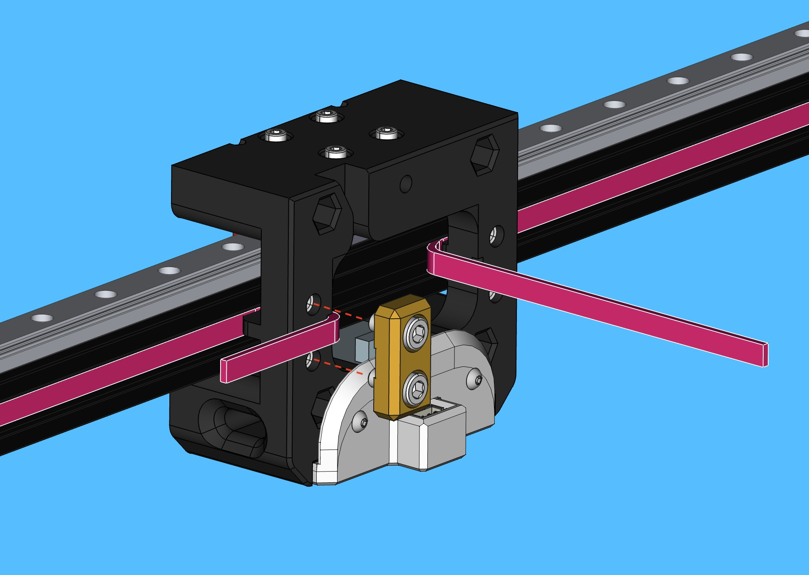
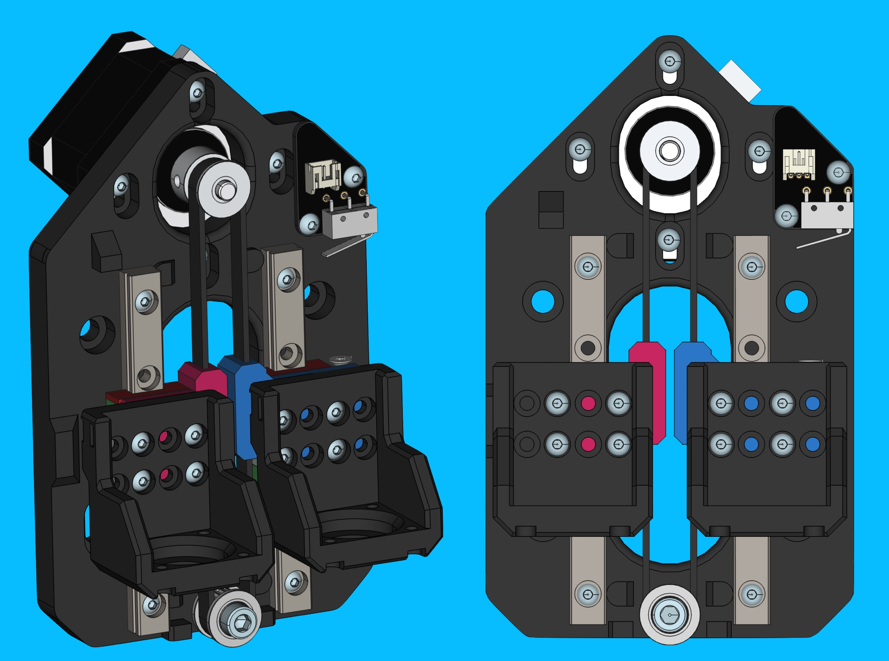
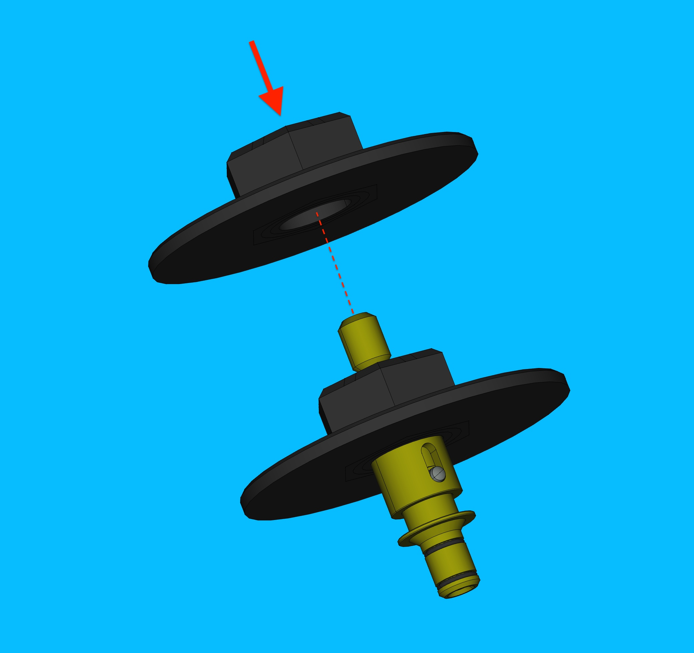
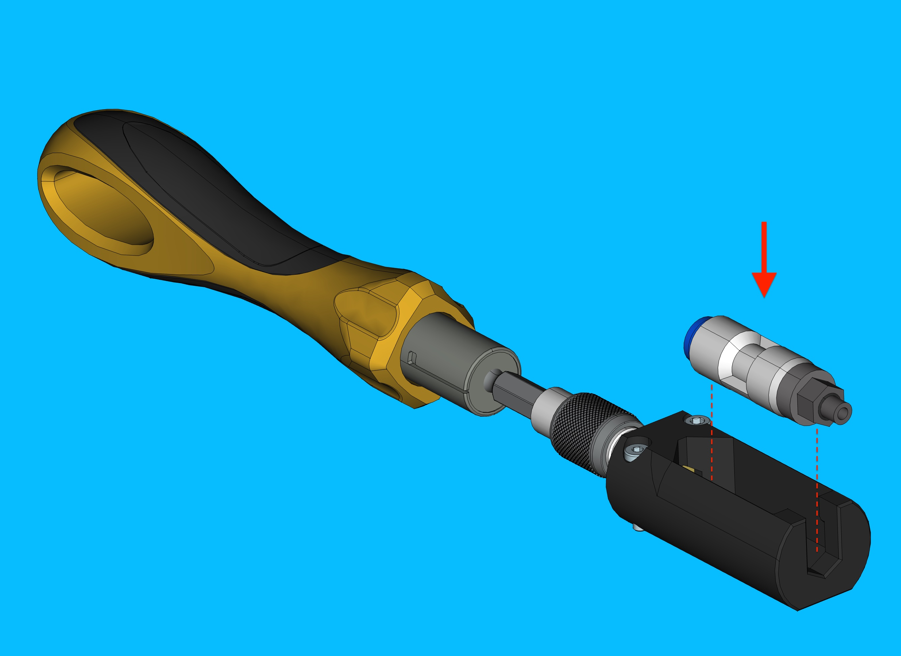

Preparing x-gantry
==================

## Create `x-linear-axis` subassembly
---------------------------------

### Prepare `X-gantry-back`

*  Install `M5-hex-nut`

#### Top-camera-assembly preparation

*   Use the top-camera-focus-jig to pre-focus top-cameras

*   Connect top-camera-focus-jig to a laptop and open a native camera viewing application

	

*   Remove the top-camera lens cap
*   Loosen the set screw found on the side of the lens body that locks the focus

	

*   Install the top-camera fully into the top-camera-focus-jig, plugging the USB cable into the camera module afterwards

	

*   In Photobooth, change the selected camera to PnP Top to view the camera feed of the top-camera. The setup should now look like the following image

	 

*   Rotate the camera lens until the live viewport shows the datum board as focused as possible

	
	
	
	
	!!! info "Camera view before and after focusing shown above"
	 	
*   Once the camera is focused, tighten the set screw to lock in the adjustments
*   Put a red dot on the camera PCB with a sharpie to denote that the camera has passed testing

	

*   Remove the top-camera from the top-camera-focus-jig and immediately replace the lens cap.

#### Install `top-camera` and `top-ring-light` into `x-gantry-back`

*   Installing top-ring-light into top-light-mount

### Install `NEMA-17-stepper-motor` onto `x-motor-mount`

*   Set `timing-pulley` height on `NEMA-17-stepper-motor` shaft with `x-pulley-spacer-jig`

*  Tighten the first `set-screw` into the flat region found on the `NEMA-17-stepper-motor` shaft, before tightening the second `set-screw`
	*   Tighten each `set-screw` to 0.6 N/M

	

### Install `NEMA-17-stepper-motor` onto `x-motor-mount`

*	Orient `NEMA-17-stepper-motor` onto `x-motor-mount` so that the motor's connector is facing the backside of the print as shown in the image below

	

*   Bolt `NEMA-17-stepper-motor` onto x-`motor-mount` with 4x M3x8 bolts

	*   Tighten these bolts to 0.4 N/M

	

### Install `XY-limit-switch-board` onto `x-motor-mount`

*  Install `XY-limit-switch-board` onto `x-motor-mount` and secure it with 2x `m3x12-self-tapping-flat-head-screws`

	

### Install `belt-tensioner-arm` onto `x-idler mount`

*  If you have not already done so, assemble 1x `belt-tensioner-arm`

	!!!note "For reference building this sub-assembly, visit the [Y Gantry OHAI page](../lumen/y-gantry/#prepare-belt-tensioner-arm)"

* Install 1x `M5-lock-nut` into `x-idler-mount`

	

*   Install `belt-tensioner-arm` onto `x-idler-mount`

	

*   Bolt `belt-tensioner-arm` to `x-idler-mount` with 1x `M5x40-socket-head-bolt`
	*   Avoid over tightening the bolt! `belt-tensioner-arm` should be able to pivot smoothly without much resistance.
	*   Ensure the belt-tensioner-arm is installed correctly on x-idler-mount (IE not backwards)
		*   The acorn nut should be resting against the x-idler mount when installed correctly

	

### Install `alu-extrusion` onto `x-motor-mount`

### Install `M3-t-nut-bar`

!!!warning "Inspect the `M3-t-nut-bar` to ensure that each hole has M3 threads"

*	Slide `M3-t-nut-bar` into top-side track of `alu-extrusion`

	

### Install `x-idler-mount` onto `alu-extrusion`

*	Insert 2x `M5-t-nut` into `alu-extrusion`

	

*	Slide `x-idler-mount` onto `alu-extrusion`

	

	

*	Use `x-gantry-spacer-jig` to slide `x-idler-mount` onto `alu-extrusion` the required amount
	*	The WIP `x-linear-axis` should be sitting on `x-gantry-spacer-jig` snug - not overly tight - when `x-idler-mount` is at the correct depth

	

*	Secure `x-idler-mount` in place with 2x `M5x10-socket-head-bolt`
	* Tigthen these bolts to 0.6N/M

	
	

### Install `linear-rail-525mm`

*	Remove the `linear-rail-2020-alignment-jig` from both ends of `linear-rail-525mm`

*	 Slide the `linear-rail-carriage` back and forth a few times, checking to see that it travels smoothly and consistently

### Install GT2-belt

*	Bolt `x-gantr-back` to the linear-rail-carriage with 4x `M3x16-socket-headbolt`
	*	Tighten each bolt to 0.6 N/M
	*	Push `x-gantry-back` inward towards the `linear-rail-carriage` while tightening the mounting bolts to align it

	

## Create `x-gantry-front` subassembly

### Prepare `NEMA-17-stepper-motor` for z-axis

*   Set `timing-pulley` height on `NEMA-17-stepper-motor` shaft with jig

	*   The 1st set-screw tightened must contact the flat region of the motor’s shaft
		*   Tighten both set screws to 0.4 N/M

		

		

### Prepare `z-belt-subassembly`

*   Prepare `z-gantry-backplate-right`
	*   	Drill out the limit switch striker bolt hole on `z-gantry-backplate-right` with a 2.5mm drill bit

		

	*   Install an M3x16 Flathead bolt into `z-gantry-backplate-right` to a depth that roughly matches the image shown below
		*   This screw depth will be precisely adjusted in later steps

		

* Install both `z-gantry-backplate-left` and `z-gantry-backplate-right` onto `gt2-belt-loop`
	*   Place a `gt2-belt-loop` onto the `z-belt-alignment-jig`
	*   Place `z-gantry-backplate-left` and `z-gantry-backplate-right` onto the `z-belt-alignment-jig` to align them correctly on the `gt2-belt-loop`
	*   Twist `z-gantry-backplate-left` upwards to pull the completed `z-belt-subassembly` off of the `z-belt-alignment-jig`
	*   Use a dull knife or other tool to push the `gt2-belt-loop` all the way down into the cavity of each `z-ganry-backplate`

	!!!note "TO DO: Add info about LOCTITE 435 Usage"

### Install `M5-lock-nut` into `x-gantry-front`

*   Use an arbor press to install an `M5-lock-nut` into backside of `x-gantry-front`

	

### Install 2x `linear rail` onto `x-gantry-front`

*   Install 2x `linear-rail` by aligning them against the bumps found on `x-gantry-front`

	*   Uses 3x `M3x12-self-tapping-button-head` per `linear-rail`
	*   Tighten each bolt to 0.5 N/M

	

	

	

### Install `z-axis-limit-switch`

*   Secure with 2x `M3x12-self-tapping-button-head`
*   Make sure each limit switch clicks and feels normal when actuated

### Install z-axis belt drive components

*   Secure `idler-pulley` onto `x-gantry-front`  with 1x `M5x25-bolt`, tigthend enough that the pulley can rotate freely without resistance
*   Check that the pulley can only rotate - it should not be able to move up and down if the bolt is tightened correctly

	

*   Begin by placing `z-belt-subassembly` onto  `x-gantry-front`

	*   The `z-gantry-backplate-right` should fit over the right `linear-rail-carriage`, and the same goes for the left side

	*	The `gt2-belt-loop` should wrap around the `idler-pulley`

	

*   Install the `NEMA-17-stepper-motor` by angling it into the `z-belt-subassembly`

	*   The limit switch connector will be at a 45º from the motor’s connector when everything is in the proper position.

	

*   Bolt `NEMA-17-stepper-motor` onto `x-gantry-front` with 4x `M3x8-bolt`

	*   Leave the bolts loose for now

	

*   Tension `gt2-belt-loop` by pulling the motor upwards before tightening the mounting bolts to 0.5 N/M

	*   The belts should feel much firmer now - to test manually move the z-axis back and forth while inspecting the belts for sag when changing directions
	*   You should be able to pluck the belt like a bass string

		

		

*	The `x-gantry-front` should now match the image shown below:

	

### Install 2x `z-gantry` 

*   Loosely attach a `z-gantry` onto the left-side `linear-rail-carriage` with 4x `M3x8-bolt` per side
	

*   Align `z-gantry` paralell to `linear-rail` by lightly pressing it outward, while tigtening the mounting bolts
	*   Tighten bolts to 0.3 N/M, moving in a star pattern

	

*	Repeat this process to attach the second `z-gantry` to the right-side `linear-rail-carriage`

	

### Install `NEMA11-hollow-shaft-stepper`

*   Bolt `NEMA11-hollow-shaft-stepper` onto left-side `z-ganty`
	*   Attach with 4x M2.5x8 bolts
	*   Torque each bolt to 0.3 N/M

	

	

### Install toolhead components
*	Slide `nozzle-mask` onto `nozzle-holder` as shown in the image below

	

*	Place `rotary-pneumatic-adapter` into `rotary-pneumatic-adapter-socket` 
	*  Attach the custom socket to a torque driver if you have not already done so
	*  Set the torque driver to `0.5 N/M` for the following steps

	
	

*   Install `nozzle-holder` and `rotary-pneumatic-adapter` onto `NEMA11-hollow-shaft-stepper`
	*  Begin by loosely threading `nozzle-holder w/attached nozzle-mask` onto the `NEMA11-hollow-shaft-stepper` (on the side closest to the `idler-pulley`)
	*  Install `rotary-pneumatic-adapter` onto `NEMA11-hollow-shaft-stepper` (on the side closest to the motor's cable connector)
	*  Place a 16mm wrench onto the flats found on `nozzle-mask`
	*  Tighten the toolhead components onto the `NEMA11-hollow-shaft-stepper` by torquing the `rotary-pneumatic-adapter`

	

*   Repeat above process to attach a `pneumatic-toolhead-assembly` to the left-side `z-gantry`

	

## Install `x-gantry-front` onto `x-linear-axis`

*	Words go here

## Gundam test `x-gantry`

*   Ensure that the Gundam motherboard is unplugged from 24vDC power
*   Check that the x-gantry fits correctly on the x-gantry-spacer-jig
*   Slide a bolt into the x-gantry on either side of x-gantry-spacer-jig to prevent it from falling during testing
*   Bolt down the test jig’s drag-chain onto x-gantry-back-subassembly with 2x M5x16 bolts
*   Connect the test jig’s z-limit-switch, x-motor, and z-motor cables to the x-gantry being tested on the x-gantry-spacer-jig
*   Connect the Gundam motherboard to 24vDC power and then press reset on the motherboard
*   Connect the motherboard to the Gundam test software
*   Begin testing the x-gantry by running various macros

*   Check X-Home

	*   If the toolhead is moving very slow, the stepper drivers may not have initialized properly - try restarting the motherboard again

*   Check X-Movement Speed

	*   Ensure that no weird sounds are heard, if so consult with team for debugging steps
	*   Adjust the tightness of the belts and each tensioner-bar as needed to pass this test
	
*   Test Z-Home

	*   Check that the z-belt is adequately tensioned and adjust if necessary - you shouldn’t be able to twist the belt too much
	*   Adjust the M3x16 bolt either up or down, if needed, provided the z-gantries are not aligned vertically after homing,
	
	*   This can be checked by sliding a brass shim across the top of the motor while checking to see if it sits higher/lower than the top surface of the adjacent motor
	
	*   Repeat this test and continue adjusting the M3x16 bolt until the alignment appears to be perfect
	
*   Test Z-Movement Speed

!!! failure   "If issues arrise, continue rerunning tests and reworking the x-gantry"

!!! success  "Once everything is passing, proceed with the following steps"

*   Remove x-gantry from Gundam
	*   Disconnect Gundam motherboard from 24vDC power
	*   Unplug the test jig’s z-limit-switch, x-motor, and z-motor cables from the x-gantry being tested on the x-gantry-spacer-jig
	*   Unscrew the drag-chain mounting hardware from the x-gantry being tested on the x-gantry-spacer-jig
	*   Remove the 2 M5x25 bolts used initially for keeping the x-gantry from falling off the x-gantry-spacer-jig

## Install top-camera-assembly
*   Install top-camera and Light subassembly onto x-gantry
	*   Use two M3x14mm screws to mount the top-camera and Light subassembly onto the back of the X Gantry Back.

	

	

## QC Checklist
Inspect the completed `x-gantry` for the following criteria:

* `GT2-belt` has been trimmed to appropriate length (flush on 1 side, ~1/2" - 3/4" on the other)
* Camera is installed with two bolts
* Camera lens cap is present
* The wire connectors on both `NEMA-11-stepper-motor` units face away from each other, sitting adjacent to their respective cable strain relief points
* Each `nozzle-holder` has been lubricated and fit-tested with a nozzle
* `Z-belt-loop` feels appropriately tensioned when plucked
* Each `z-gantry` moves smoothly when actuated back-and-forth by hand
* 2x `M5-hex-nut` are installed in `x-gantry-back` for use with `drag-chain` attachment 
* `NEMA-17-stepper-motor` wire connector faces towards `drag-chain` mounting location on `x-gantry-back`
* `Linear-rail` is centered atop `aluminum-extrusion`
* `x-idler-mount` and `x-motor-mount` are secured to `600mm-alu-extrusion` with 2x `M5x10-bolt` per side
* 2x `M5-hex-nut` are installed in `x-motor-mount` for use with the `x-motor-cable-guide`
* `Tensioner-arm` is installed on `x-idler-mount` in the correct orientation (IE acorn-nut facing touches print)
* `Timing-pulley` is tightened down and at proper height
* `GT2-belt` lays flat and is roughly centered in the `600mm-alu-extrusion` channels
* `GT2-belt` has been correctly tensioned
* `X-gantry-toolhead` moves smoothly when actuated back and forth by hand

!!!success "If all checks pass, bring the completed `x-gantry` to the shelf for peer-review and pack-out."
