Preparing x-gantry
==================

!!!warning "This set of work instructions is out of date!"
	What's shown here is for `v3.0.5` of the LumenPnP. Instructions for the latest version of `x-gantry` still need to be written for LumenPnP v3.1.#.
	 
	Please note however, the QC Checklist is up to date.

Assemble the x-gantry-linear-axis
---------------------------------

### Prepare the x-motor-mount

*   Install 2x M5 Hex Nuts into x-motor-mount

	

*   Use an M5x16 bolt to align the hex nut with the hex pocket

	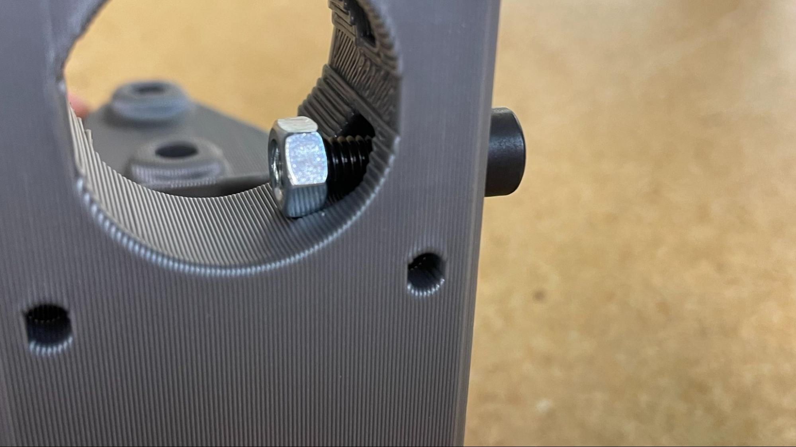

*   Before continuing, add a small drop of Loctite to the side of the hex nut

	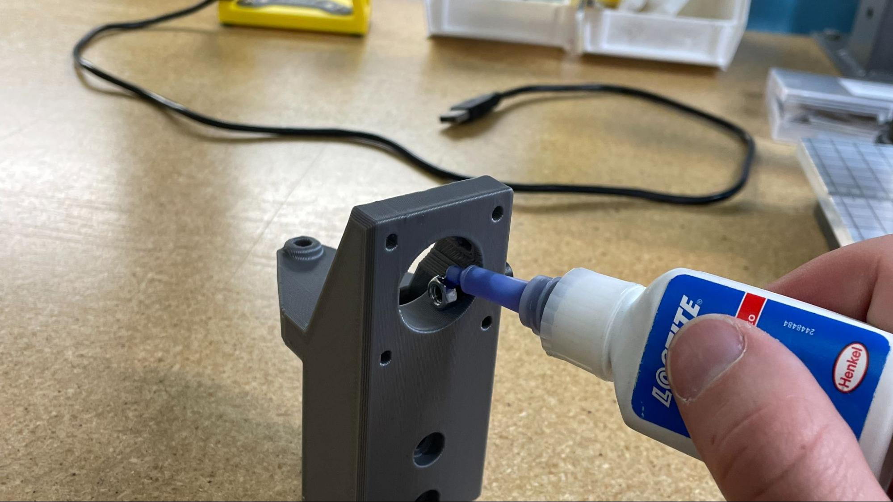

*   You can then proceed to pull the hex nut fully into the hex pocket by tightening the bolt

	

*   Repeat this process for the second hex nut, when finished your x-motor-mount should match the images shown below:

	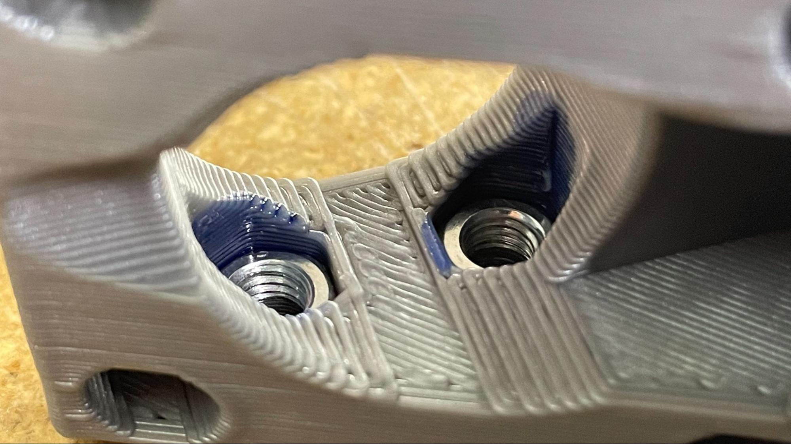
	

### Install NEMA 17 stepper motor onto x-motor-mount

*   Set timing-pulley height on NEMA 17 stepper motor shaft with jig

	*   The 1st set screw tightened must contact the flat region of the NEMA 17 motor’s shaft
	*   Tighten both set screws to 0.6 N/M

	

*   Bolt NEMA 17 motor onto motor mount with 4x M3x8 bolts

	*   Tighten these bolts to 0.4 N/M
	*   The motor connector should face towards the 2x pressed in M5 hex nuts when installed

	

### Assemble x-axis tensioner and install onto x-idler mount

*   The pieces you will need are shown below

	

*   Press an M3 hex nut into the belt-tension-arm, followed by an M3x16 bolt

	

*   Thread the M3x16 bolt all the way through the belt-tension-arm, and then thread an M3 acorn nut onto the ends of the bolt.

	*   Tighten the nut onto the bolt with pliers and an Allen wrench!

		

*   Install the idler-pulley with an M5x25 bolt and a nyloc M5 hex nut

	*   Avoid over tightening the bolt, the idler-pulley should be able to spin freely without resistance.

*   Install belt-tension-arm onto x-idler-mount

	*   Bolt the pieces together at the pivot point on x-idler-mount with an M5x40 bolt and a nyloc M5 hex nut.
	*   Avoid over tightening the bolt, the belt-tensioner arm should be able to pivot smoothly without much resistance.
	*   Ensure the belt-tensioner-arm is installed correctly on x-idler-mount (IE not backwards)
	*   The acorn nut should be resting against the x-idler mount when installed correctly

		

		

### Assemble x-motor-mount and x-idler mount onto alu-extrusion

**needs work**

## Prepare the x-gantry’s toolhead-assembly

### Top-camera-assembly preparation

*   Use the top-camera-focus-jig to pre-focus top-cameras

*   Connect top-camera-focus-jig to a laptop and open a native camera viewing application

	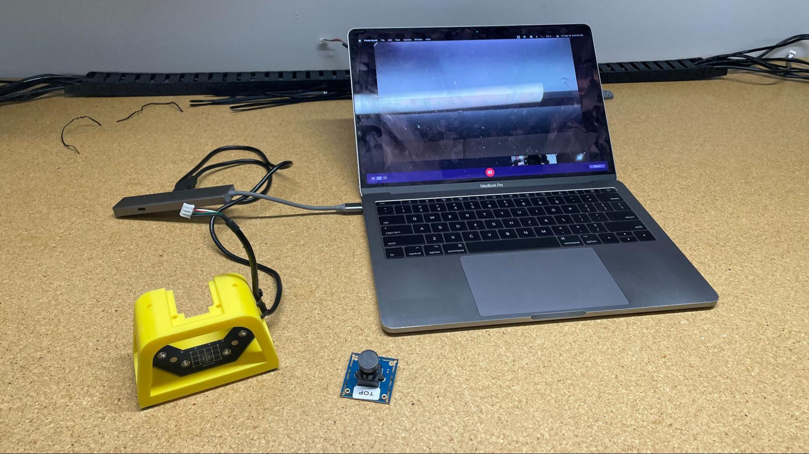

*   Remove the top-camera lens cap
*   Loosen the set screw found on the side of the lens body that locks the focus

	

*   Install the top-camera fully into the top-camera-focus-jig, plugging the USB cable into the camera module afterwards

	

*   In Photobooth, change the selected camera to PnP Top to view the camera feed of the top-camera. The setup should now look like the following image

	 

*   Rotate the camera lens until the live viewport shows the datum board as focused as possible

	
	
	
	
	!!! info "Camera view before and after focusing shown above"
	 	
*   Once the camera is focused, tighten the set screw to lock in the adjustments
*   Put a red dot on the camera PCB with a sharpie to denote that the camera has passed testing

	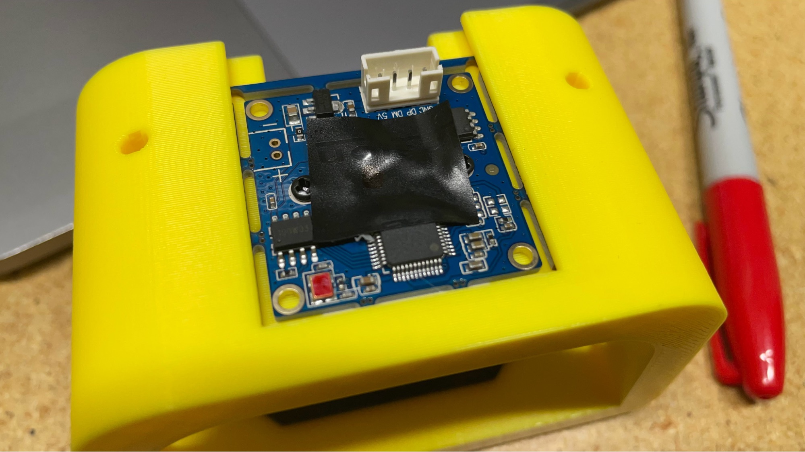

*   Remove the top-camera from the top-camera-focus-jig and immediately replace the lens cap.

### Assemble the top-camera-assembly

*   Installing top-ring-light into top-light-mount
	*   Place the ring light facing downwards into the top-light-mount.
	*   The LEDs will shine down, and the white plastic wire connector will face upwards.
	
	

*   Place top-camera-mount above top-light-mount, ensuring that the tab from the top-light-mount fits onto the side opposite the arms on the top-camera

	*   These two prints will pinch the top ring light in place

	

*   Install top-camera into top-camera-mount. 
	*   Make sure the connector on the back side of the camera is between the two arms of the top-camera-mount.

	

*   Secure the whole stack in place with four M2.5x20mm screws in the outer four holes 
	*   Do not put the screws through the inner holes with metal circles around them
	*   Tighten the screws enough so that all parts are tightly held together, however be cautious as these screws are threading directly into the plastic

	

### X-gantry-back hex nut installation

*   Insert 2x hex nuts into x-gantry-back for later drag-chain-assembly attachment

*   Add a small amount of Loctite to the sides of the hex nuts to ensure they stay installed in transit to the customer

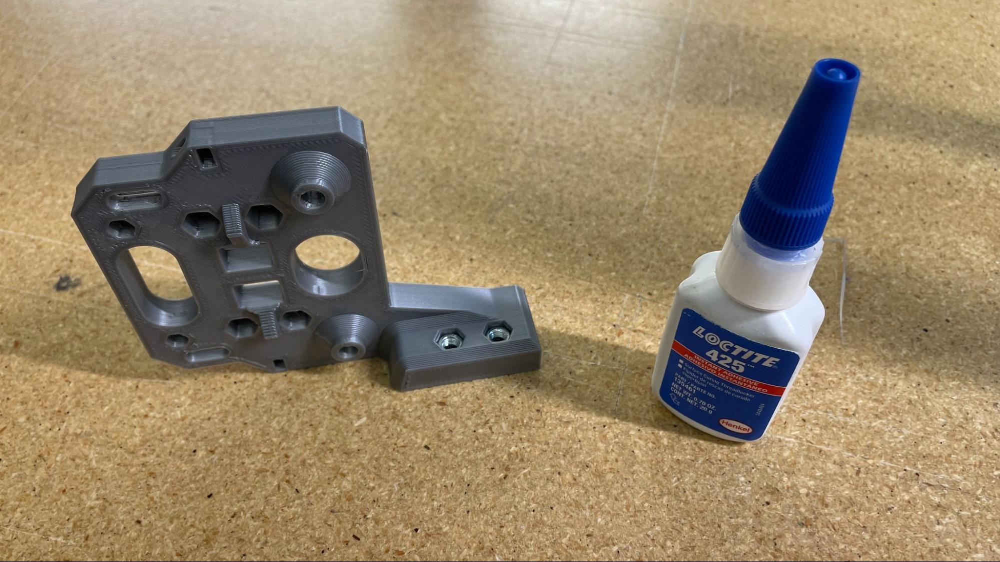

*   It is recommended to use a wide tool that can easily press down on the entire hex nut without allowing it to rock. This helps insert the hex nut into the print straight on.

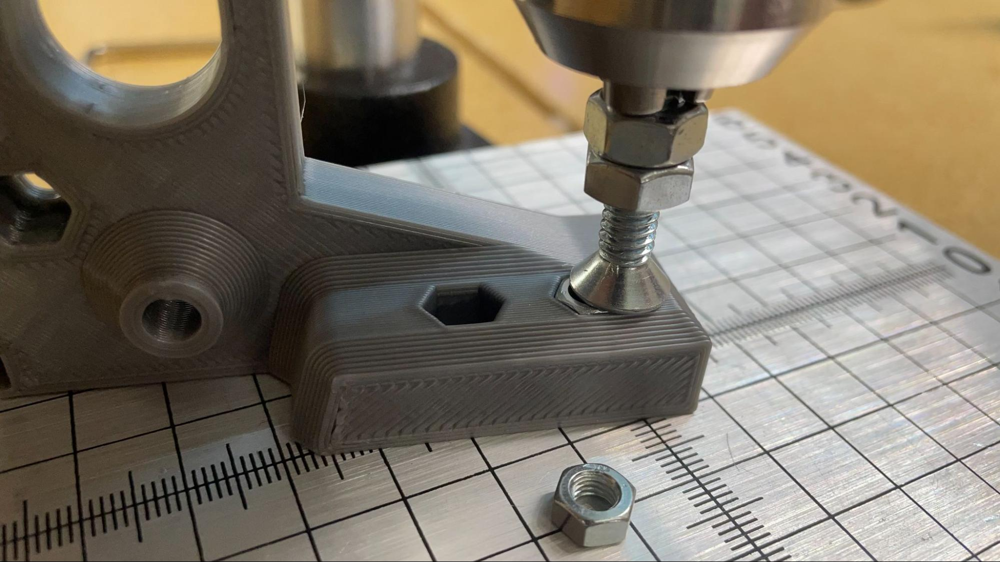

*   However, be sure to switch to a narrow tool that can fully press hex nuts into the pockets

*   Insert 2x backside hex-nuts into x-gantry-back

*   Place the x-gantry-back-nut-plate jig onto the arbor press to hold x-gantry-back in a proper position during the following steps

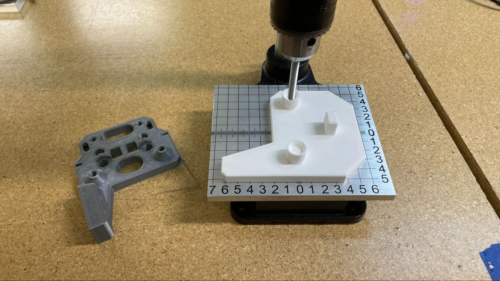

*   Press the hex nuts into x-gantry-back until they are flush with the surface

*   The 2x adjustable sliding M5 hex nuts are not installed at this time because they can be loose and it would be inappropriate to fix them in place with Loctite

*   Insert all the remaining top-side hex nuts into x-gantry-back

*   Fully insert the 4x M5 hex nuts used for belt-clamp attachment

*   If the pockets for the 2x hex nuts used for attaching the top-camera assembly loosely fit the hardware, use Loctite to prevent to secure them

*   Insert the 2x hex nuts used for tension adjustment deep into the print, stopping once the threads are fully visible from the intersecting bolt hole

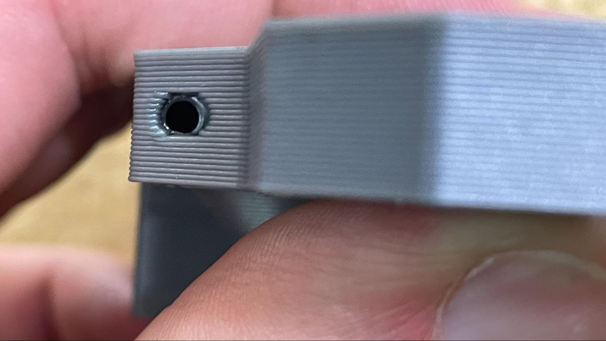

*   Install tensioner bar onto x-gantry back

### X-gantry-front preparation

*   Install hex nuts into x-gantry-front, being sure to utilize the x-gantry-front-nut-plate fixture when installing hardware into the backside of the print.

*   Press an M5 nyloc hex nut into the backside of x-gantry-front

*   Install the 8x M3 hex nuts into the backside of the x-gantry-front, use a narrow tool to ensure that these pieces are fully inserted into the 3D print.

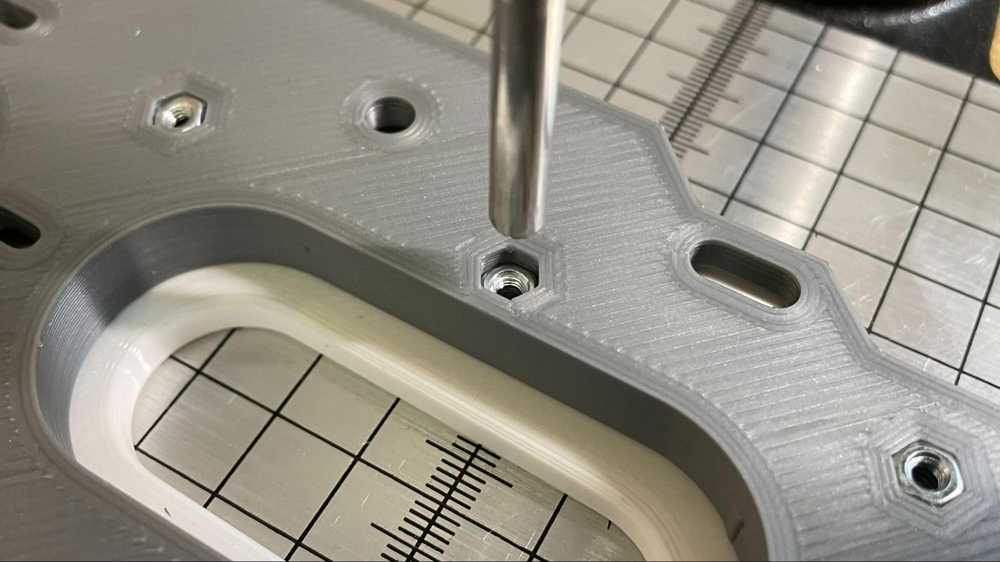

*   Insert the 2x hex nuts used for tension adjustment deep into the print, stopping once the threads are fully visible from the intersecting bolt hole

*   Install tensioner bar onto x-gantry-front

### x-gantry-toolhead assembly

*   Install linear-rails by aligning them against the bumps on x-gantry-front

	*   Uses 3x M3x14 bolts per rail
	*   Tighten each bolt to 0.5 N/M

	

	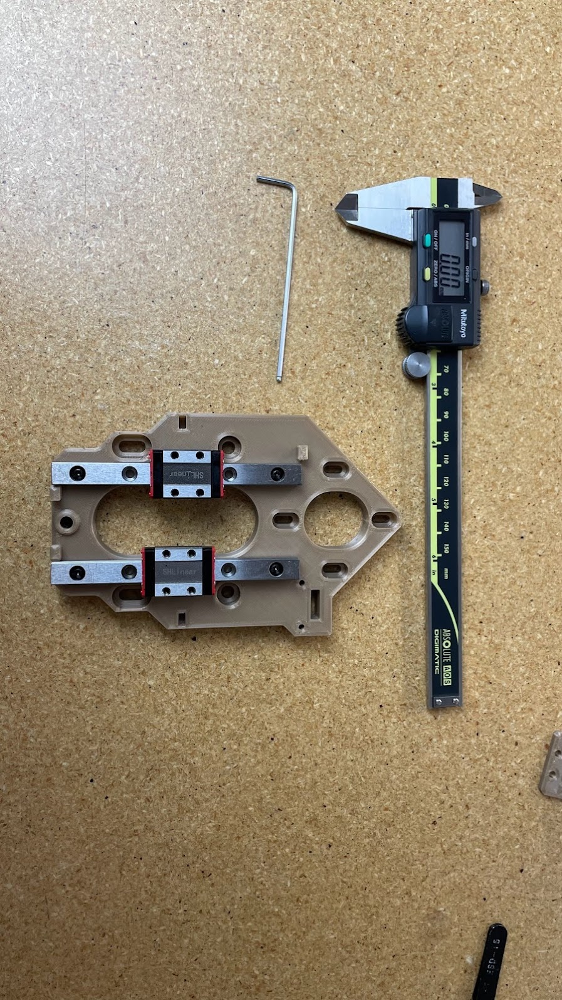

*   Install z-axis limit switch onto x-gantry-front

	*   Mounts with 2x M3x8 bolts and 2x M3 hex nuts on backside (should be already installed by now)
	*   Make sure each limit switch clicks and feels normal when actuated

	

	

*   Install idler-pulley onto x-gantry-front

	*   Use 1x M5x25 bolt and torque with a 4mm hex driver
	*   Check that the pulley can rotate freely without resistance
	*   Check that the pulley can only rotate - it should not be able to move up and down if the bolt is tightened correctly

	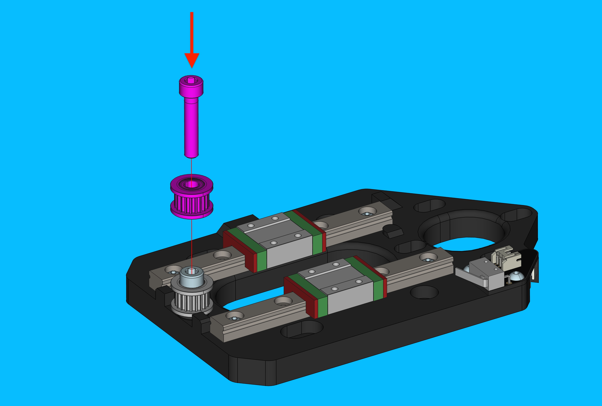
	

*   Prepare z-belt-subassembly

	*   Prepare z-gantry-backplate-left
	*   Drill out the limit switch striker bolt hole on z-gantry-backplate-left with a 2.5mm drill bit
	
		

	*   Install an M3x16 Flathead bolt into z-gantry-backplate-left to a depth that roughly matches the image shown below
		*   This screw depth will be precisely in later steps

		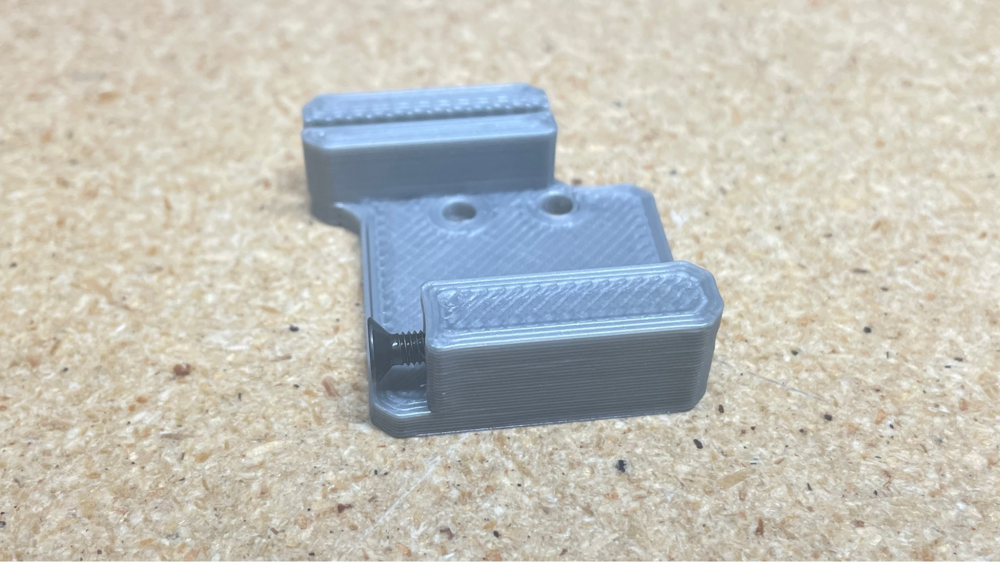

	*   Place a gt2-belt-loop onto the z-belt-alignment-jig
	*   Place z-gantry-backplate-left and z-gantry-backplate-right onto the z-belt-alignment-jig to align them correctly on the gt2-belt-loop
	*   Twist z-gantry-backplate-left upwards to pull the completed z-belt-subassembly off of the z-belt-alignment-jig
	*   Use a dull knife or other tool to push the gt2-belt-loop all the way down into the cavity of each z-ganry-backplate

*   Set timing-pulley height on NEMA 17 stepper motor shaft with jig

	*   The 1st set screw tightened  must contact the flat region of the NEMA 17 motor’s shaft
		*   Tighten both set screws to 0.4 N/M

		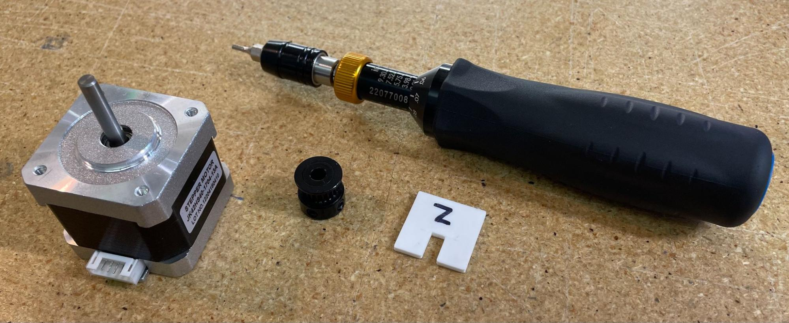

		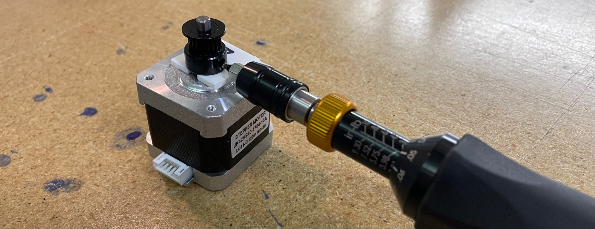

*   Install NEMA 17 stepper motor and belts onto the x-gantry-front subassembly

	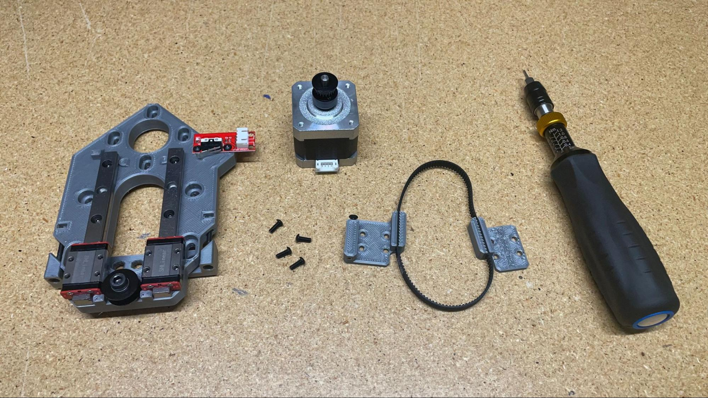

	*   Begin by placing the gt2-belt-loop w/attached z-gantry-backplates onto the x-gantry-front subassembly

	*   The z-gantry-backplate-right should fit over the right linear rail’s carriage, and the same goes for the left side

		

	*   Install the NEMA 17 stepper motor by angling it into the belt-loop

	*   The limit switch connector will be at a 45degree angle from  the z-axis stepper motor’s connector when everything is in the proper position.

		

	*   Bolt NEMA 17 stepper motor onto x-gantry-front with 4x M3x8 bolts

	*   Leave the bolts loose for now

		

	*   Tension belt-loop by pulling the stepper motor upwards before tightening its mounting bolts to 0.5 N/M

		*   The belts should feel much firmer now - to test manually move the z-axis back and forth while inspecting the belts for sag when changing directions
		*   You should be able to pluck the belt like a bass string

			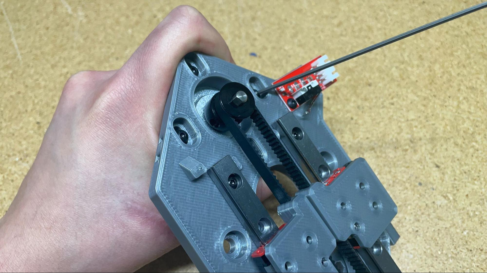

			

*   Attach z-gantry-left and z-gantry-right onto each respective linear rail carriages + z-gantry-backplate with 4x M3x8 bolts per side

	*   Align each z-gantry to be parallel with the linear-rail by lightly pressing it outward with your hand, away from the mid-plane of the x-gantry-subassembly
		*   As these bolts are tightend ensure that the z-gantry doesn’t collide with the z-idler’s bolt head
	*   Tighten bolts to 0.3 N/M, moving in a star pattern

		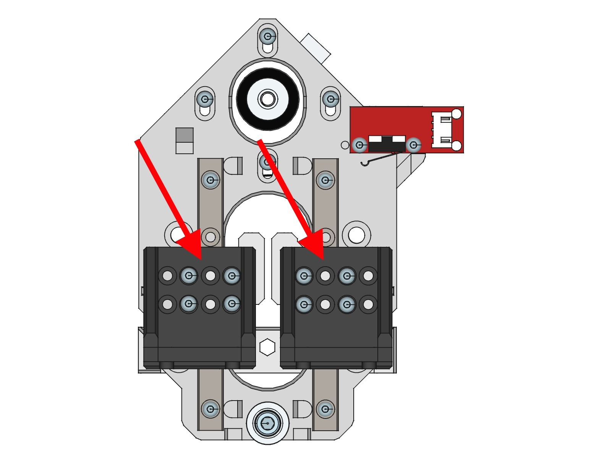

*   Prepare pneumatic-toolhead-assembly
	*   Install a `nozzle-holder` and `rotary-pneumatic-adapter` onto `NEMA11-hollow-shaft-stepper`
		*  Use a torque driver w/custom `rotary-pneumatic-adapter-socket` and 8mm wrench to tighten these components onto the motor shaft
		*  Set the torque driver to `0.5 N/M` for this step
		*  Use the 8mm wrench to hold the `nozzle-holder` stationary while applying torque from the `rotary-pneumatic-adapter`side
		*  The `rotary-pneumatic-adapter` should be installed closer to the motor's cable connector

		
		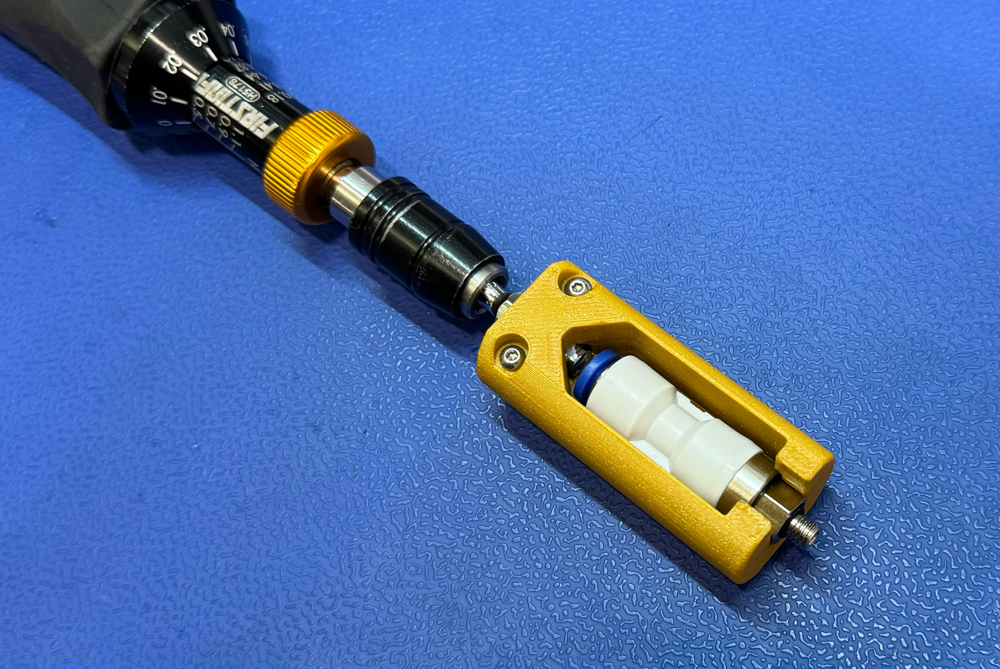
		
		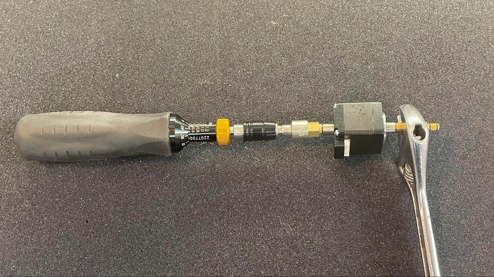

	*   Install 2x pneumatic-toolhead-assembly onto x-gantry-front-subassembly

	*   Bolt pneumatic-toolhead-assembly onto left side z-ganty
		*   Attach with 4x M2.5x8 bolts
		*   Torque each bolt to 0.3 N/M

		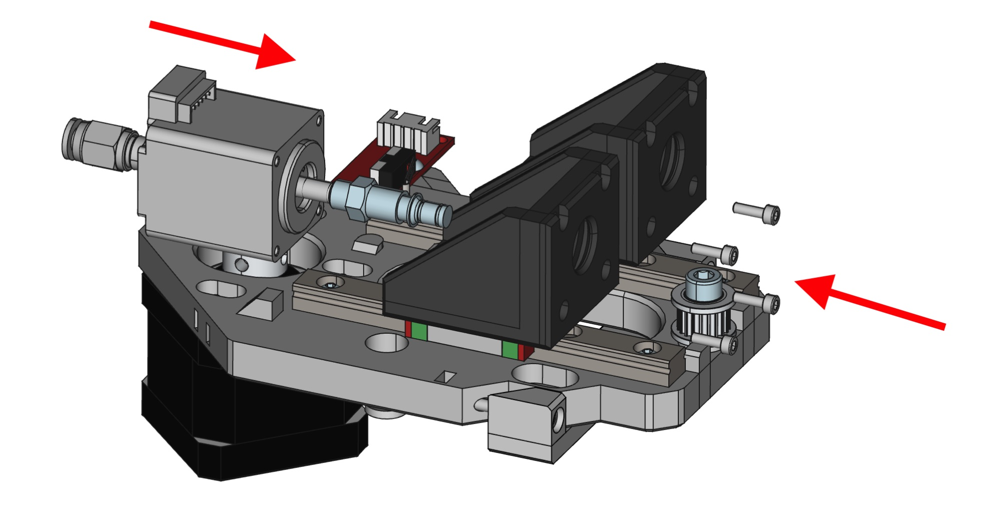

		

	*   Repeat above process to attach a pneumatic-toolhead-assembly to the right side z-gantry

		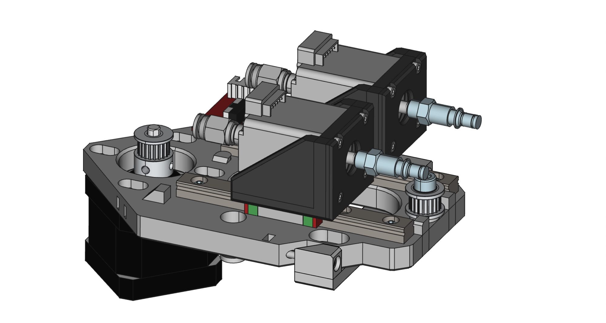

### X-gantry final assembly

*   Precut GT2 belt to ### length
*   Run gt2-belt through x-gantry-linear axis and connect both ends to x-gantry-back

*   Fully depress the x-axis belt tensioner arm before tightening down the belt with 2x belt-clamps with 2x M5x10mm socket head screws per clamp.
*   Use brass bar to route the belt through the extrusion and ends of the axis

*   Install x-gantry-front-subassembly onto x-gantry-linear-axis, connecting it to previously installed x-gantry-back

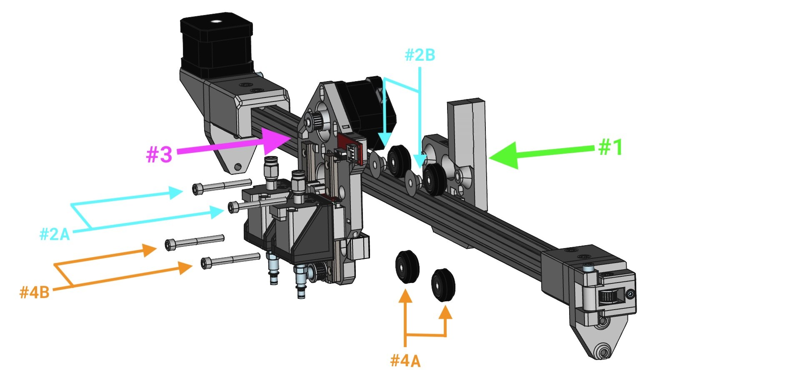

*   Step #1 - Hold the x-gantry-back subassembly against the x-gantry-linear-axis subassembly for the following steps to happen easier
*   Step #2A - Fully insert 2x M5x40 bolts through the upper counterbored M5 bores in x-gantry-front
*   Step #2B - Happening basically simultaneously with the previous step, align 2x roller-space and 2x v-wheels onto the previously inserted M5x40 bolts

 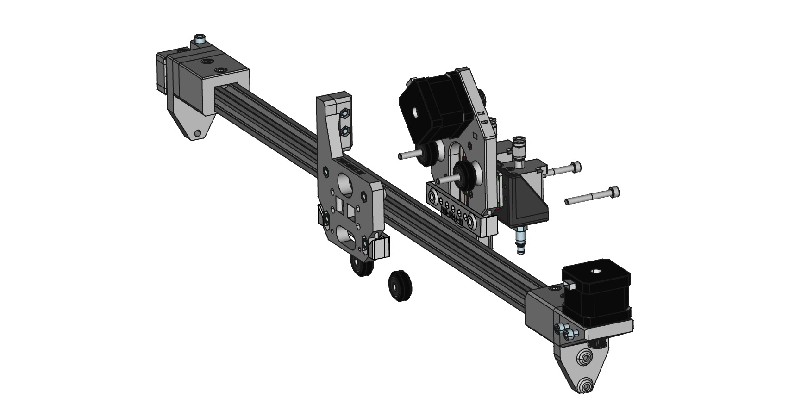

*   Step #3 - Move the x-gantry-front-subassembly backward into the x-gantry-back-subassembly, paying attention to keeping the upper 2x v-wheels aligned on the x-gantry-linear-axis’s 2020-v-groove extrusion

!!!note
	Rotate everything upside down for the following steps

*   Step #4A - Lower 2x v-wheels up until they rest loosely against the 2020 v-groove extrusion, they should also each be aligned so that each wheel is concentric to the raised nubs on the x-gantry’s tensioner-bars.

*   Note that the 2x tensioner-bar pieces may not be vertically aligned very well by this point, so this process may be tricky

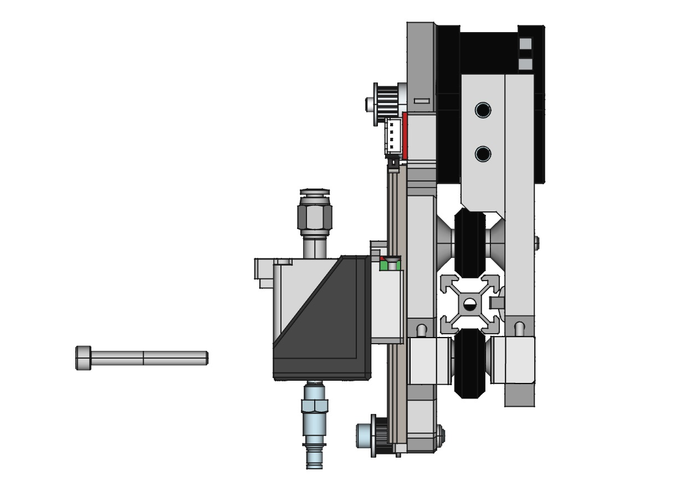

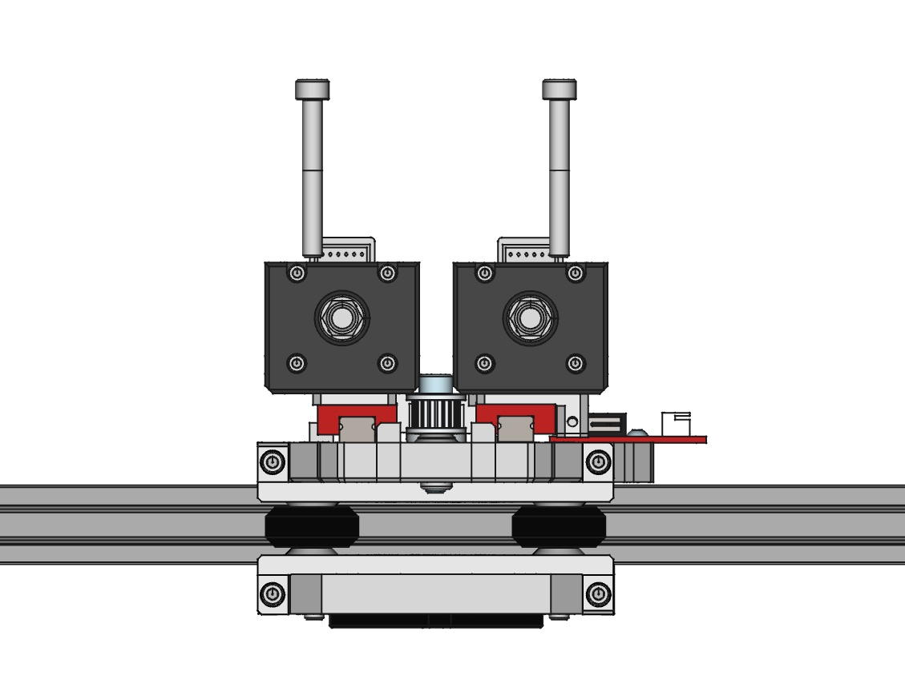

*   Step #4B -

	*   Adjust the vertical alignment of the 2x tensioner-bar pieces
	
	*   This is done by tightening or loosening the 4x M3x30 adjustment bolts until you can peer straight through the lower counterbored M5 bores in x-gantry-front and past the hex-nut slot found on x-grant-back
	*   This may take a few minutes so be patient!
	*   Tighten and loosen all 4x M3x30 bolts as a set, taking care to never make a single bolt more than a few turns away from any other bolt
	
	*   Fully insert 2x M5x40 bolts into the lower counterbored M5 bores in x-gantry-front, through both v-wheels, and stopping within two hex-nut slots found on x-gantry-back
	
	*   Manipulate the z-gantry pieces as needed to avoid interference with the bolts
	
	
	
	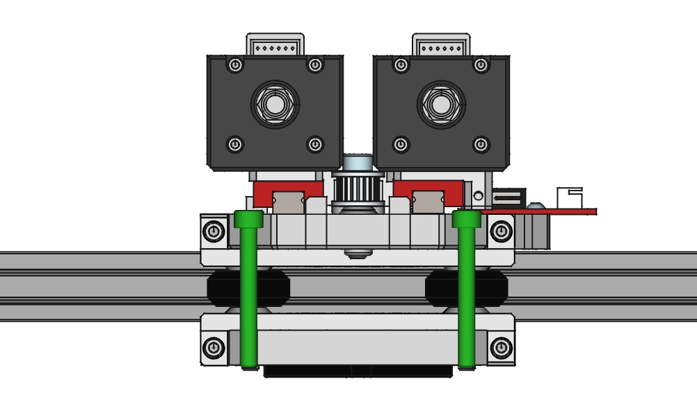
	
	*   Tension x-gantry v-wheels and x-axis belt tensioner arm
	
	*   Tighten the 4x M3x30 bolts until the toolhead-assembly can smoothly move along the x-gantry-linear-axis, without resistance
	
	*   Grab the toolhead-assembly and try twisting it in many directions, if you feel any play or looseness tighten the appropriate M3x30 bolts until the play dissipates
	
	
	
	*   Tighten the 2x lower M5x40 bolts to 0.1 N/M to lock-in the calibrated v-wheel tension
	*   Tension the belt to 0.03 N/M \*\* need to confirm \*\*
	
	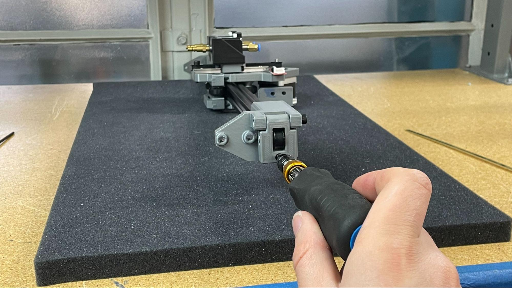

## Test x-gantry on Gundam jig

*   Ensure that the Gundam motherboard is unplugged from 24vDC power
*   Check that the x-gantry fits correctly on the x-gantry-spacer-jig
*   Slide a bolt into the x-gantry on either side of x-gantry-spacer-jig to prevent it from falling during testing
*   Bolt down the test jig’s drag-chain onto x-gantry-back-subassembly with 2x M5x16 bolts
*   Connect the test jig’s z-limit-switch, x-motor, and z-motor cables to the x-gantry being tested on the x-gantry-spacer-jig
*   Connect the Gundam motherboard to 24vDC power and then press reset on the motherboard
*   Connect the motherboard to the Gundam test software
*   Begin testing the x-gantry by running various macros

*   Check X-Home

	*   If the toolhead is moving very slow, the stepper drivers may not have initialized properly - try restarting the motherboard again

*   Check X-Movement Speed

	*   Ensure that no weird sounds are heard, if so consult with team for debugging steps
	*   Adjust the tightness of the belts and each tensioner-bar as needed to pass this test
	
*   Test Z-Home

	*   Check that the z-belt is adequately tensioned and adjust if necessary - you shouldn’t be able to twist the belt too much
	*   Adjust the M3x16 bolt either up or down, if needed, provided the z-gantries are not aligned vertically after homing,
	
	*   This can be checked by sliding a brass shim across the top of the motor while checking to see if it sits higher/lower than the top surface of the adjacent motor
	
	*   Repeat this test and continue adjusting the M3x16 bolt until the alignment appears to be perfect
	
*   Test Z-Movement Speed

!!! failure   "If issues arrise, continue rerunning tests and reworking the x-gantry"

!!! success  "Once everything is passing, proceed with the following steps"

*   Remove x-gantry from Gundam
	*   Disconnect Gundam motherboard from 24vDC power
	*   Unplug the test jig’s z-limit-switch, x-motor, and z-motor cables from the x-gantry being tested on the x-gantry-spacer-jig
	*   Unscrew the drag-chain mounting hardware from the x-gantry being tested on the x-gantry-spacer-jig
	*   Remove the 2 M5x25 bolts used initially for keeping the x-gantry from falling off the x-gantry-spacer-jig

## Install top-camera-assembly
*   Install top-camera and Light subassembly onto x-gantry
	*   Use two M3x14mm screws to mount the top-camera and Light subassembly onto the back of the X Gantry Back.

	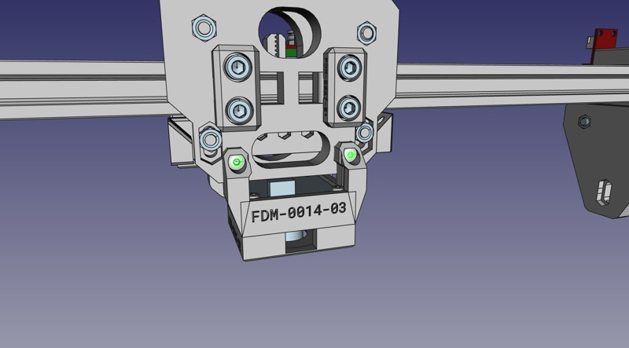

	

## QC Checklist
Inspect the completed `x-gantry` for the following criteria:

* `GT2-belt` has been trimmed to appropriate length (flush on 1 side, ~1/2" - 3/4" on the other)
* Camera is installed with two bolts
* Camera lens cap is present
* The wire connectors on both `NEMA-11-stepper-motor` units face away from each other, sitting adjacent to their respective cable strain relief points
* Each `nozzle-holder` has been lubricated and fit-tested with a nozzle
* `Z-belt-loop` feels appropriately tensioned when plucked
* Each `z-gantry` moves smoothly when actuated back-and-forth by hand
* 2x `M5-hex-nut` are installed in `x-gantry-back` for use with `drag-chain` attachment 
* `NEMA-17-stepper-motor` wire connector faces towards `drag-chain` mounting location on `x-gantry-back`
* `Linear-rail` is centered atop `aluminum-extrusion`
* `x-idler-mount` and `x-motor-mount` are secured to `600mm-alu-extrusion` with 2x `M5x10-bolt` per side
* 2x `M5-hex-nut` are installed in `x-motor-mount` for use with the `x-motor-cable-guide`
* `Tensioner-arm` is installed on `x-idler-mount` in the correct orientation (IE acorn-nut facing touches print)
* `Timing-pulley` is tightened down and at proper height
* `GT2-belt` lays flat and is roughly centered in the `600mm-alu-extrusion` channels
* `GT2-belt` has been correctly tensioned
* `X-gantry-toolhead` moves smoothly when actuated back and forth by hand

!!!success "If all checks pass, bring the completed `x-gantry` to the shelf for peer-review and pack-out."
