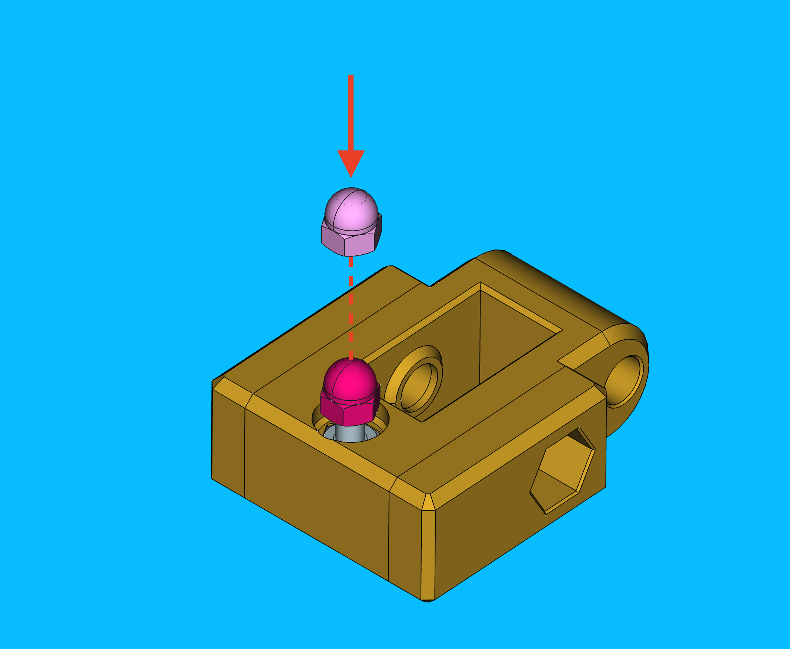
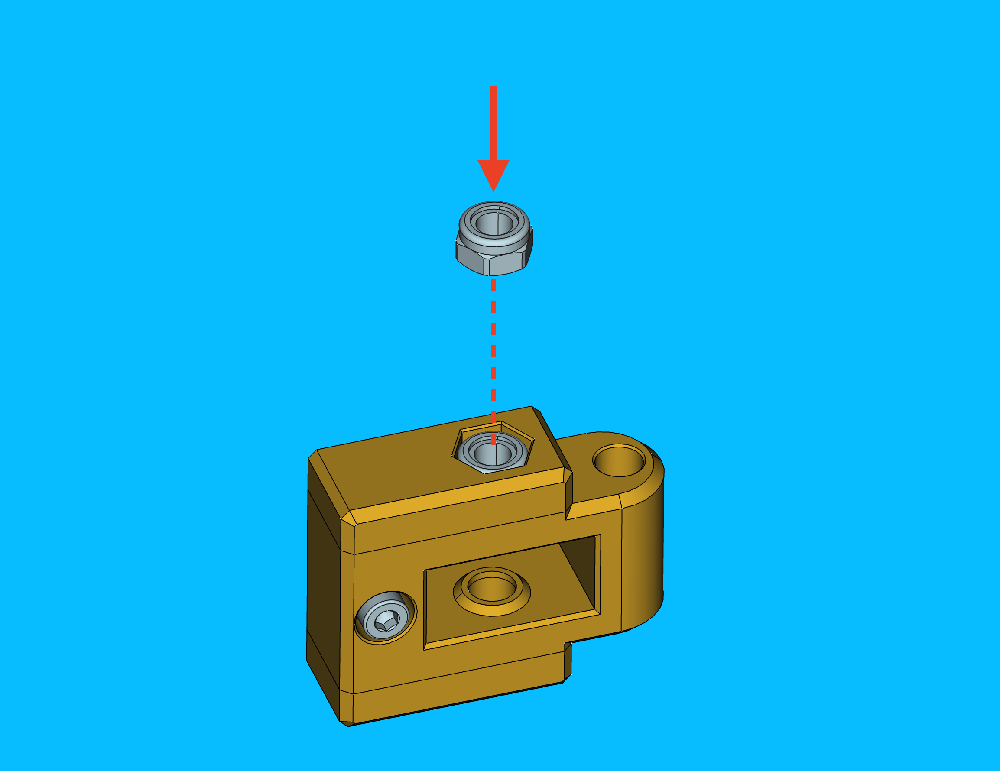
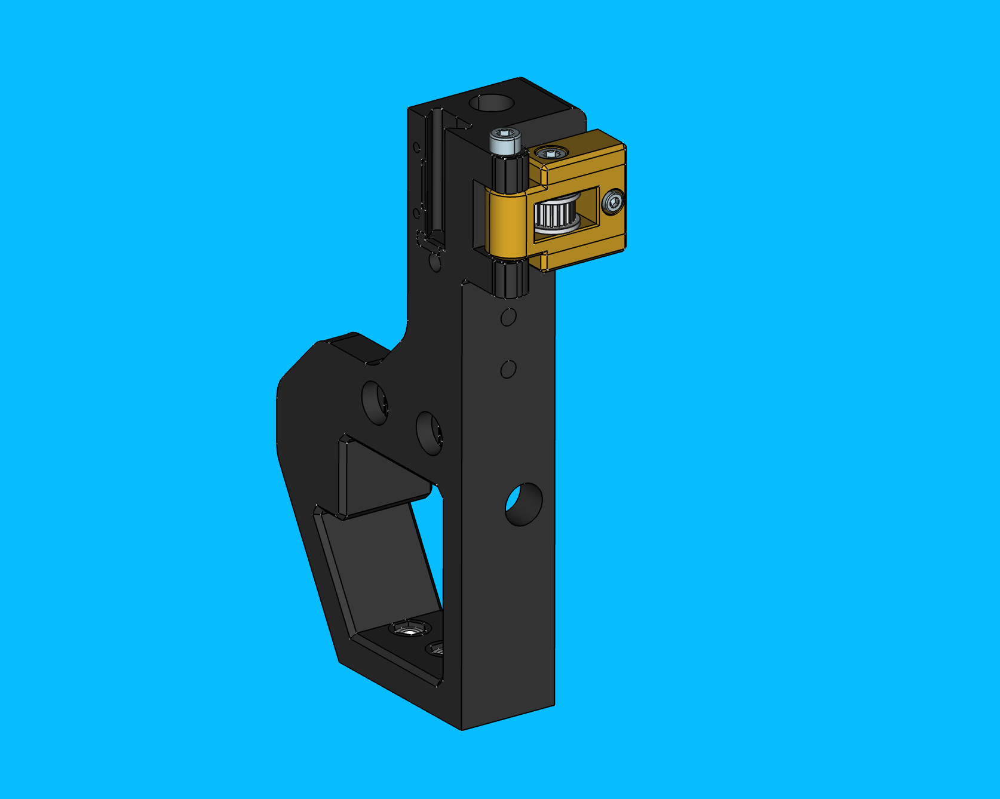
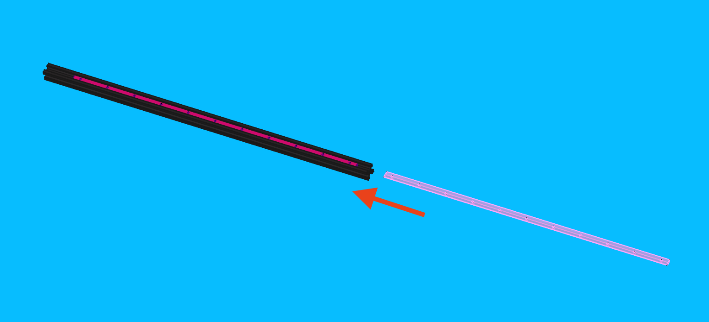
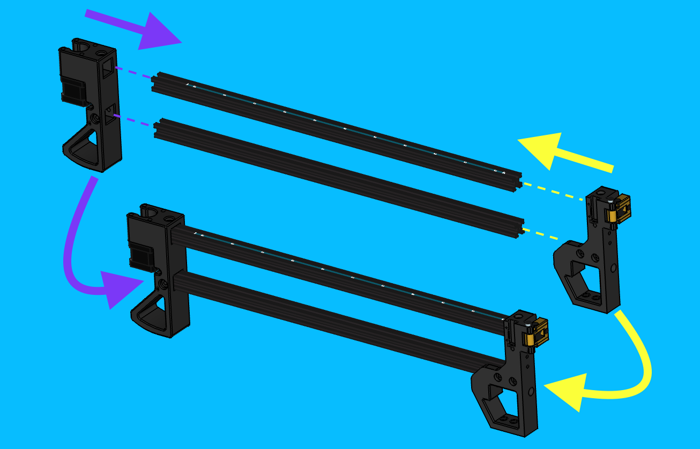
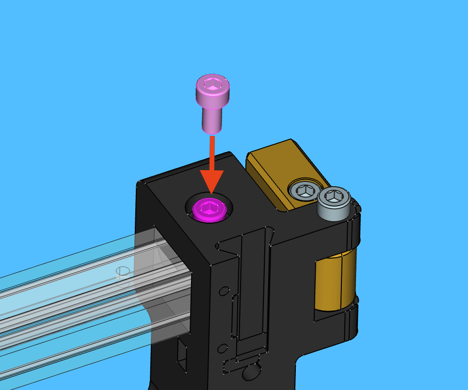
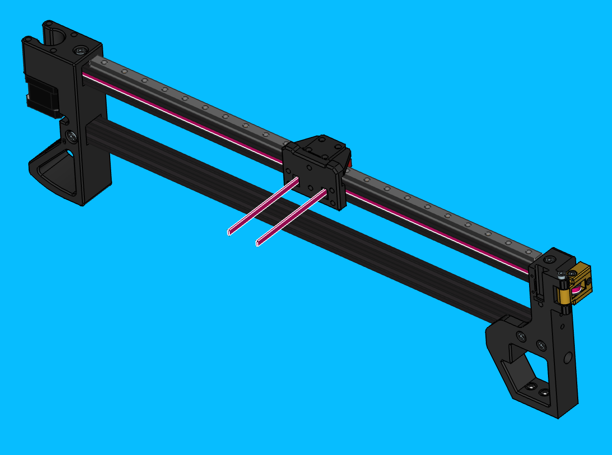
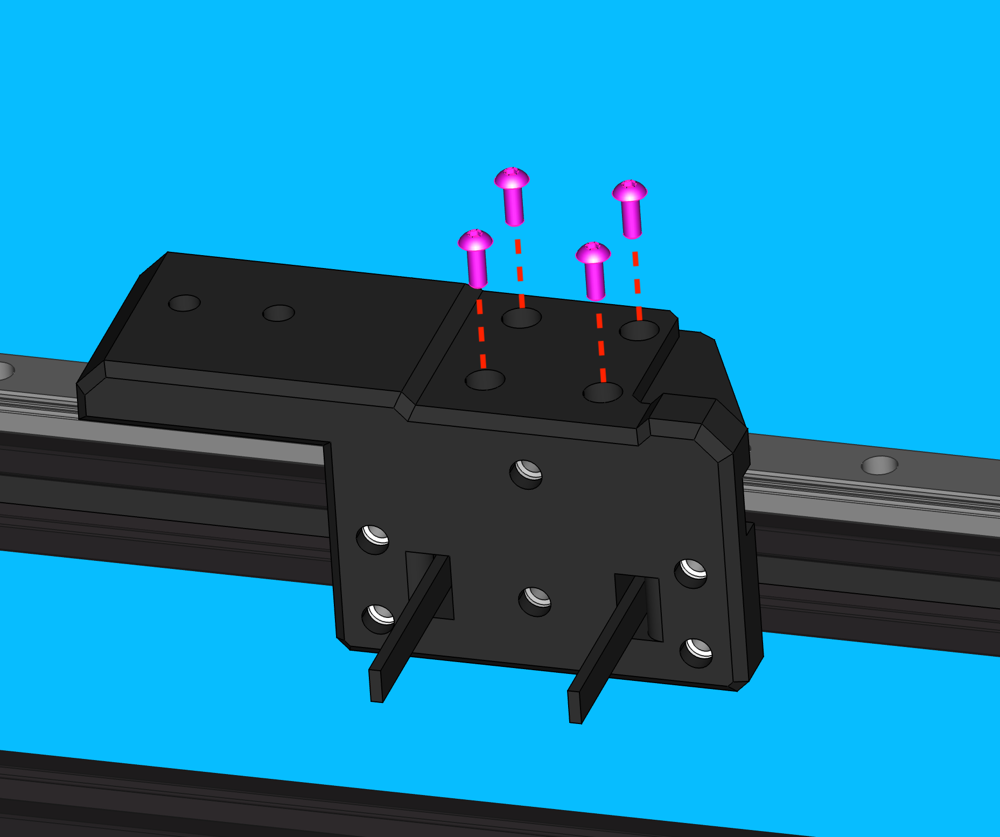
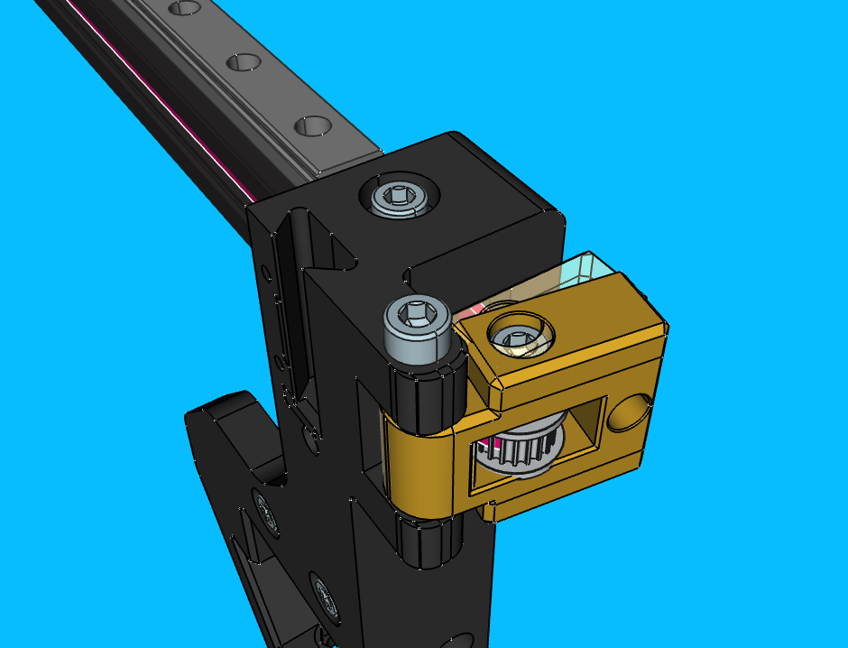
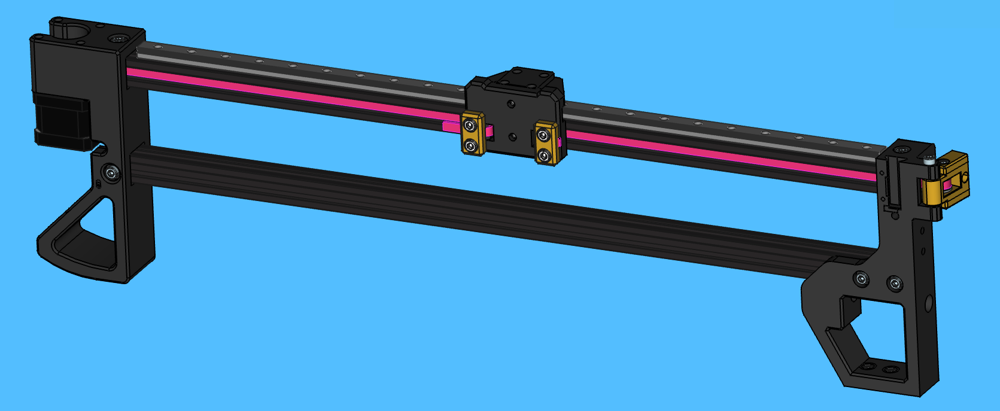

## Intro
The purpose of this work instruction is to explain the assembly process for the LumenPnP v4 Left-Side Y-Gantry (`y-gantry-left`). This document also serves as the work instruction for the `y-gantry-right` subassemby, as this is simply a mirror of the left-side.

## Create Y-Gantry Subassembly
- Remove any stringing from the print with a heat gun
- Insert 6x `m5-hex-nut` into the following region
	
- Install 2x `m5-square-nut` into the location shown below
	

## Create Front-Left-Leg Subassembly

### Prepare front-left-leg
- Remove any stringing from the print with a heat gun
- Insert 2x `m5-hex-nut` into bottom of leg
	
	

- Insert 1x `m5-square-nut` near extrusion pocket
 	
 	
- Insert 1x `m5-nylock-hex-nut` into in the underside of `belt-tensioner-arm` mounting post
	

### Prepare belt-tensioner-arm
- Press an `M3-hex-nut` into the `belt-tension-arm` with a `arbor-press-jig`

- Thread a `M3x16-bolt` through the `belt-tension-arm`

- Thread a `M3-acorn-nut` onto the end of the bolt
	-  The `M3-acorn-nut` and `M3-hex-nut` should be on the same side of the `belt-tensioner-arm`
	-  Tighten the `M3-acorn-nut` onto the `M3x16-bolt` with a 5.5mm socket and an allen wrench
	
	
	
	

- Rotate the `M3x16-bolt` until the `M3-acorn-nut` is loosely resting against the `M3-hex-nut`

	!!!info "This ensures the `belt-tensioner-arm` is installed with it's adjustment range fully available for when it's time to tension `GT2-belt`"

	

- Insert a `M5-nylock-hex-nut` into `belt-tension-arm`'s hex-nut pocket
	

- Slide a `GT2-idler-pulley` into the `belt-tensioner-arm`
	

	!!!note "Note that the `GT2-idler-pulley` is symmetrical, so it's orientation does not matter"

- Install a `M5x25-bolt` into the `belt-tensioner-arm` to secure the `GT2-idler-pulley` in place
	- Avoid over tightening this bolt as the `GT2-idler-pulley` should be able to spin freely without resistance
	- The bolt should, however, be tightened enough to eliminate lateral pulley movement within the `belt-tensioner-arm`

	

### Install belt-tensioner-arm onto front-left-leg

- Add a drop of `ptfe-silicone-lubricant` to both sides of `belt-tensioner-arm`'s pivot point

- Install `belt-tensioner-arm` onto `front-left-leg`
	

- Secure the `belt-tensioner-arm` onto `front-left-leg` with a `M5x40-bolt`
	- Avoid over tightening this bolt as the `belt-tensioner-arm` should be able to pivot freely without *much* resistance

	

- The completed `front-left-leg` should match the image shown below
	

## Create Back-Left-Leg Subassembly

### Prepare back-leg
- Remove any stringing from the 3D print with a heat gun
- Insert an `m5-hex-nut` into the bottom of the `back-leg` 3D print
	- Finger strength *should* be sufficient to install this fastener into position
	!!!glue "Glue if needed"
		Add a drop of loctite to the region if the fastener fit is looser than normal and seems at risk of falling out in transit
	
	

### Prepare y-gantry stepper motor
- Gather the following parts and tools
	- nema17-stepper-motor
	- GT2-timing-pulley
	- y-timing-pulley-spacer-jig
	- Torque driver w/2mm hex driver, set to `0.7 N/M` *(not shown)*

	
- Use motor spacing jig to mount the timing pulley to the NEMA 17, ensuring the set screw is aligned to the flat side of the motor shaft
	
- Tighten the 2x timing pulley set screws to 0.7 N/M - first tightening the one facing the flat on the motor shaft
	
	
	
### Install y-gantry stepper motor onto back-leg
- Connect `Y1-stepper-motor-cable` to the `y-gantry-stepper-motor`

	

- Install the  `y-gantry-stepper-motor` onto `back-leg`
	- The `Y1-stepper-motor-cable` should be routed through `back-leg` to exit towards the center of the machine
	- Ensure no wires are being crushed or strained

	

- Put 4x `M3x8-bolt` through the motor mounting holes found on `back-leg`

	

- Install a `zip-tie` for cable strain relief
	- Use a `zip-tie` to attached the `Y1-stepper-motor-cable` to the `back-leg` to add strain relief

		

	- Cut the `zip-tie` with `flush-cutters`

		

	- Ensure that `Y1-stepper-motor-cable` and `zip-tie` are resting against the logo-face side of `back-leg`

		

## Assemble y-gantry-left

### Install front-left-leg and back-leg onto 600mm-alu-extrusion

- Begin by inserting a `525mm-m3-t-nut-bar` into a piece of `600mm-alu-extrusion`
	- There should be about 51.5mm between the end of the `525mm-m3-t-nut-bar` and the right-side end of the `600mm-alu-extrusion` after installation
	- The `525mm-m3-t-nut-bar` needs to be slide aside in later steps, so do not bother to make this perfect right now

	

- Insert `front-left-leg` and `back-leg` onto 2x pieces of `600mm-alu-extrusion`
	- The `525mm-m3-t-nut-bar` is oriented in the top-side groove of the uppermost `600mm-alu-extrusion`
	- The extrusion pieces should be *fully* inserted into each leg

	

- Bolt `back-leg` to `600mm-alu-extrusion`
	- Insert 3x `m3-t-nut` into the `600mm-alu-extrusion` pieces before sliding each of them into alignment with the matching bolt holes on `back-leg`

		

	- Insert 3x `M5x10-bolt` into `back-leg` and thread the bolts into each corresponding `M3-t-nut`

		

- Bolt `front-left-leg` to `600mm-alu-extrusion`
	- Slide the `M3-t-nut-bar` out of the way *if needed*
	- Insert an `M3-t-nut` into the upper channel of `600mm-alu-extrusion`
	- Align the `M3-t-nut` with the top-side bolt hole on `front-left-leg`  

		

	- Insert a `M5x10-bolt` into the top-side bolt hole on `front-left-leg` and tighten it into the `M3-t-nut`

		

	- Slide 2x `M3-t-nut` into the the side channel of lower `600mm-alu-extrusion` and align them with the two bolt holes on `front-left-leg`

		

	- Insert 2x `M5x10-bolt` into the side bolt holes on `front-left-leg` and tighten each into the corresponding `M3-t-nut`

		

- Compare the WIP `y-gantry-left` assembly to the image below after completing all previous steps, address any discrepancies as needed before proceeding onward

	

### Install linear-rail-550mm

- Roughtly position `linear-rail-550mm` onto top-side of uppermost `600mm-alu-extrusion`

	

- Place a `linear-rail-2020-alignment-jig` on both ends of `linear-rail-550mm`
	- Do not cover any bolt holes with the jig  

	

- Visually center the `linear-rail-550mm` between the `back-leg` and `front-left-leg`
- Slide the `M3-t-nut-bar` to line up with the linear rail's bolt hole pattern
- Starting from the `front-left-leg` side, lightly snug a `M3x8-bolt` into **every other** bolt hole on `linear-rail-550mm`
	- Move the `linear-rail-carriage` out of the way as needed

	

- Torque the rail mounting bolts to specification in sequence beginning with the bolts at the center of the rail and working towards each end
	- A torque wrench should be used to set the specified bolt torque
	- The torque specification for these `M3x8-bolts` is `0.5N/M`

	

- Remove the `linear-rail-2020-alignment-jig` from both ends of `linear-rail-550mm`
- Slide the linear-rail-carriage back and forth a few times, checking to see that it travels smoothly and consistently

### Halfway Checkpoint

- Verify that `y-gantry-left` matches the following photo

	

!!!success "If `y-gantry-left` matches the photo, proceed to the next section"
!!!failure "If `y-gantry-left` does not match the photo, correct discrepancies before proceeding to the next section"

### Install GT2-belt
- Route a 1.3m-long piece of `GT2-belt` through `y-gantry-left`

	!!!info "Belt routing step-by-step"
			- Start by running the belt through the `y-gantry`'s left-side slot and leave 75mm of extra belt poking out
			- Run it through the extrusion towards the `back-leg`
			- Wrap it around the `timing-pulley`
			- Run it back through the extrusion towards the `front-left-leg`
			- Wrap it around the `idler-pulley`
			- Run it back through the extrusion towards the `back-leg` again
			- Have the belt exit through the `y-gantry`'s right-side slot

	

- Slide the `y-gantry` subassembly onto the `linear-rail-carriage` while pulling slack out of the `GT2-belt`
	
	

- Bolt `y-gantry` to the `linear-rail-carriage` with 4x `M3x8-bolt`
	- Tighten each bolt to 0.5 N/M
	- Push `y-gantry` inward towards the `linear-rail-carriage while tightening the mounting bolts to align it  

	!!!warning "Ensure that `y-gantry` sits flush against `linear-rail-carriage` without any visible gaps"

	

- Use `belt-clamp` with 2x `M5x10-bolt` to clamp the left-side of the `GT2-belt` to the `y-gantry`
	- Tighten each `M5x10-bolt` to 0.5 N.M

	
	

### Tension the Y-Gantry

- Pull the right-side `GT2-belt` tightly towards `front-left-leg`

	

- Use `belt-clamp` with 2x `M5x10-bolt` to clamp the right-side `GT2-belt` to the `y-gantry`
	- Tighten each `M5x10-bolt` to 0.5 N.M

	

- Rotate the `M3x16-bolt` clockwise on the `belt-tensioner-arm` to tension the `GT2-belt` installed on `y-gantry-left`
	- This will cause the `belt-tensioner-arm` to pull the `idler-pulley` away from the `front-left-leg` which adds desired tension to `GT2-belt`

	

- Trim the loose `GT2-belt` on either side of the `y-gantry`
	- For the `front-left-leg` side of the `y-gantry` print, trim the loose `GT2-belt` until it's flush against `belt-clamp`
	- For the `back-leg` side of the `y-gantry` print, trim the loose `GT2-belt` until there's approx. 15mm of `GT2-belt` past `belt-clamp`

	

### Add cable management

- Use **3x** `extrusion-cable-clip` to secure the `Y1-stepper-motor-cable` to the inner side of the lower `600mm-alu-extrusion`

	

## Quality Checks
A `y-gantry-left` that was built while following the above steps will match the following image.

Confirm this by inspecting the completed `y-gantry-left` assembly with the following QC checklist:

* Confirm M5 bolts are installed in every counterbored region
* `M5-hex/square-nut` installed where required:
	* 2x `M5-hex-nut` pressed into bottom of `front-left-leg`
	* 1x `M5-square-nut` pressed into side of `front-left-leg` for use with `front-drag-chain-mount`
	* 1x `M5-hex-nut` pressed into bottom of `back-leg`
	* 2x `M5-hex-nut` pressed into `y-gantry`
* `GT2-belt` has been trimmed to appropriate length (flush on 1 side, ~1/2" - 3/4" on the other)
* `GT2-belt` has been correctly tensioned
* `Tensioner-arm` is installed on `front-right-leg` in the correct orientation (IE acorn-nut facing touches leg)
* `Linear-rail` is centered atop `aluminum-extrusion`
* `y-gantry` sits flat on `linear-rail-carriage`
* `y-gantry` feels smooth and free of friction across the y-min to y-max travel range when actuated by hand
* `GT2-belt` lays flat in the `600mm-alu-extrusion` channels
* 3x `extrusion-cable-clip` have been installed onto the `y-gantry-left`'s lower `600mm-alu-extrusion`
* `Timing-pulley` is tightened down and at proper height
* `Y1` cable is secured with a zip-tie and exits the port labeled `Y1`

!!!warning "Stay vigilant for new failure modes not listed above and report them to a production lead when found"
	
!!!success "If everything looks good"
	Set the finished `y-gantry-left` aside for functional QC testing at the Gundam test station
