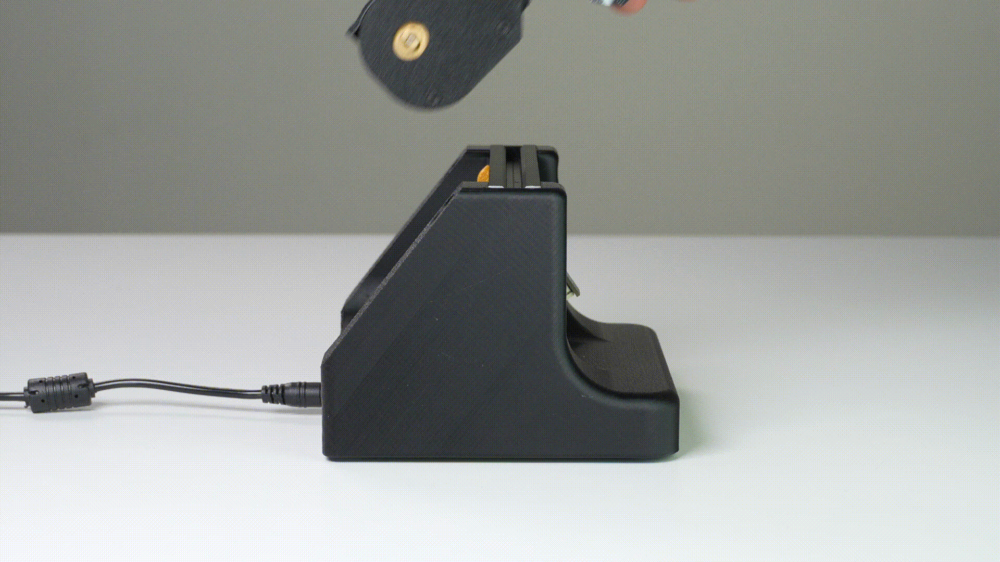

# Feeder Loading Station 

### Required Parts — Prints, PCBs & Jigs

- 3D Prints:

    - `fls-base`
    - `fls-cover`
    - `fls-slot`
    - `extrusion-cable-clip`

- PCBs:
    - `power-breakout`
    - `feeder-slot`

- Jigs:
    - `feeder-blade-jig`
    - `slot-centering-jig`

### Required Parts — Fasteners & Other

- Fasteners:
    - `M3x8mm-self-tapping-flat-hex-head`
    - `M5-tslot-nut`
    - `M5x10mm-socket-head`

- Other:
    - `short-photon-harness` - cable harness 
    - `vslot-extrusion-20mm-x-20mm-x-140mm` - extrusion
    - `rubber-foot` - rubber feet for stability

### Mount `feeder-slot` PCB to `fls-slot`

1. Use `m3x8mm-self-tapping-flat-hex-head` to secure `feeder-slot` PCB to `fls-slot` print. Use `feeder-blade-jig` to make alignment easier when securing multiple `feeder-slot` PCBs

    

2. Insert `m5x10mm-socket-head` into the large opening at the bottom of the `fls-slot` print

    

3. Thread on `m5-tslot-nut` onto `m5x10mm-socket-head`

    

### Prepare Extrusion and Cable Harness

1. Insert `vslot-extrusion-20mm-x-20mm-x-140mm` into `slot-centering-jig` and secure `fls-slot`

    
    

2. Feed `short-photon-harness` through channel of `fls-base` so that it feeds into the cutout at the bottom of the base

    
    

3. Plug `short-photon-harness` into `feeder-slot` PCB

    

### Secure Extrusion to `fls-base`

1. Insert `vslot-extrusion-20mm-x-20mm-x-140mm` into `fls-base`

    

2. Install `extrusion-cable-clip`. Pull `short-photon-harness` taut and ensure the clip is installed as far right on the extrusion as possible

    
    
    

3. Secure `vslot-extrusion-20mm-x-20mm-x-140mm` to `fls-base` with 4x `m5x10mm-socket-head` and 4x `m5-tslot-nut`

     
    

### Install `power-breakout` PCB

1. Place `power-breakout` PCB into cutout of `fls-base`

    
    

2. Secure `power-breakout` PCB with 4x `M3x8mm-self-tapping-flat-hex-head`

    

3. Plug `short-photon-harness` into `power-breakout` PCB

    

### Final Assembly

1. Ensure `short-photon-harness` cable is managed and add `fls-cover`

    
    

2. Secure `fls-cover` with 4x `M3x8mm-self-tapping-flat-hex-head`

    

3. Install 4x `rubber-foot` in the designated cutouts on `fls-base`

    
    

    !!! success
        Feeder Loading Station is now fully assembled.