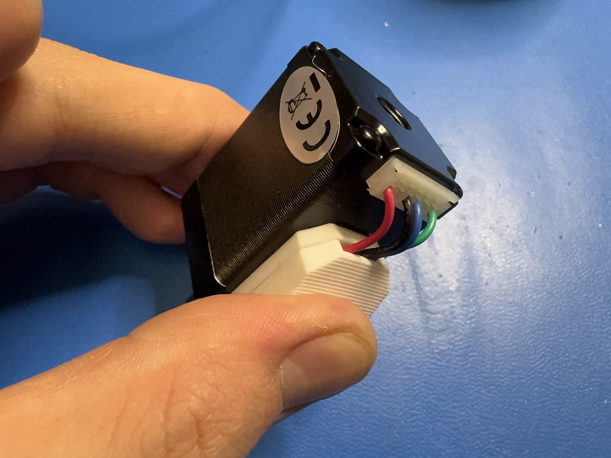
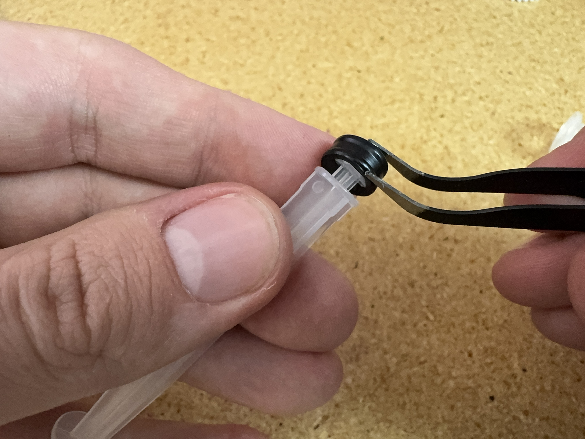
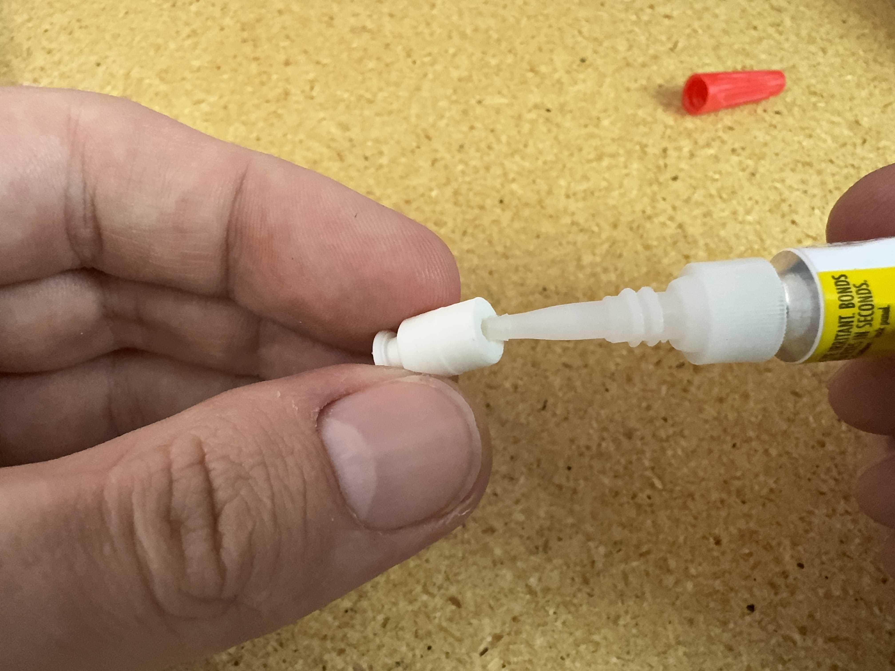

# Paste Extruder

## Motor Wiring (Perform in Mendel)

Collect:

- NEMA11 Stepper
- `stepper-adapter` PCB
- `adapter-mount` and `adapter-cover` print
- Loctite
- Molex Micro-Latch 53254-0670 1x06 Connector

Process:

- Solder Molex connector into `stepper-adapter` PCB

    
    

- Snip the legs off the bottom of the board after soldering, getting as close to flush as possible.
  
    

- Glue `stepper-adapter` PCB into `adapter-mount` print as shown. Make sure the top surface of the board sits flush with the print. let dry

    
    
    

- Apply glue to the backside of the `adapter-mount` and press onto the side of the stepper with the cable port, as shown.

    
    

- Make sure to press it firmly, centered on the motor with an even border as shown. let dry

    

- pull the wires up over the board, and snip along the top edge of the four plated pads

    
    
    

- Apply solder to all four pads on the `stepper-adapter` PCB.

    
    

- Strip all four wires and apply solder to the exposed wire

    
    

- using tweezers, connect the wires to the pads, making sure they go straight up and do not cross

    
    

- apply glue on the edges of `adapter-cover`, and press it onto the `adapter-mount` as shown. make sure there are no gaps, and it lines up with the bottom edge of `adapter-mount`. let dry.

    
    
    
    

- Your assembly should look like this when complete

    

## Base Prep

Arbor press an M3 square nut into the void in the `extruder-base`.

Attach the `cartridge-clamp` using an M3 x 20mm bolt.

.webp)

## Motor Prep

Lightly screw four M2.5 x 5mm screws into the mounting holes on the motor.

Get the `extruder-gear` and align its "D" profile with the "D" profile on the motor spindle. Lightly press it onto the spindle.

Load it into the arbor press in the jig. This jig is critical, in that it supports the shaft while pressing on the gear.

Put the pressing tool on top of the gear. Also, place the shim on the top surface of the motor.

Press the gear down until you touch the shim.

Remove from the jig and package in bubble wrap.

## Cartridge Prep

!!!info "Follow the section below twice in order to prepare 2x bagged cartridge assembies"

Get a `cartridge-gear`, a M3 hex nut, a `3ml-luer-syringe`, an M3 x 70mm threaded rod, a bottle of Loctite, and a `plunger`.

Use the arbor press to set the hex nut in place in the `cartridge-gear`.

Remove the center part of the syringe, and remove the rubber gasket at the end.

Apply some glue in the opening in the `plunger`, and push the threaded rod into the opening. You might need to twist/thread the rod to be fully seated in the plunger.

Press the rubber gasket onto the end of the `plunger`.

Thread the `extruder-gear` onto the threaded rod, **making sure that the nut is facing the plunger**.

Push the `plunger` all the way down into the syringe base, unthreading the `extruder-gear` as necessary.

Bag the cartridge assembly into a 3in x 4in bag.

## Kit Packing

Apply the product label to a 6in x 9in bag.

Bag two `20-gauge-luer-lock-tips` into a 2.5in x 3in bag.

Bag the following items into the product bag:

