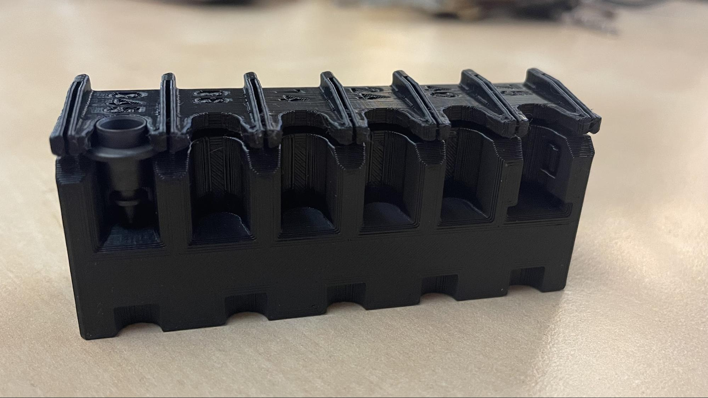
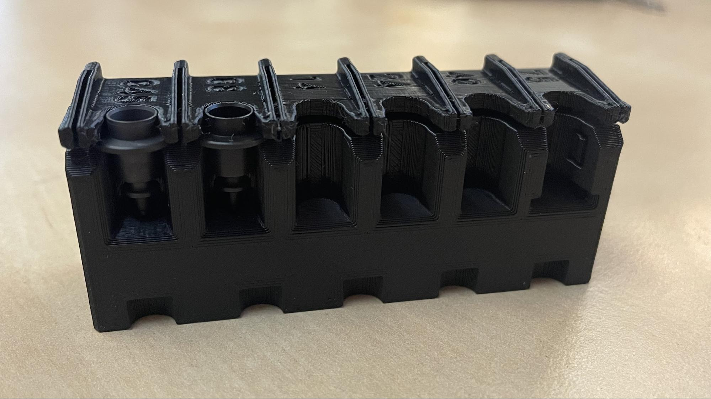

## Purpose

The purpose of this work instruction is to document the assembly process for the LumenPnP CP40 Nozzle Set [`ASM-0001-04`]

## Bill of Materials
| ITEM | Opulo MFG PN            | MANUFACTURER P/N     | PART DESCRIPTION                                             | QUANTITY    | PART COMMENT                              |
|------|-------------------------|----------------------|--------------------------------------------------------------|-------------|-------------------------------------------|
| 1    | FDM-0001-03 PARTLIST | nozzle-rack          | 3D printed rack that holds the 6 different LumenPnP nozzles  |    1 each   |                                           |
| 1    | FIL-0003-00             | Black PLA            | 1.75mm PLA 3D Printer Filament                               |    24.54 g  |                                           |
| 2    | MCM-0006-00             | N045-CP40-nozzle-tip | CP40 nozzle CP40LV-N045                                      |    1 each   |                                           |
| 3    | MCM-0002-00             | N08-CP40-nozzle-tip  | CP40 nozzle CP40LV-N08                                       |    1 each   |                                           |
| 4    | MCM-0003-00             | N14-CP40-nozzle-tip  | CP40 nozzle CP40LV-N14                                       |    1 each   |                                           |
| 5    | MCM-0004-00             | N24-CP40-nozzle-tip  | CP40 nozzle CP40LV-N24                                       |    1 each   |                                           |
| 6    | MCM-0005-00             | N40-CP40-nozzle-tip  | CP40 nozzle CP40LV-N40                                       |    1 each   |                                           |
| 7    | MCM-0007-00             | N75-CP40-nozzle-tip  | CP40 nozzle CP40LV-N75                                       |    1 each   |                                           |
| 8    | FBO-0004-00             | rubber-band          | Rubber Band (3 1/2" x 1/8" #33)                              |    1 each   |                                           |
| 9    | PKG-0009-00             | S-1292               | 3" x 4" Reclosable Bag                                       |    1 each   | Plastic bag used for component packaging  |

## Instructions
### Cleanup nozzle-rack 3D print	

1. Clean nozzle-rack [`FDM-0001-03`] of any stringy plastic by briefly applying hot air to the print with a heat gun.

	* Before:
	
		
	
	* After:
	
		
	
### Install nozzles onto nozzle-rack

2. Insert CP40LV-N045 [`MCM-0006-00`] into nozzle-rack [`FDM-0001-03`]

	

3. Insert CP40LV-N08 [`MCM-0002-00`] into nozzle-rack [`FDM-0001-03`]

	

4. Insert CP40LV-N14 [`MCM-0003-00`] into nozzle-rack [`FDM-0001-03`]

	

5. Insert CP40LV-N24 [`MCM-0004 -00`] into nozzle-rack [`FDM-0001-03`]

	

6. Insert CP40LV-N40 [`MCM-0005-00`] into nozzle-rack [`FDM-0001-03`]

	

7. Insert CP40LV-N75 [`MCM-0007-00`] into nozzle-rack [`FDM-0001-03`]

	

8. Twist rubber-band [`FBO-0004-00`] around nozzle-rack [`FDM-0001-03`] twice-over to prevent the installed nozzles from falling out during shipping

	

### Package Components

9. Gather the parts used in the steps above and put them in a 3" x 4" Reclosable Bag [`PKG-0009-00`]

	

	

10. Seal the 3" x 4" Reclosable Bag [`PKG-0009-00`] closed once everything is installed, being sure to squeeze out extra air

!!! Success "LumenPnP CP40 Nozzle Set [`ASM-0001-04`] Completed"
