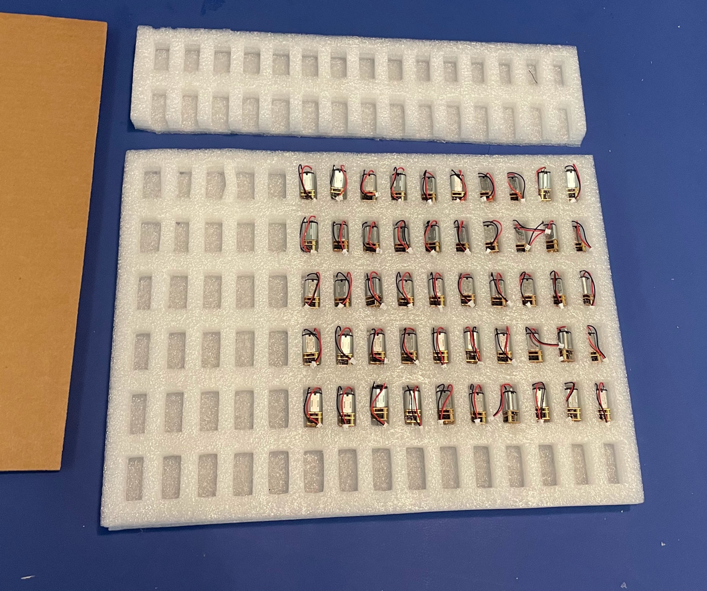
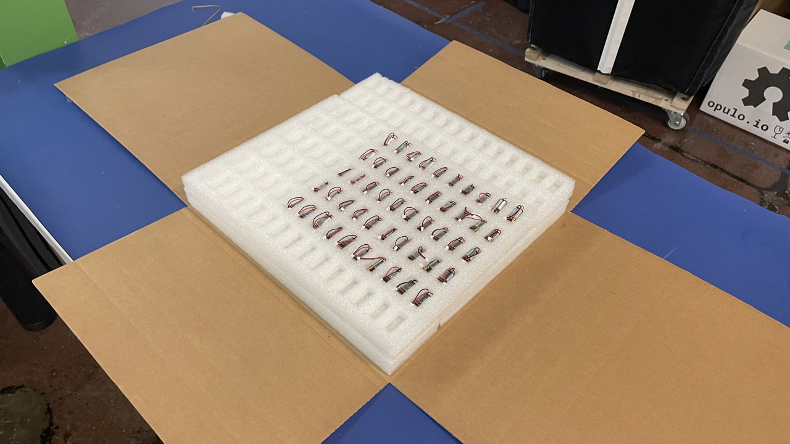
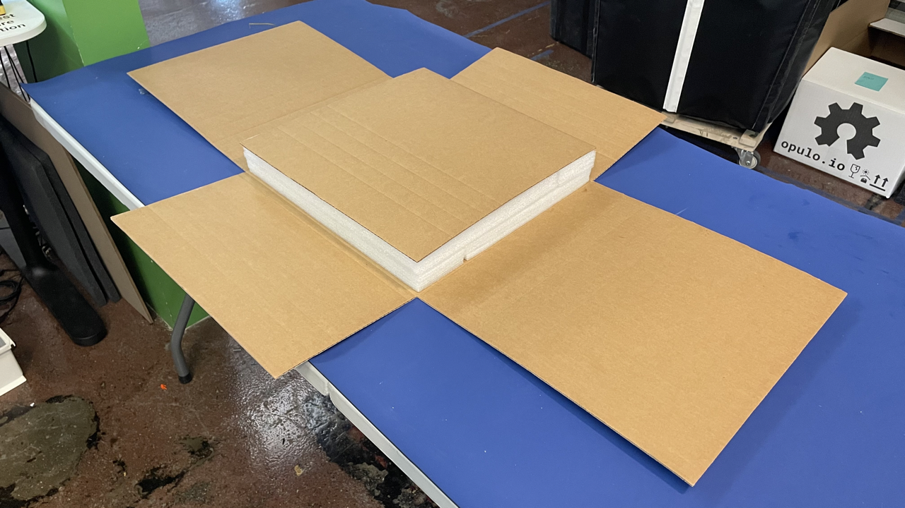

## Introduction
This work instruction is for assembling `feeder-part-kit` - this is a pack of parts that helps customers build their own feeders. The following items are included in the kit:

* `drive-motor` [`MTR-0004-01`]
* `peel-motor` [`MTR-00003-00`]
* `drive-wheel-asm` [`ASM-0060-01`]

## Quality Checks
Collect the required quantity of feeder parts from inventory and perform the following quality checks before continuing:

* `drive-motor` [`MTR-0004-01`]
	* Green LED already removed
	* Shaft cannot be free-spin by hand
	* Wire soldered to PCB correctly
	* Connector end of wire is intact with no loose crimps 
	
* `peel-motor` [`MTR-00003-00`]
	* Shaft cannot be free-spin by hand
	* Wire soldered to motor leads correctly 
	* Connector end of wire is intact with no loose crimps 

* `drive-wheel-asm` [`ASM-0060-01`]
	*	`Shaft-collar-asm` is firmly attached to `drive-wheel-pcb`
	*  `M2.5x3mm-set-screw` is present and partially threaded into `shaft-collar-asm`

## Packaging

### Packaging <5 sets

* Collect a scrap foam tray used in `drive-motor` shipments

	
	
* Cut the webbing out from in-between 2 pockets to create a larger pocket for the `drive-wheel-asm`
	* It is OK to put 1x-3x `drive-wheel-asm` pieces in each pocket provided the `shaft-collar`
	
	
	
* 	Continue by packaging the tray with however many `feeder-part-kit` sets were ordered

	
	
* Cut the filled tray section out from the rest of the tray
	* Just 1 order of `feeder-part-kit` is shown here, but this cutaway section can be bigger if additional sets were ordered by the same person.
	* Cut the filled trays into a size that works well with the package you intend to use - you may not even need to cut the tray if enough `feeder-part-kit` sets were ordered!
	
	
	
* Package each `feeder-part-kit` into a `esd-safe-bag` before taping it closed
	
	
	
	
	
	
	
	

### Packaging 5+ Sets

* For orders of 5+ `feeder-part-kit` sets, it's OK to simply stack filled trays atop one another
	* Just aim for a professional looking pack-out with trays sized appropriately for the box you use 

### Packaging 50 Sets
When packaging 50 sets of `feeder-part-kit` use the following section for guidance. The images below show how to best package a 50pcs `feeder-part-kit` order.

* Cut up a `drive-motor`'s foam tray to fit in a `OPF-folder-box`
	* There should be 17 double-wide pockets to hold `drive-wheel-asm`
	* There should be 50 regular size pockets to hold 50x `drive-motor`
	  
	
	
* Fill the `drive-motor`'s foam tray with components
	* Place a `drive-motor` into each of the 50x regular-size pockets, doing your best to tuck the cable in so it's not loose outside the pocket
	* Place 3x `drive-wheel-asm` in each of the 17x double-wide pockets, giving the customer 50pcs + 1pcs (spare) in total
	
	

* Cut up a `peel-motor` foam tray to fit in a `OPF-folder-box`

* Fill the `peel-motor` foam tray with motors

	

* Place the packaged `peel-motor` foam tray on top of the packaged `drive-motor` foam tray

	

* Place a 15" x 14.5" cardboard pad on top of the stacked foam trays

	

	
	
* Tape the `OPF-folder-box` shut 
* Proceed with the pack-out process flow
	

