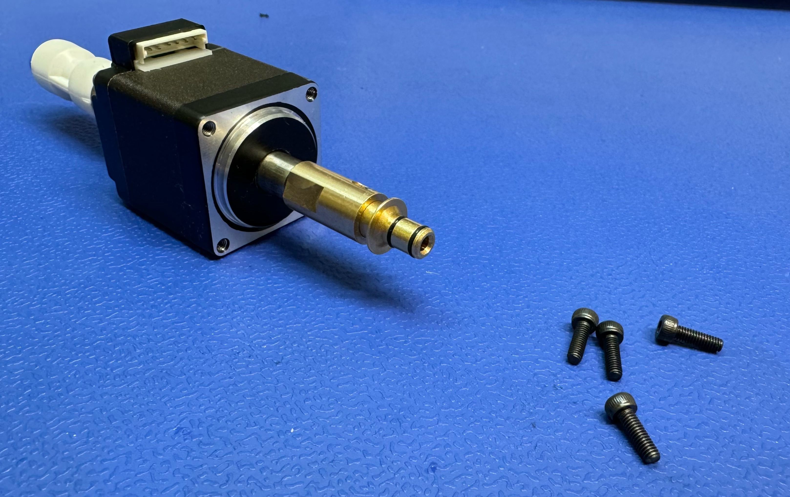
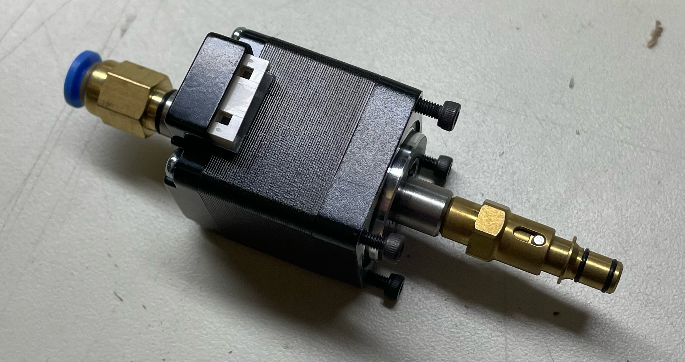
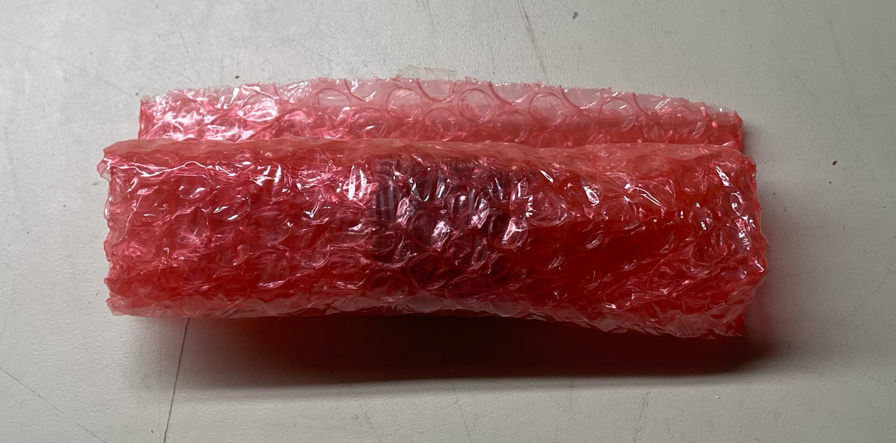
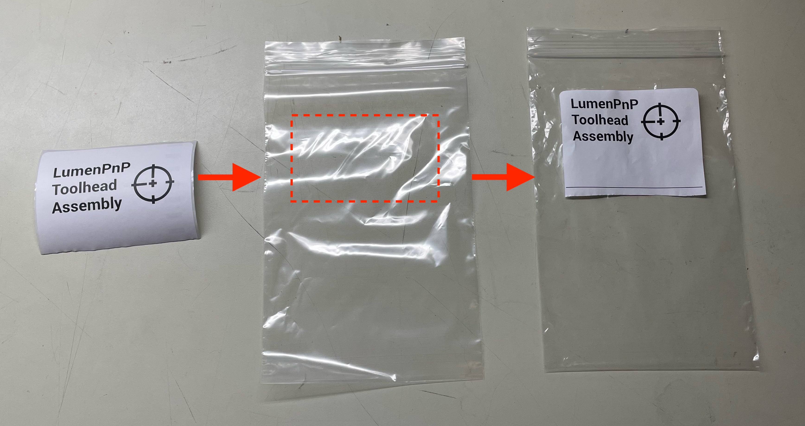
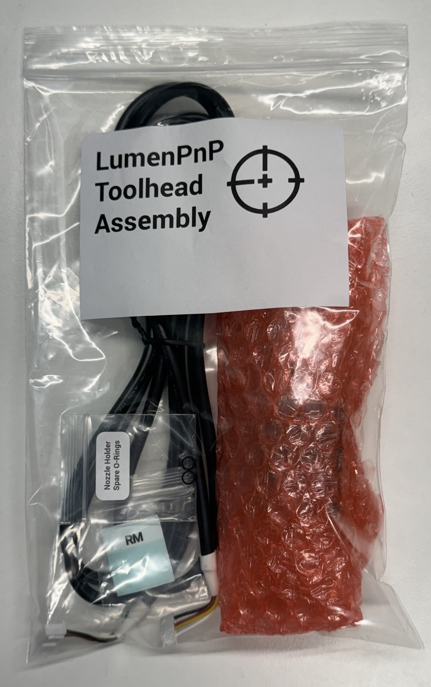

## Purpose

The purpose of this work instructions is to document the assembly process for the LumenPnP Toolhead Assembly [`SKU-0005-03`]

## Instructions

### Prepare Toolhead Assembly
1. Install a `nozzle-holder` and `rotary-pneumatic-adapter` onto `NEMA11-hollow-shaft-stepper`
	*  Use a torque driver w/custom `rotary-pneumatic-adapter-socket` and 8mm wrench to tighten these components onto the motor shaft
		*  Set the torque driver to `0.5 N/M` for this step
	*  Use the 8mm wrench to hold the `nozzle-holder` stationary while applying torque from the `rotary-pneumatic-adapter`side
	*  The `rotary-pneumatic-adapter` should be installed closer to the motor's cable connector

		
		
	
	

2. Loosely bolt 4x `M2.5x8mm-socket-head` fasteners into the front face of `NEMA11-hollow-shaft-stepper`

	
		

3. Package this completed assembly into a 4" x 4" Red ESD Bag and then roll it up

		

		

### Prepare Extra Toolhead Cable Labels

4. Print out 2x `RM` cable labels and insert them into a 1.5" x 1.5" plastic bag before sealing it shut

	
	

### Prepare Packaging

5. Print LumenPnP Toolhead Assembly bag labels by accessing our account on [Avery Print](https://www.avery.com/myaccount/projects)
	- See [SOP-0007](https://docs.google.com/document/d/1Jm7L9rtee2UymbxKDrj7xCHDT8VNdBmkq5X-eJMKwhk/edit) for access credentials
	- Print 2x labels out at time by printing them on the DYMO 4XL label maker with 4" x 6" label paper loaded
	- Cut the printed 4" x 6" labels in half to create 2x 4" x 3" LumenPnP Toolhead Assembly labels  

	

	!!! info "Check Inventory"
		There's usually a pre-made surplus of these labels, so check inventory before assuming you need to print more copies 

6.  Adhere 4" x 3" LumenPnP Toolhead Assembly label to a 6" x 9" Polybag as shown in the image below

	

### Package Components
	
7. Package the following components into the labeled 6" x 9" Polybag
	* `NEMA11-hollow-shaft-stepper` (w/attached `nozzle-holder`, `rotary-pneumatic-adapter`, and bolts)
	* `l-motor-harness`
	* `silicone-grease-packet`
	* Bagged `RM` cable labels

	
	

8. Seal up the bag after all the components listed above are placed inside it

!!! Success "LumenPnP Toolhead Assembly [`SKU-0005-03`] Completed"