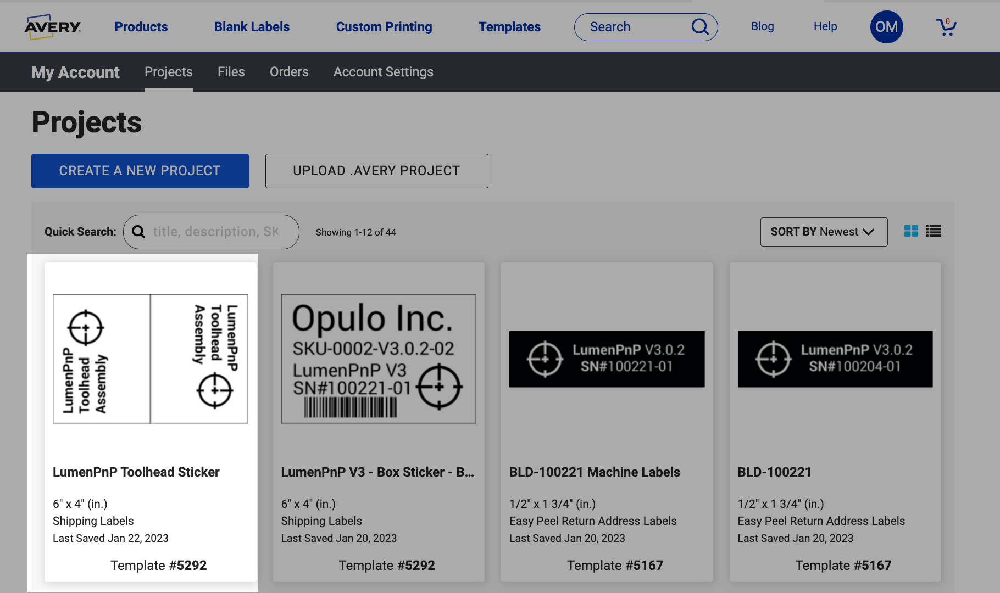

## Purpose

The purpose of these work instructions are document the assembly process of for the LumenPnP Toolhead Assembly [`SKU-0005-02`]

## Bill of Materials

| Item  | Opulo MFG PN | MANUFACTURER P/N            | PART DESCRIPTION                             | QUANTITY | PART COMMENT                              |
|-------|--------------|-----------------------------|----------------------------------------------|----------|-------------------------------------------|
| 1     | FBO-0001-00  | CP40-holder                 | CP40 Holder                                  |  1 each  |                                           |
| 2     | MTR-0002-00  | NEMA11-hollow-shaft-stepper | NEMA 11 Hollow Shaft Stepper Motor           |  1 each  |                                           |
| 3     | PNU-0003-00  | pneumatic-adapter-MS4M-M5   | Push-To-Connect Pneumatic Fitting - MS4M-M5  |  1 each  |                                           |
| 4     | LUB-0001-00  | silicone-grease-packet      | Single-Use Grease Packet                     |  1 each  | Synthetic grease with PTFE - 1 cc packet  |
| 5     | PKG-0011-00  | 6" x 9" Polybag             | 6" x 9" Polybag                              |  1 each  | Plastic bag used for component packaging  |
| 6     | CHA-0005-01  | l-motor-harness             | l-motor-harness                              |  1 each  |                                           |
| 7     | FST-0032-00  | M2.5x8mm-socket-head        | ISO4762 Screw M2.5x8                         |  1 each  |                                           |
| 8     | N/A          | N/A                         | 4" x 4" Red ESD Bag                          |  1 each  | Reused ELP camera packaging material      |

## Instructions

### Prepare Toolhead Assembly
1. Install a CP40-holder and pneumatic-coupler onto a NEMA11-hollow-shaft-stepper
	*  Use a torque driver w/10mm socket and adjustable wrench to tighten these items onto the motor shaft
		*  Set the torque driver to `0.5 N/M` for this step
	*  Use the adjustable wrench to hold the CP40-holder stationary while applying torque from the pneumatic-coupler side
	*  The pneumatic-coupler should be installed closer to the motor's cable connector
	
		
	

2. Loosely bolt 4x M2.5x8mm-socket-head fasteners into the front face of NEMA11-hollow-shaft-stepper

		

3. Package this completed assembly into a 4" x 4" Red ESD Bag and then roll it up

		
	
		

	### Prepare Toolhead Cable
 
4. Use a permanent marker to black out the `LM` text on the label of `CHA-0005-01`
	
	
		
	!!! Note
		The toolhead cable included this product is an older rev of l-motor-harness than what's used in the [LumenPnP v3 Drag Chain](../lumen/drag-chain)
		
		*  Since we do not know if customers are using this cable for the left head or right head, it is better that ship them a cable with no labels
		*  We use `CHA-0005-01` there is only 1 label we need to deface/remove - which is the LM label found on the cable's motherboard side

	### Prepare Packaging
	
5. Print LumenPnP Toolhead Assembly bag labels by accessing our account on [Avery Print](https://www.avery.com/myaccount/projects)
	- See [SOP-0007](https://docs.google.com/document/d/1Jm7L9rtee2UymbxKDrj7xCHDT8VNdBmkq5X-eJMKwhk/edit) for access credentials
	- Print 2x labels out at time by printing them on the DYMO 4XL label maker with 4" x 6" label paper loaded
	- Cut the printed 4" x 6" labels in half to create 2x 4" x 3" LumenPnP Toolhead Assembly [`SKU-0005-02`] labels
	
	
	
6.  Adhere 4" x 3" LumenPnP Toolhead Assembly label to a 6" x 9" Polybag as shown in the image below
	
	

	### Package Components
	
7. Package the following components into the labeled 6" x 9" Polybag
	* NEMA11-hollow-shaft-stepper (w/attached CP40-holder, pneumatic-coupler, and bolts)
	* l-motor-harness
	* silicone-grease-packet
	
	
	
	
	
8. Seal up the bag after all the components listed above are placed inside it