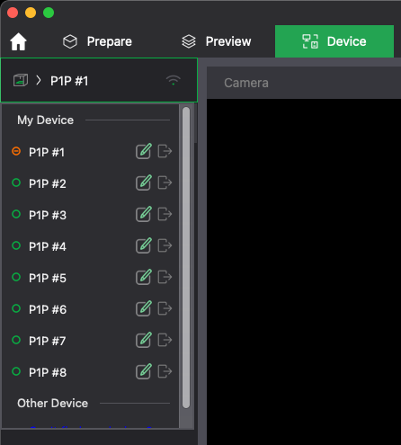
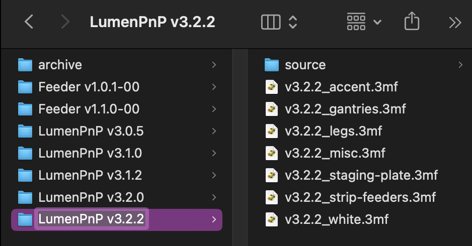

# Print Farm Management

## Print Farm Setup

There are a few things you need to do to prepare to slice and upload for our print farm.

### BambuStudio Setup

1. Download version [1.9.3.50 of BambuStudio](https://github.com/bambulab/BambuStudio/releases/).
2. Login to the OpuloInc Bambu account. Ask Lucian for the credentials.
    
3. Make sure you're logged in by checking that:
    1. Account slicer settings are present (should say "Production" or "MFG")
        
    2. Our P1Ps (creatively named numbers 1-8) show up in the "Devices" tab.
        

### Google Drive

We use Google Drive to manage all our 3MF files.

1. Install [Google Drive Desktop](https://www.google.com/drive/download/) and login with your Opulo email account.
2. Select the "Stream files" option.
   
3. Navigate to `Shared Drives/OpuloEngineering/Manufacturing/In-House Production/3D Printing` in Finder, and click on the little clowd/arrow icon next to it. This will keep this folder downloaded to your computer.
   

## Updating the Print Farm

When we make a new release of any of our products on Github, we'll need to update our print farm so we're making the latest and greatest. Performing this section constitutes a checked box for the `Update Print Farm` task in Mattermost Playbooks.

!!! note "Different Products"
    Keep in mind that this process will happen the exact same for other products. We'll use the LumenPnP as an example, but it's the same process for other products.

### Making a new folder

1. Go to the latest release ([LumenPnP](https://github.com/opulo-inc/lumenpnp/releases))([Feeders](https://github.com/opulo-inc/feeder/releases)) for the product you're updating.
2. Under "Assets," download the zip file with "STLs" or "STEPs" in the name.
3. Go to the "Print Farm Files" folder in Drive.
4. You'll find a series of folders, one for each version of each product.
   
5. Duplicate the latest folder for the product you're updating. In this example, we're duplicating `LumenPnP v3.2.0`
   
6. Rename the duplicate folder name to the version of the release. Also rename all files inside to the new version number. In this example, `LumenPnP v3.2.2`.
   
7. Delete everything in the `source` folder, and in the `slice` folder.
8. Unzip the source file you downloaded from the release.
9. Move all unzipped files into the now empty `source` folder.

### Updating 3MFs

All the files have been moved and renamed successfully. Now, we need to update the 3MF files to contain all the new changes.

1. In the release notes, check for a list of files that have been updated. These are the files that you need to pull from the source in the 3MF files.
2. For each file in this list:
    1. Find the 3MF file that contains it. The names aim to be as descriptive as possible.
    2. With the 3MF file open in BambuStudio, look for the plate with the part's name.

    !!! warning "If the file is not present"
        If you cannot find a plate with the title of the part, it is likely a new part. Make a new plate and title it the name of the part.

    

    3. Delete all the old parts from the plate.
    4. Click the "Add new part" button.

        

    5. Select the new version of the part from the "source" folder for the new version.
        
    6. Right click on the newly added part and select "Fill bed with copies"
        
    7. It does a pretty good job of laying the parts out, but if it does something stupid, feel free to move them around a bit.

### Slicing and Saving

With your 3MFs up to date, we'll slice them and send them to all the printers on the farm.

1. Open each of the 3MF files in the version folder in turn. Inside each 3MF file, you'll find a plate for each part. For each plate in each 3MF file:
    1. Click on a plate to select it. It should appear darker than the others.
        
    2. Make sure your slicing settings are correct.
        1. Filament should be `MFG - STANDARD - PolyLite PLA` for all prints. (The small exception is the dynamic board mount which is PETG, and peel-worm-gear gets `MFG - DETAIL - PolyLite PLA`).
        2. Process should be `MFG - STANDARD - 0.2mm P1P` for *almost* all prints. The few exceptions are that the feeder frame needs to use `MFG - FEEDER - 0.2mm P1P` and the worm-gear needs to use `MFG - DETAIL - 0.08mm P1P`.
        3. Be sure you're slicing with the correct Plate Type. Reference the [Print Farm Kanban Cards](https://docs.google.com/presentation/d/1iP0LQSKqcGVxUUVWdpAv4Ua863dX2MB9aPtw2I8KEZI/) for the correct plate type for each print.
    3. Click "Slice Plate."
        
    4. Inspect the resulting toolpath. Any overhangs? Any potential issues?
    5. Click the "Export plate sliced file" button.
        
    6. Save the .gcode file to the `slice` folder.
        

### Sending

We use a utility to upload all sliced files to our print farm. Open [FarmUpload](https://github.com/opulo-inc/farm-upload/releases) on your computer, select the `settings.json` file in the "Print Farm Files" Drive folder, and select the newly filled `slice` folder.

### Making Kanban Cards

Before switching over the farm, you need to update the Kanban cards.

1. Go to the [Opulo Kanban Card Document](https://docs.google.com/presentation/d/1iP0LQSKqcGVxUUVWdpAv4Ua863dX2MB9aPtw2I8KEZI/edit). There is a card type called "Kanban" that you should use when making new cards. Do the following:
   1. Delete cards for any parts that are not part of the new build.
   2. Add new cards for any new parts.
   3. Edit any cards for parts that have changed (material, color, build plate).
2. Print any changed or new cards on the Dymo label printer.
3. Grab the "Kanban Supplies" box on the rack by the print farm to get the printed cards you can affix the labels to.

### Officially Change Over

1. Find the print bins for all parts that have changed, and parts that are no longer needed. Throw away all the parts in the bins, and the kanban cards for the parts that have new cards.
2. Put all the new cards you made in the last section into new bins to support the new parts.
3. Next to the print farm is a board with the current version of each product. Update to the verison you just sliced for.
4. Post in #factory-floor about the version change, and that folks should be mindful of the new version when selecting the print to run from the printer.

## Running the Print Farm

We run the print farm in a [kanban](https://www.youtube.com/watch?v=Levkx8f0qL4) style. When a part gets low, and we hit the "kanban level" of the part, we know it's time to print more.

1. Check the kanban board by the print farm. The kanban cards on the board are parts we need to print.
2. For each card:
    1. Find a printer that already has the correct material loaded and build plate loaded. If none are available, swap filament and build plates.
    2. In the printer's files, find the part name. **Make sure you're selecting the correct version.** The curent version number is posted in the print farm area.
    3. Run the print.
3. When prints are complete, bring them to the processing area for QC and support clearing.
4. Using an empty bin, move them into Ghidra and fill the bin for that part.
5. If the parts are now full to the green line, return the kanban card to the parts bin in Ghidra or the Tequila Sunrise. If the parts have not reached the green line, keep the kanban by the print farm to indicate more need to be printed.

While consuming parts in a build, when you notice the part level in a bin goes below the red line, take the kanban card and put it on the board by the print farm.
